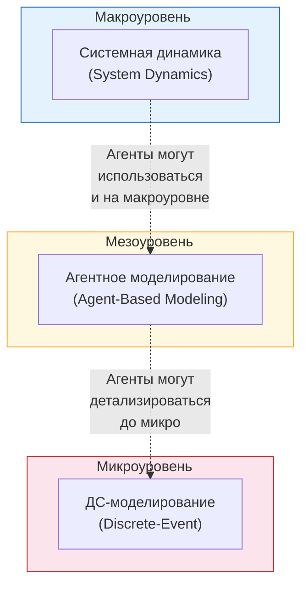

# Введение в имитационное моделирование

## Зачем это нужно

Представь, ты проектируешь новый Макдональдс. Сколько касс поставить? Если мало -- очереди, клиенты уходят. Если много -- кассиры простаивают, убытки. Аналитически это не решить, слишком много факторов: час пик, ленч офисных работников, дети после школы, UberEats-заказы... Вот тут и нужна симуляция.

Или возьми пример попроще. Представь себе обычный банк. Есть очередь, есть окошки, люди приходят и уходят. Допустим, ты -- менеджер банка и хочешь понять: **сколько в среднем клиент будет ждать в очереди?**

Если у тебя одно окошко и поток клиентов подчиняется простым статистическим законам, то ответ можно получить по формуле:

$$w = \frac{\lambda b^2}{1 - \lambda b}$$

где $\lambda$ -- интенсивность входящего потока (сколько клиентов приходит в единицу времени), а $b$ -- среднее время обслуживания одного клиента.

!!! note "Зачем формула, если есть симуляция?"
    Формула -- это прекрасно, когда она существует. Проблема в том, что для реальных систем формулы либо не существует вовсе, либо она настолько сложна, что проще запустить компьютерную симуляцию и "прожить" работу системы виртуально.

Реальный банк -- это не один кассир и не простой поток. Это несколько окон, разные типы операций, обеденные перерывы, VIP-клиенты без очереди, сезонные колебания нагрузки... Аналитическая формула для такого случая? Её просто нет. Вот тут-то и приходит на помощь ==имитационное моделирование== (ИМ).

---

## Что такое модель

==Модель== -- это упрощённое представление реального объекта или процесса, которое сохраняет важные для нас свойства оригинала. Модели бывают очень разными:

| Тип модели | Пример |
|---|---|
| **Ментальная модель** | "Я думаю, что если добавить кассира, очередь станет короче" -- модель у тебя в голове |
| **Физическая модель** | Макет здания из картона, аэродинамическая труба для модели самолёта |
| **Математическая формула** | $w = \frac{\lambda b^2}{1 - \lambda b}$ -- та самая формула из теории массового обслуживания |
| **Табличная модель (Excel)** | Финансовая модель бизнеса в электронной таблице |
| **Имитационная модель** | Компьютерная программа, которая воспроизводит поведение системы во времени |

Ключевая идея моделирования -- это цепочка переходов:


Мы берём реальную проблему, строим её модель (упрощаем до сути), находим решение на модели, а затем переносим это решение обратно в реальный мир. Важно понимать: **модель -- это всегда упрощение**. Мы сознательно отбрасываем то, что считаем несущественным, и оставляем то, что важно для нашей задачи.

---

## Когда аналитика не работает

Аналитические (формульные) решения -- это золотой стандарт. Если формула есть -- используй формулу. Но вот давай посмотрим, как быстро всё ломается.

Берём простейший случай: один кассир, клиенты приходят случайно, обслуживание тоже случайное. Формула есть, она красивая, всё работает. Теперь добавим второго кассира -- формула уже сложнее, но ещё существует. А теперь добавим одну мелочь: VIP-клиенты проходят без очереди. Всё, формулы нет. Добавим ещё одну мелочь: кассиры уходят на обед по очереди. Формулы нет подавно. А ведь в реальной системе таких "мелочей" не две, а десятки, и каждая взаимодействует с остальными.

Вот конкретные причины, по которым аналитика перестаёт справляться:

1. **Много параметров.** Система описывается десятками или сотнями переменных, и учесть их все в одной формуле невозможно. Каждая новая переменная не просто добавляется к формуле -- она умножает сложность, потому что может взаимодействовать со всеми остальными.

2. **Нелинейные зависимости.** Переменные влияют друг на друга сложным, нелинейным образом. Небольшое изменение одного параметра может привести к непропорционально большому эффекту в другом месте. Как пробка на дороге: одна лишняя машина -- и поток, который ехал нормально, встаёт намертво.

3. **Время и причинность.** В системе важна последовательность событий: что произошло раньше, что позже, как одно событие порождает другое. Формулы обычно дают статическую картину, а нам нужна динамика. Очередь в 9:00 и очередь в 13:00 -- это разные очереди с разной динамикой, и одна формула не опишет обе.

4. **Нестандартное поведение элементов.** Люди не ведут себя как идеальные "частицы" -- они принимают решения, устают, ошибаются, уходят из очереди, если она слишком длинная. Попробуй записать формулой: "клиент посмотрел на очередь, прикинул время ожидания, вспомнил, что рядом есть другой банк, и ушёл".

!!! info "Пример с банком: от простого к сложному"
    - **M/M/1** (одно окно, простейшие потоки) -- формула $w = \frac{\lambda b^2}{1 - \lambda b}$ работает отлично.
    - **M/M/K** (K окон, простейшие потоки) -- формула существует, но уже заметно сложнее (формулы Эрланга).
    - **Реальный банк** (разные типы клиентов, приоритеты, перерывы, переменная нагрузка в течение дня) -- **аналитического решения не существует**. Единственный способ -- имитационная модель.

---

## Имитационная модель

Погнали разбираться, что же такое имитационная модель.

!!! tip "Определение"
    ==Имитационная модель== -- это исполняемая (executable) модель системы. По сути, это набор правил, по которым из текущего состояния системы строится следующее состояние. Запуская эти правила многократно, мы получаем **траекторию** -- историю поведения системы во времени.

Можно думать об этом так: имитационная модель -- это "виртуальная копия" реальной системы, которую можно запустить на компьютере и наблюдать, как она себя ведёт.

Схема работы ИМ предельно проста:

```
Входные данные  ->  [ Имитационная модель ]  ->  Выходные данные
   (параметры,         (правила перехода          (метрики,
    сценарии)           между состояниями)         статистика)
```

На вход мы подаём параметры системы и сценарий ("что будет, если добавить ещё одно окно?"). Модель "проживает" этот сценарий и выдаёт результат -- например, среднее время ожидания клиента.

Ключевое свойство ИМ -- это именно **исполняемость**. Это не просто описание системы на бумаге -- это программа, которая генерирует поведение. Мы можем запускать её снова и снова с разными параметрами, проводя виртуальные эксперименты.

---

## Преимущества ИМ

Почему имитационное моделирование так популярно? Вот основные преимущества:

**1. Любая переменная измерима в любой момент времени.**
В реальной системе ты не можешь "заморозить" банк и посчитать, сколько людей в каждой очереди в каждую секунду. В модели -- запросто. Хочешь знать загрузку третьего кассира в 14:37? Пожалуйста.

**2. Наглядная динамика.**
Модель показывает, как система развивается во времени. Ты видишь не просто итоговую цифру, а весь процесс: как очередь растёт утром, стабилизируется днём и снова растёт к вечеру.

**3. Интерактивная "игра" с графическим интерфейсом.**
Современные инструменты ИМ часто предоставляют красивый GUI, нередко с 3D-визуализацией. Ты можешь буквально "ходить" по виртуальному банку и наблюдать за процессом. Это не просто красиво -- это помогает находить неочевидные проблемы.

**4. Убедительнее, чем аналитика.**
Попробуй объяснить топ-менеджеру формулу Эрланга. А теперь покажи ему 3D-анимацию, где видно, как клиенты толпятся у входа. Что будет убедительнее? Имитационная модель -- это не "чёрный ящик" с непонятной формулой, а наглядная демонстрация.

!!! warning "Но есть нюанс"
    ИМ -- не замена аналитике. Если задача решается формулой -- используй формулу, это быстрее и точнее. ИМ -- это инструмент для случаев, когда аналитика бессильна. Кроме того, результаты ИМ всегда содержат элемент случайности (стохастичности), и для получения надёжных выводов нужно проводить множество прогонов модели.

---

## Области применения

Имитационное моделирование применяется на самых разных уровнях -- от глобальной экономики до работы отдельного склада. Удобно разделить области применения по ==уровню абстракции==:

### Макроуровень (стратегический)

Здесь мы смотрим на систему "с высоты птичьего полёта", оперируя агрегированными показателями:

- **Рынки и конкуренция** -- как изменится доля рынка при изменении ценовой политики? Например, Shell использует системно-динамические модели для долгосрочных сценариев развития энергетического рынка.
- **Социальные системы** -- распространение эпидемий, миграция населения. Классика: модели ВОЗ для прогнозирования волн COVID-19, которые определяли политику локдаунов.
- **Экосистемы** -- динамика популяций "хищник -- жертва"
- **Экономика здравоохранения** -- как повлияет новая программа вакцинации на нагрузку на больницы через 10 лет?

### Мезоуровень (тактический)

Средний уровень детализации -- отдельные организации, процессы, цепочки:

- **Цепочки поставок (supply chain)** -- оптимизация логистики, складских запасов. Amazon моделирует работу своих фулфилмент-центров, чтобы решить, где разместить новый склад и сколько людей нанять к Чёрной пятнице.
- **Больницы** -- потоки пациентов, загрузка отделений
- **Транспортные системы** -- моделирование дорожного трафика. Яндекс.Такси моделирует распределение водителей по районам города, чтобы минимизировать время подачи.
- **Производство** -- планирование производственных линий
- **Бизнес-процессы** -- оптимизация workflow в компании

### Микроуровень (операционный)

Максимальная детализация -- конкретные объекты, люди, единицы продукции:

- **Склады** -- перемещение каждой единицы товара, маршруты погрузчиков. Крупные ритейлеры вроде Walmart моделируют каждый погрузчик и каждую полку, чтобы сократить время сборки заказа на секунды.
- **Пешеходное движение** -- эвакуация из здания, потоки людей на вокзале. Перед каждым чемпионатом мира по футболу моделируют потоки болельщиков на стадионах, чтобы избежать давки.
- **Компьютерные системы** -- сетевой трафик, нагрузка на серверы
- **Военное дело** -- моделирование боевых операций

---

## Три метода ИМ

Существуют три основных метода (подхода) имитационного моделирования. Каждый из них лучше подходит для своего уровня абстракции:



### 1. Системная динамика (System Dynamics)

> Смотрим на систему сверху, как на потоки воды между бассейнами.

!!! note "Историческая справка"
    Системная динамика была разработана **Джеем Форрестером** (Jay Forrester) в **1950-х годах** в MIT. Первоначально применялась для моделирования промышленных процессов.

Системная динамика работает с **агрегированными потоками и накопителями**. Мы не отслеживаем каждого отдельного клиента -- мы говорим: "в системе сейчас 150 клиентов, поток входа -- 10 в час, поток выхода -- 8 в час". Это уровень непрерывных дифференциальных уравнений, но представленных в наглядной графической форме (диаграммы потоков и накопителей).

**Где применяется:** стратегические решения, макроэкономика, экология, управление ресурсами.

### 2. Агентное моделирование (Agent-Based Modeling, ABM)

> Задаём правила каждому агенту и смотрим, что получится в целом.

В агентном моделировании система описывается через множество **автономных агентов**, каждый из которых действует по своим правилам. Агенты взаимодействуют друг с другом и с окружающей средой, и из этих локальных взаимодействий **возникает** (emerge) глобальное поведение системы. Никто не программирует пробку на дороге -- она сама возникает из поведения отдельных водителей.

**Где применяется:** моделирование поведения потребителей, распространение инноваций, социальные сети, эпидемиология, экосистемы, транспорт.

### 3. Дискретно-событийное моделирование (Discrete-Event Simulation, DES)

> Прыгаем от события к событию: пришёл клиент -- встал в очередь -- обслужился -- ушёл.

!!! note "Историческая справка"
    Основы DES были заложены **Джеффри Гордоном** (Geoffrey Gordon) в **1960-х годах**, создавшим язык моделирования GPSS.

В DES система описывается через **сущности** (entities), которые проходят через **процессы** (processes), используя **ресурсы** (resources). Время продвигается от одного события к следующему (дискретно -- отсюда название). Между событиями ничего интересного не происходит, поэтому модель просто перескакивает к следующему моменту, когда что-то меняется. Классический пример -- тот самый банк: клиенты (сущности) приходят, встают в очередь, обслуживаются кассиром (ресурс) и уходят.

**Где применяется:** производство, логистика, сервисные системы, здравоохранение, call-центры.

!!! tip "Какой метод выбрать?"
    Нет одного "лучшего" метода -- выбор зависит от задачи и нужного уровня детализации. Более того, в сложных проектах методы часто **комбинируются**: например, агенты-клиенты в дискретно-событийной модели банка, или системная динамика для макроуровня экономики с агентами-компаниями внутри.

---

## Инструменты ИМ

Исторически для каждого метода ИМ существовали свои специализированные инструменты:

| Метод | Инструменты |
|---|---|
| **Системная динамика** | VenSim, PowerSim, Stella, iThink |
| **ДС-моделирование** | Arena, ExtendSim, GPSS, SimEvents |
| **Агентное моделирование** | Swarm, RePast, NetLogo, Mesa (Python) |

Каждый из этих инструментов хорош в своей области, но ограничен одним методом. Что делать, если задача требует комбинации подходов?

!!! info "AnyLogic -- многоподходный инструмент"
    **AnyLogic** -- это среда моделирования, которая поддерживает **все три метода** (системную динамику, агентное и дискретно-событийное моделирование) в одном инструменте. Более того, она позволяет **комбинировать** методы в одной модели.

AnyLogic разработан на базе Java, имеет графический редактор моделей, поддерживает 2D- и 3D-анимацию, и широко используется как в академической среде, так и в индустрии.

---

**Итого:** имитационное моделирование -- это мощный инструмент для изучения сложных систем, которые не поддаются аналитическому решению. Три основных метода (системная динамика, агентное моделирование, дискретно-событийное моделирование) покрывают задачи на разных уровнях абстракции, и современные инструменты позволяют комбинировать их для решения самых сложных задач.
