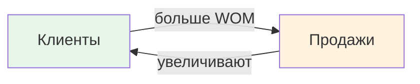
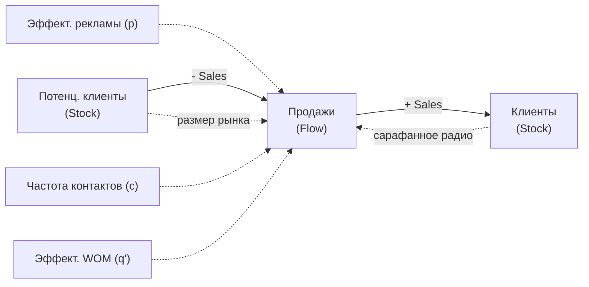
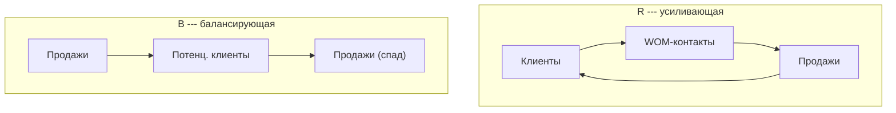

# Системная динамика

---

## Зачем это нужно

Погнали. ==Системная динамика== (System Dynamics, SD) --- подход к моделированию, который работает на **макро- и стратегическом уровне**. Если агентное моделирование смотрит на поведение отдельных "актёров", то системная динамика смотрит на систему целиком --- через потоки, накопления и обратные связи.

Подход придумал **Джей Форрестер** (Jay Forrester) в MIT в 1950-х годах. Изначально он применял его для анализа производственных цепочек, а потом метод распространился на самые разные области:

- моделирование **рынков** и диффузии продуктов;
- **социальные системы** (урбанистика, демография);
- **экосистемы** и устойчивое развитие;
- **динамика персонала** в крупных организациях;
- **экономика здравоохранения** (эпидемии, нагрузка на систему).

Суть в том, что мир полон обратных связей. Если мы хотим понять, почему система ведёт себя контринтуитивно (а она почти всегда так делает на длинном горизонте), нужно явно нарисовать эти петли обратной связи и проследить их во времени.

---

## Основные понятия

В системной динамике вся модель строится из трёх базовых кирпичиков. Но прежде чем разбирать их формально, вот самая главная аналогия, которую стоит запомнить:

Накопитель -- это ванна. Поток -- это кран (вход) и слив (выход). Если кран открыт сильнее, чем слив -- ванна наполняется. Если слив открыт сильнее -- опустошается. Вот и вся системная динамика в одном предложении. Всё остальное -- это детали того, как именно связаны между собой краны, сливы и уровни воды.

### Накопители (Stocks)

!!! note "Накопитель (Stock)"
    Переменная, которая аккумулирует значение во времени. Это "уровень воды в ванне": она не меняется мгновенно, а растёт или убывает постепенно.

Примеры ==накопителей==:

- число клиентов компании;
- объём воды в водохранилище;
- количество заражённых в эпидемии;
- уровень знаний сотрудника.

Математически накопитель --- это интеграл:

$$
S(t) = S(t_0) + \int_{t_0}^{t} \bigl[\text{входящий поток} - \text{исходящий поток}\bigr]\, d\tau
$$

### Потоки (Flows)

!!! note "Поток (Flow)"
    Скорость изменения накопителя. Это "кран", через который вода втекает или вытекает из ванны.

Примеры потоков:

- продажи (увеличивают число клиентов);
- отток клиентов (уменьшает число клиентов);
- скорость заражения;
- скорость обучения.

Поток --- это производная накопителя:

$$
\frac{dS}{dt} = \text{inflow}(t) - \text{outflow}(t)
$$

### Обратные связи

Главное тут --- ==обратные связи==. Это замкнутые причинно-следственные цепочки, из-за которых система "живёт своей жизнью".

!!! warning "Два типа петель обратной связи"
    - **Усиливающая петля (R --- Reinforcing)** --- "снежный ком". Рост порождает ещё больший рост (или падение усиливает падение). Пример: чем больше клиентов, тем больше "сарафанного радио", тем больше новых клиентов.
    - **Балансирующая петля (B --- Balancing)** --- "термостат". Система стремится к некоторому равновесию. Пример: чем больше клиентов уже привлечено, тем меньше остаётся потенциальных --- рост замедляется.

Чтобы лучше прочувствовать разницу, вот примеры из жизни:

- **R-петля (усиливающая):** подписчики в соцсетях. Чем больше подписчиков, тем больше репостов, тем больше людей видят контент, тем больше новых подписчиков. Это snowball effect -- самоподдерживающийся рост. Именно поэтому первые 1000 подписчиков набрать труднее всего, а дальше процесс разгоняется сам.

- **B-петля (балансирующая):** эпидемия. Чем больше людей заболело, тем меньше осталось здоровых, которые могут заразиться. В какой-то момент вирусу просто некого заражать -- эпидемия затухает сама по себе, даже без карантина. Система сама себя тормозит.

В реальных моделях петли переплетаются, и именно их взаимодействие определяет поведение системы: S-образный рост, осцилляции, overshooting и т.д. Почти любое контринтуитивное поведение системы объясняется тем, что в разные моменты времени доминируют разные петли.

---

## Модель Басса

Модель диффузии Басса (Bass Diffusion Model) --- классический пример из системной динамики. Она описывает, как новый продукт распространяется на рынке.

По сути, это модель хайпа. Представь запуск нового iPhone. Сначала его покупают только те, кто увидел рекламу -- фанаты Apple, гики, ранние последователи. Их немного, продажи растут медленно. Потом эти люди начинают показывать телефон друзьям, писать отзывы, выкладывать фотки -- включается сарафанное радио, и рост резко ускоряется. Но в какой-то момент все, кто хотел, уже купили -- и продажи падают. Получается колоколообразная кривая: медленный старт, взрывной рост, неизбежный спад.

### Структура модели

В модели два накопителя и один поток:

| Элемент | Тип | Описание |
|---------|-----|----------|
| Потенциальные клиенты | Накопитель | Люди, которые ещё не купили продукт |
| Клиенты | Накопитель | Люди, которые уже купили |
| Продажи | Поток | Скорость перехода из потенциальных в клиенты |

### Формулы

Продажи складываются из двух компонент:

$$
\text{Продажи} = \underbrace{\text{Продажи от рекламы}}_{\text{инновационная компонента}} + \underbrace{\text{Продажи от WOM}}_{\text{имитационная компонента}}
$$

**Продажи от рекламы** --- часть потенциальных клиентов, привлечённая напрямую рекламой:

$$
\text{Продажи}_{\text{реклама}} = p \cdot \text{Потенциальные клиенты}
$$

где $p$ --- коэффициент эффективности рекламы (коэффициент инновации).

**Продажи от сарафанного радио (WOM)** --- потенциальные клиенты, привлечённые через контакт с существующими клиентами:

$$
\text{Продажи}_{\text{WOM}} = c \cdot q' \cdot \text{Потенциальные клиенты} \cdot \frac{\text{Клиенты}}{\text{Потенциальные клиенты} + \text{Клиенты}}
$$

где:

- $c$ --- частота контактов между людьми;
- $q'$ --- вероятность того, что контакт приведёт к покупке (эффективность WOM).

!!! tip "Про долю клиентов"
    Дробь $\dfrac{\text{Клиенты}}{\text{Потенциальные клиенты} + \text{Клиенты}}$ --- это просто доля клиентов в общей популяции. Она определяет вероятность того, что случайный контакт окажется с кем-то, кто уже купил продукт.

Если обозначить $q = c \cdot q'$, то получаем классическую запись Басса:

$$
\text{Продажи} = p \cdot \text{Потенциальные клиенты} + q \cdot \text{Потенциальные клиенты} \cdot \frac{\text{Клиенты}}{\text{Потенциальные клиенты} + \text{Клиенты}}
$$

### Дифференциальные уравнения

Динамика системы описывается парой связанных ОДУ:

$$
\frac{d(\text{Потенциальные клиенты})}{dt} = -\text{Продажи}
$$

$$
\frac{d(\text{Клиенты})}{dt} = +\text{Продажи}
$$

!!! note "Сохранение населения"
    Суммарное население $N = \text{Потенциальные клиенты} + \text{Клиенты}$ остаётся постоянным. Модель описывает **перетекание** людей из одного состояния в другое, а не появление новых.

### Обратные связи в модели Басса

В модели есть обе петли:

- **Петля R (усиливающая):** больше клиентов --- больше контактов с потенциальными клиентами --- больше продаж от WOM --- ещё больше клиентов.
- **Петля B (балансирующая):** больше продаж --- меньше потенциальных клиентов --- меньше "топлива" для продаж --- продажи замедляются.

Именно взаимодействие этих петель даёт знаменитую **колоколообразную кривую продаж**: сначала рост (доминирует R), потом спад (доминирует B).

---

## Уровни абстракции

Системная динамика работает на **высоком уровне абстракции**. Это принципиально отличает её от агентного или дискретно-событийного моделирования.

| Характеристика | Системная динамика |
|---|---|
| Единица анализа | **Агрегаты** (общее число клиентов, средний уровень запасов) |
| Причинно-следственные связи | **Глобальные** (на уровне всей системы) |
| Время | **Непрерывное** (дифференциальные уравнения) |
| Фокус внимания | **Обратные связи** и их динамика |
| Типичный горизонт | Месяцы, годы, десятилетия |

!!! warning "Ограничение"
    Системная динамика **не моделирует отдельных агентов**. Если важно, что каждый клиент уникален и принимает решения по-разному --- это территория агентного моделирования. SD смотрит на "среднюю температуру по больнице", но зато позволяет увидеть долгосрочные структурные эффекты.

Грубая аналогия: SD --- это макроэкономика (ВВП, инфляция, агрегированные потоки), а ABM --- микроэкономика (отдельные фирмы и потребители).

---

## Инструменты

Для построения моделей системной динамики существует несколько специализированных пакетов:

| Инструмент | Особенности |
|------------|-------------|
| **Vensim** | Классика SD-моделирования. Бесплатная версия (PLE) для обучения. Мощный язык формул и анализ чувствительности. |
| **Powersim** | Удобный интерфейс, хорошо подходит для бизнес-моделирования. Интеграция с Excel. |
| **iThink / Stella** | Пионер визуального SD-моделирования от isee systems. Интуитивный drag-and-drop интерфейс. |
| **AnyLogic** | **Мультиподходный** инструмент: поддерживает SD, агентное и дискретно-событийное моделирование в одной среде. Можно комбинировать подходы. |

!!! tip "Что выбрать"
    Для учебных целей отлично подходит **Vensim PLE** --- он бесплатный и заточен именно под системную динамику. Если нужно комбинировать SD с другими подходами (например, внутри SD-модели рынка запустить агентов-потребителей), стоит смотреть в сторону **AnyLogic**.

---

## Когда использовать

### Подходит, когда:

- нужно понять **долгосрочную динамику** системы (годы, десятилетия);
- важны **обратные связи** и нелинейные эффекты;
- достаточно работать с **агрегированными показателями** (общее число, средний уровень);
- задача --- **стратегический анализ**: "что будет, если мы изменим политику?";
- данных мало, но есть хорошее **качественное понимание** структуры системы;
- нужно моделировать **непрерывные процессы** (рост населения, диффузию, эпидемии).

### Не подходит, когда:

- важна **гетерогенность** агентов (каждый клиент уникален);
- нужно моделировать **пространственные эффекты** (география, сети);
- система описывается **дискретными событиями** (очереди, конвейеры);
- нужна **детальная операционная оптимизация** (расписание, маршрутизация);
- критична **стохастичность на микроуровне** (SD-модели обычно детерминированы).

!!! warning "Комбинирование подходов"
    Подходы можно и нужно **комбинировать**. Системная динамика задаёт "большую картину", а агентное или дискретно-событийное моделирование может детализировать отдельные блоки. Инструменты вроде AnyLogic позволяют делать это в рамках одной модели.

---

**Короче говоря:** системная динамика --- мощный инструмент для стратегического моделирования. Она заставляет явно формулировать обратные связи и помогает понять, почему сложные системы ведут себя контринтуитивно. Модель Басса --- отличный пример того, как два простых накопителя и один поток, связанные петлями обратной связи, порождают реалистичную S-образную кривую диффузии продукта.
