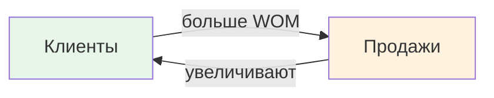
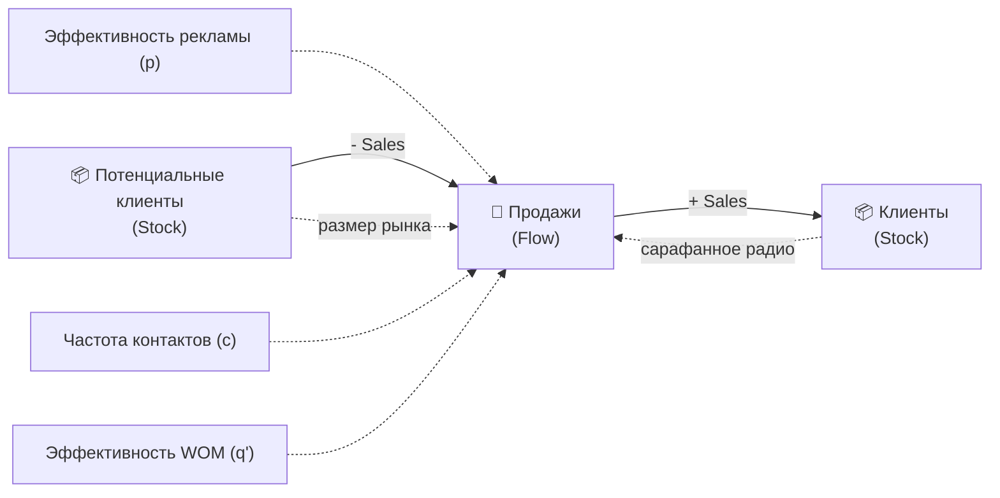
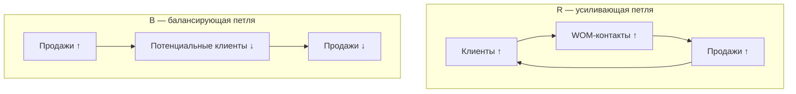

# Системная динамика

> Конспект лекции по курсу «Имитационное моделирование» (НИУ ВШЭ).
> Тема — подход **System Dynamics**: зачем он нужен, из чего состоит и как строить модели.

---

## Зачем это нужно

Системная динамика (System Dynamics, SD) — это подход к моделированию, который работает на **макро- и стратегическом уровне**. Если агентное моделирование смотрит на поведение отдельных «актёров», то системная динамика смотрит на систему целиком — через потоки, накопления и обратные связи.

Подход придумал **Джей Форрестер** (Jay Forrester) в MIT в 1950-х годах. Изначально он применял его для анализа производственных цепочек, а потом метод распространился на самые разные области:

- моделирование **рынков** и диффузии продуктов;
- **социальные системы** (урбанистика, демография);
- **экосистемы** и устойчивое развитие;
- **динамика персонала** в крупных организациях;
- **экономика здравоохранения** (эпидемии, нагрузка на систему).

Главная идея простая: мир полон обратных связей. Если мы хотим понять, почему система ведёт себя контринтуитивно (а она почти всегда так делает на длинном горизонте), нужно явно нарисовать эти петли обратной связи и проследить их во времени.

---

## Основные понятия

В системной динамике вся модель строится из трёх базовых кирпичиков.

### Накопители (Stocks)

> [!NOTE]
> **Накопитель (Stock)** — переменная, которая аккумулирует значение во времени. Это «уровень воды в ванне»: она не меняется мгновенно, а растёт или убывает постепенно.

Примеры накопителей:
- число клиентов компании;
- объём воды в водохранилище;
- количество заражённых в эпидемии;
- уровень знаний сотрудника.

Математически накопитель — это интеграл:

$$
S(t) = S(t_0) + \int_{t_0}^{t} \bigl[\text{входящий поток} - \text{исходящий поток}\bigr]\, d\tau
$$

### Потоки (Flows)

> [!NOTE]
> **Поток (Flow)** — скорость изменения накопителя. Это «кран», через который вода втекает или вытекает из ванны.

Примеры потоков:
- продажи (увеличивают число клиентов);
- отток клиентов (уменьшает число клиентов);
- скорость заражения;
- скорость обучения.

Поток — это производная накопителя:

$$
\frac{dS}{dt} = \text{inflow}(t) - \text{outflow}(t)
$$

### Обратные связи

Самая важная часть. Обратные связи — это замкнутые причинно-следственные цепочки, из-за которых система «живёт своей жизнью».

> [!IMPORTANT]
> Есть два типа петель обратной связи:
>
> - **Усиливающая петля (R — Reinforcing)** — «снежный ком». Рост порождает ещё больший рост (или падение усиливает падение). Пример: чем больше клиентов, тем больше «сарафанного радио», тем больше новых клиентов.
>
> - **Балансирующая петля (B — Balancing)** — «термостат». Система стремится к некоторому равновесию. Пример: чем больше клиентов уже привлечено, тем меньше остаётся потенциальных — рост замедляется.

В реальных моделях петли переплетаются, и именно их взаимодействие определяет поведение системы: S-образный рост, осцилляции, overshooting и т.д.

```mermaid
graph LR
    A[Клиенты] -->|больше WOM| B[Продажи]
    B -->|увеличивают| A
    style A fill:#e8f5e9
    style B fill:#fff3e0
```

---

## Модель Басса

Модель диффузии Басса (Bass Diffusion Model) — это классический пример из системной динамики. Она описывает, как новый продукт распространяется на рынке.

### Структура модели

В модели два накопителя и один поток:

| Элемент | Тип | Описание |
|---------|-----|----------|
| Потенциальные клиенты | Накопитель | Люди, которые ещё не купили продукт |
| Клиенты | Накопитель | Люди, которые уже купили |
| Продажи | Поток | Скорость перехода из потенциальных в клиенты |

```mermaid
flowchart LR
    PC["📦 Потенциальные клиенты
    (Stock)"]
    C["📦 Клиенты
    (Stock)"]
    S["🔄 Продажи
    (Flow)"]

    PC -- "- Sales" --> S
    S -- "+ Sales" --> C

    Ad["Эффективность рекламы (p)"] -.-> S
    Cf["Частота контактов (c)"] -.-> S
    WOM["Эффективность WOM (q')"] -.-> S
    C -.->|"сарафанное радио"| S
    PC -.->|"размер рынка"| S
```

### Формулы

Продажи складываются из двух компонент:

$$
\text{Продажи} = \underbrace{\text{Продажи от рекламы}}_{\text{инновационная компонента}} + \underbrace{\text{Продажи от WOM}}_{\text{имитационная компонента}}
$$

**Продажи от рекламы** — часть потенциальных клиентов, привлечённая напрямую рекламой:

$$
\text{Продажи}_{\text{реклама}} = p \cdot \text{Потенциальные клиенты}
$$

где $p$ — коэффициент эффективности рекламы (коэффициент инновации).

**Продажи от сарафанного радио (WOM)** — потенциальные клиенты, привлечённые через контакт с существующими клиентами:

$$
\text{Продажи}_{\text{WOM}} = c \cdot q' \cdot \text{Потенциальные клиенты} \cdot \frac{\text{Клиенты}}{\text{Потенциальные клиенты} + \text{Клиенты}}
$$

где:
- $c$ — частота контактов между людьми;
- $q'$ — вероятность того, что контакт приведёт к покупке (эффективность WOM).

> [!TIP]
> Дробь $\dfrac{\text{Клиенты}}{\text{Потенциальные клиенты} + \text{Клиенты}}$ — это просто доля клиентов в общей популяции. Она определяет вероятность того, что случайный контакт окажется с кем-то, кто уже купил продукт.

Если обозначить $q = c \cdot q'$, то получаем классическую запись Басса:

$$
\text{Продажи} = p \cdot \text{Потенциальные клиенты} + q \cdot \text{Потенциальные клиенты} \cdot \frac{\text{Клиенты}}{\text{Потенциальные клиенты} + \text{Клиенты}}
$$

### Дифференциальные уравнения

Динамика системы описывается парой связанных ОДУ:

$$
\frac{d(\text{Потенциальные клиенты})}{dt} = -\text{Продажи}
$$

$$
\frac{d(\text{Клиенты})}{dt} = +\text{Продажи}
$$

> [!NOTE]
> Обратите внимание: суммарное население $N = \text{Потенциальные клиенты} + \text{Клиенты}$ остаётся постоянным. Модель описывает **перетекание** людей из одного состояния в другое, а не появление новых.

### Обратные связи в модели Басса

В модели есть обе петли:

- **Петля R (усиливающая):** больше клиентов → больше контактов с потенциальными клиентами → больше продаж от WOM → ещё больше клиентов.
- **Петля B (балансирующая):** больше продаж → меньше потенциальных клиентов → меньше «топлива» для продаж → продажи замедляются.

```mermaid
graph TD
    subgraph "R — усиливающая петля"
        R1[Клиенты ↑] --> R2[WOM-контакты ↑]
        R2 --> R3[Продажи ↑]
        R3 --> R1
    end

    subgraph "B — балансирующая петля"
        B1[Продажи ↑] --> B2[Потенциальные клиенты ↓]
        B2 --> B3[Продажи ↓]
    end
```

Именно взаимодействие этих петель даёт знаменитую **колоколообразную кривую продаж**: сначала рост (доминирует R), потом спад (доминирует B).

---

## Уровни абстракции

Системная динамика работает на **высоком уровне абстракции**. Это принципиально отличает её от агентного или дискретно-событийного моделирования.

| Характеристика | Системная динамика |
|---|---|
| Единица анализа | **Агрегаты** (общее число клиентов, средний уровень запасов) |
| Причинно-следственные связи | **Глобальные** (на уровне всей системы) |
| Время | **Непрерывное** (дифференциальные уравнения) |
| Фокус внимания | **Обратные связи** и их динамика |
| Типичный горизонт | Месяцы, годы, десятилетия |

> [!WARNING]
> Системная динамика **не моделирует отдельных агентов**. Если вам важно, что каждый клиент уникален и принимает решения по-разному — это территория агентного моделирования. SD смотрит на «среднюю температуру по больнице», но зато позволяет увидеть долгосрочные структурные эффекты.

Грубая аналогия: SD — это макроэкономика (ВВП, инфляция, агрегированные потоки), а ABM — микроэкономика (отдельные фирмы и потребители).

---

## Инструменты

Для построения моделей системной динамики существует несколько специализированных пакетов:

| Инструмент | Особенности |
|------------|-------------|
| **Vensim** | Классика SD-моделирования. Бесплатная версия (PLE) для обучения. Мощный язык формул и анализ чувствительности. |
| **Powersim** | Удобный интерфейс, хорошо подходит для бизнес-моделирования. Интеграция с Excel. |
| **iThink / Stella** | Пионер визуального SD-моделирования от isee systems. Интуитивный drag-and-drop интерфейс. |
| **AnyLogic** | **Мультиподходный** инструмент: поддерживает SD, агентное и дискретно-событийное моделирование в одной среде. Можно комбинировать подходы. |

> [!TIP]
> Для учебных целей отлично подходит **Vensim PLE** — он бесплатный и заточен именно под системную динамику. Если же вы хотите комбинировать SD с другими подходами (например, внутри SD-модели рынка запустить агентов-потребителей), то стоит смотреть в сторону **AnyLogic**.

---

## Когда использовать

### Подходит, когда:

- нужно понять **долгосрочную динамику** системы (годы, десятилетия);
- важны **обратные связи** и нелинейные эффекты;
- достаточно работать с **агрегированными показателями** (общее число, средний уровень);
- задача — **стратегический анализ**: «что будет, если мы изменим политику?»;
- данных мало, но есть хорошее **качественное понимание** структуры системы;
- нужно моделировать **непрерывные процессы** (рост населения, диффузию, эпидемии).

### Не подходит, когда:

- важна **гетерогенность** агентов (каждый клиент уникален);
- нужно моделировать **пространственные эффекты** (география, сети);
- система описывается **дискретными событиями** (очереди, конвейеры);
- нужна **детальная операционная оптимизация** (расписание, маршрутизация);
- критична **стохастичность на микроуровне** (SD-модели обычно детерминированы).

> [!IMPORTANT]
> Помните: подходы можно и нужно **комбинировать**. Системная динамика задаёт «большую картину», а агентное или дискретно-событийное моделирование может детализировать отдельные блоки. Инструменты вроде AnyLogic позволяют делать это в рамках одной модели.

---

**Резюме:** системная динамика — это мощный инструмент для стратегического моделирования. Она заставляет явно формулировать обратные связи и помогает понять, почему сложные системы ведут себя контринтуитивно. Модель Басса — отличный пример того, как два простых накопителя и один поток, связанные петлями обратной связи, порождают реалистичную S-образную кривую диффузии продукта.
