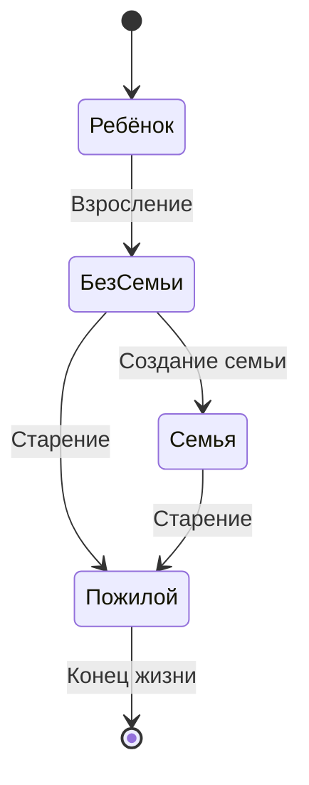
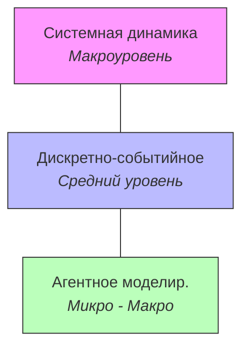

# Агентное моделирование

==Агентное моделирование== (Agent-Based Modeling, ABM) --- подход, который позволяет описывать сложные системы "снизу вверх", задавая поведение каждого отдельного участника.

---

## Зачем это нужно

В агентном моделировании мы описываем **индивидуальные объекты** (агенты) и задаём им **локальные правила поведения**. Иногда модель также включает описание **среды**, в которой агенты существуют и взаимодействуют.

Суть в том, что мы не пишем уравнения для системы в целом --- мы задаём простые правила для каждого агента, а сложное глобальное поведение **возникает само**.

!!! tip "Когда ABM особенно хорош"
    ABM особенно хорош, когда важна **неоднородность** участников: у каждого агента могут быть свои параметры, своя память, своя стратегия.

**Где применяется:**

- **Социальные системы** --- миграция, сегрегация, распространение мнений
- **Эпидемиология** --- моделирование распространения инфекций (каждый человек --- агент)
- **Рынки** --- поведение трейдеров, ценообразование, конкуренция
- **Экосистемы** --- хищник-жертва, эволюция, динамика популяций

**Примеры, которые рядом:**

- **Пандемия COVID-19** --- одни из самых точных прогнозов распространения вируса были получены именно с помощью ABM. Каждый человек --- агент со своим расписанием, контактами, возрастом, иммунитетом. Модель воспроизводила реальные волны заражений, потому что учитывала неоднородность людей, а не усредняла всех в одну формулу.
- **Пробки на дорогах** --- каждый водитель --- агент. Он решает: перестроиться, ускориться, затормозить. Из этих простых решений миллионов водителей рождаются пробки-"фантомы", которые возникают без видимой причины --- ни аварии, ни сужения дороги, просто кто-то чуть притормозил, и волна пошла назад.
- **Соцсети** --- каждый пользователь решает, что лайкнуть и репостнуть. Из этого возникают вирусные тренды, эхо-камеры и поляризация мнений. ABM помогает понять, почему фейковые новости распространяются быстрее настоящих.

---

## Основные понятия

Погнали по ключевым терминам.

| Понятие | Описание |
|---|---|
| **Агент** | Автономная сущность с собственным набором правил поведения. Агент принимает решения на основе своего состояния и информации об окружении. |
| **Среда** | Пространство (дискретное или непрерывное), в котором действуют агенты. Среда может иметь собственные свойства --- рельеф, ресурсы, границы. |
| **Правила поведения** | Локальные правила, определяющие действия агента в каждый момент времени. Например: "если рядом есть еда --- подойди и съешь", "если сосед болен --- заразись с вероятностью $p$". |
| **Эмерджентность** | Глобальное поведение системы, которое **возникает из локальных правил** и не заложено в них явно. Классический пример --- стая птиц: ни одна птица не знает про "стаю", но вместе они формируют слаженную группу. |

!!! note "Эмерджентность"
    ==Эмерджентность== --- пожалуй, самое интересное свойство агентных моделей. Мы задаём простые правила --- а получаем сложное, порой неожиданное поведение на уровне всей системы.

    Каждый муравей следует простым правилам --- иди к еде, оставляй феромон. Но вместе они строят сложные маршруты, мосты из собственных тел и фермы грибов. Никто не планировал --- всё само возникло из простых правил. Ни один муравей не знает "генерального плана" колонии, но колония работает как единый организм. Вот это и есть эмерджентность в чистом виде.

---

## Пример: жизненный цикл

Рассмотрим простой пример агента-человека с несколькими состояниями жизненного цикла. Агент переходит между состояниями по определённым правилам (возраст, события).

Каждый агент в модели проходит через эти состояния **независимо**, но на уровне популяции мы можем наблюдать демографические тренды --- рождаемость, старение населения, размер домохозяйств и т.д.

!!! tip "Эмерджентность в действии"
    Мы нигде не задаём "демографическую кривую" явно. Она **возникает** из индивидуальных переходов каждого агента --- это и есть эмерджентность в действии.

---

## Уровень абстракции

Агентное моделирование охватывает широкий диапазон --- **от микро- до макроуровня**.

**На микроуровне** мы работаем с индивидуальными объектами и задаём точные параметры:

- **Размеры** --- физические габариты агентов
- **Расстояния** --- дистанции между агентами, радиусы взаимодействия
- **Скорости** --- скорость перемещения, скорость реакции
- **Времена** --- длительность действий, задержки

**На макроуровне** из этих деталей складывается картина социальной динамики:

- Распределение богатства в обществе
- Паттерны сегрегации в городе
- Волны эпидемии
- Рыночные пузыри и крахи

!!! warning "Главная сила ABM"
    Именно в этом сила ABM: мы моделируем **простое локальное** поведение, а анализируем **сложное глобальное**. При этом не нужно заранее знать, как устроена макродинамика --- она проявится сама.

---

## Инструменты

Для агентного моделирования существует ряд специализированных платформ и библиотек.

| Инструмент | Описание |
|---|---|
| **Swarm** | Одна из первых библиотек для ABM, разработанная в Santa Fe Institute. Исторически важна, но сейчас используется редко. |
| **RePast** | Среда для агентного моделирования на Java (и Python). Популярна в академических кругах. |
| **NetLogo** | Дружелюбная среда с визуальным интерфейсом. Отлично подходит для обучения и прототипирования. Большая библиотека готовых моделей. |
| **ASCAPE** | Платформа для ABM, часто используется в университетских проектах и исследованиях. |
| **AnyLogic** | Мультиподходная среда моделирования: поддерживает ABM, системную динамику и дискретно-событийное моделирование в одном инструменте. |

!!! tip "Что выбрать"
    Если только начинаете знакомиться с агентным моделированием --- попробуйте **NetLogo**. Там можно буквально за полчаса собрать модель и увидеть результат. А для серьёзных проектов с комбинированием подходов отлично подойдёт **AnyLogic**.

---

## Сравнение с другими подходами

Главное тут --- понять место ABM среди других методов имитационного моделирования.

Если совсем просто: СД --- это вид с вертолёта (потоки и агрегаты, общая картина без деталей). ДСМ --- это конвейер (заявки двигаются по блок-схеме, шаг за шагом). АМ --- это толпа людей, каждый делает своё, а мы смотрим, что получается. Три разных "камеры" для съёмки одной и той же реальности --- выбираешь ту, которая лучше подходит под задачу.

| Характеристика | Системная динамика (SD) | Дискретно-событийное (DES) | Агентное моделирование (ABM) |
|---|---|---|---|
| **Уровень абстракции** | Макроуровень (агрегированные потоки) | Средний / низкий (сущности в процессах) | От микро до макро (индивидуальные агенты) |
| **Базовые элементы** | Накопители, потоки, обратные связи | Заявки, очереди, ресурсы, процессы | Агенты, среда, правила поведения |
| **Типичные приложения** | Стратегическое планирование, экология, макроэкономика | Логистика, производство, сервисные системы | Социальные системы, эпидемиология, рынки, экосистемы |

!!! note "Комбинирование подходов"
    Эти подходы не конкурируют друг с другом --- они **дополняют** друг друга. В реальных проектах часто комбинируют несколько методов. Например, в AnyLogic можно встроить агентную модель внутрь дискретно-событийной, или наоборот.

---

**Короче говоря:** агентное моделирование --- мощный подход, который позволяет строить модели "снизу вверх". Мы задаём простые правила для отдельных агентов и наблюдаем, как из них рождается сложное поведение всей системы. Если нужно учесть неоднородность участников, их индивидуальные стратегии и локальные взаимодействия --- ABM будет отличным выбором.
