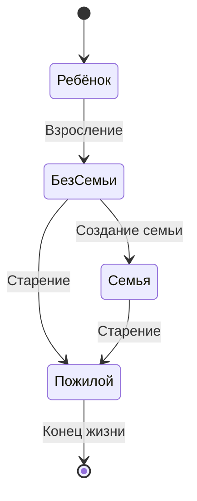
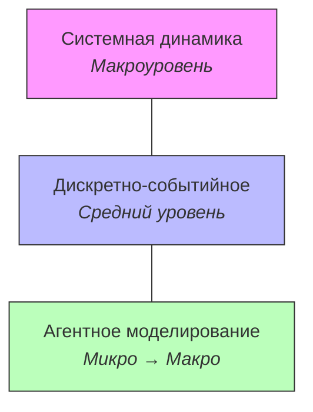

# Агентное моделирование

Привет! В этой лекции мы разберёмся с **агентным моделированием** (Agent-Based Modeling, ABM) — подходом, который позволяет описывать сложные системы «снизу вверх», задавая поведение каждого отдельного участника.

---

## Зачем это нужно

В агентном моделировании мы описываем **индивидуальные объекты** (агенты) и задаём им **локальные правила поведения**. Иногда модель также включает описание **среды**, в которой агенты существуют и взаимодействуют.

Главная идея: мы не пишем уравнения для системы в целом — мы задаём простые правила для каждого агента, а сложное глобальное поведение **возникает само**.

> [!TIP]
> ABM особенно хорош, когда важна **неоднородность** участников: у каждого агента могут быть свои параметры, своя память, своя стратегия.

**Где применяется:**

- **Социальные системы** — миграция, сегрегация, распространение мнений
- **Эпидемиология** — моделирование распространения инфекций (каждый человек — агент)
- **Рынки** — поведение трейдеров, ценообразование, конкуренция
- **Экосистемы** — хищник-жертва, эволюция, динамика популяций

---

## Основные понятия

Давайте разберём ключевые термины, без которых не обойтись.

| Понятие | Описание |
|---|---|
| **Агент** | Автономная сущность с собственным набором правил поведения. Агент принимает решения на основе своего состояния и информации об окружении. |
| **Среда** | Пространство (дискретное или непрерывное), в котором действуют агенты. Среда может иметь собственные свойства — рельеф, ресурсы, границы. |
| **Правила поведения** | Локальные правила, определяющие действия агента в каждый момент времени. Например: «если рядом есть еда — подойди и съешь», «если сосед болен — заразись с вероятностью p». |
| **Эмерджентность** | Глобальное поведение системы, которое **возникает из локальных правил** и не заложено в них явно. Классический пример — стая птиц: ни одна птица не знает про «стаю», но вместе они формируют слаженную группу. |

> [!NOTE]
> Эмерджентность — это, пожалуй, самое интересное свойство агентных моделей. Мы задаём простые правила — а получаем сложное, порой неожиданное поведение на уровне всей системы.

---

## Пример: жизненный цикл

Рассмотрим простой пример агента-человека с несколькими состояниями жизненного цикла. Агент переходит между состояниями по определённым правилам (возраст, события).

Каждый агент в модели проходит через эти состояния **независимо**, но на уровне популяции мы можем наблюдать демографические тренды — рождаемость, старение населения, размер домохозяйств и т.д.

> [!TIP]
> Обратите внимание: мы нигде не задаём «демографическую кривую» явно. Она **возникает** из индивидуальных переходов каждого агента — это и есть эмерджентность в действии.

---

## Уровень абстракции

Агентное моделирование охватывает широкий диапазон — **от микро- до макроуровня**.

**На микроуровне** мы работаем с индивидуальными объектами и задаём точные параметры:

- **Размеры** — физические габариты агентов
- **Расстояния** — дистанции между агентами, радиусы взаимодействия
- **Скорости** — скорость перемещения, скорость реакции
- **Времена** — длительность действий, задержки

**На макроуровне** из этих деталей складывается картина социальной динамики:

- Распределение богатства в обществе
- Паттерны сегрегации в городе
- Волны эпидемии
- Рыночные пузыри и крахи

> [!IMPORTANT]
> Именно в этом сила ABM: мы моделируем **простое локальное** поведение, а анализируем **сложное глобальное**. При этом не нужно заранее знать, как устроена макродинамика — она проявится сама.

---

## Инструменты

Для агентного моделирования существует ряд специализированных платформ и библиотек.

| Инструмент | Описание |
|---|---|
| **Swarm** | Одна из первых библиотек для ABM, разработанная в Santa Fe Institute. Исторически важна, но сейчас используется редко. |
| **RePast** | Среда для агентного моделирования на Java (и Python). Популярна в академических кругах. |
| **NetLogo** | Очень дружелюбная среда с визуальным интерфейсом. Отлично подходит для обучения и прототипирования. Большая библиотека готовых моделей. |
| **ASCAPE** | Платформа для ABM, часто используется в университетских проектах и исследованиях. |
| **AnyLogic** | Мультиподходная среда моделирования: поддерживает ABM, системную динамику и дискретно-событийное моделирование в одном инструменте. |

> [!TIP]
> Если вы только начинаете знакомиться с агентным моделированием — попробуйте **NetLogo**. Там можно буквально за полчаса собрать модель и увидеть результат. А для серьёзных проектов с комбинированием подходов отлично подойдёт **AnyLogic**.

---

## Сравнение с другими подходами

Чтобы лучше понять место ABM среди других методов имитационного моделирования, сравним три основных подхода.

| Характеристика | Системная динамика (SD) | Дискретно-событийное моделирование (DES) | Агентное моделирование (ABM) |
|---|---|---|---|
| **Уровень абстракции** | Макроуровень (агрегированные потоки) | Средний / низкий (отдельные сущности в процессах) | От микро до макро (индивидуальные агенты) |
| **Базовые элементы** | Накопители, потоки, обратные связи | Заявки, очереди, ресурсы, процессы | Агенты, среда, правила поведения |
| **Типичные приложения** | Стратегическое планирование, экология, макроэкономика | Логистика, производство, сервисные системы | Социальные системы, эпидемиология, рынки, экосистемы |

> [!NOTE]
> Эти подходы не конкурируют друг с другом — они **дополняют** друг друга. В реальных проектах часто комбинируют несколько методов. Например, в AnyLogic можно встроить агентную модель внутрь дискретно-событийной, или наоборот.

---

**Подведём итог.** Агентное моделирование — это мощный подход, который позволяет строить модели «снизу вверх». Мы задаём простые правила для отдельных агентов и наблюдаем, как из них рождается сложное поведение всей системы. Если вам нужно учесть неоднородность участников, их индивидуальные стратегии и локальные взаимодействия — ABM будет отличным выбором.
