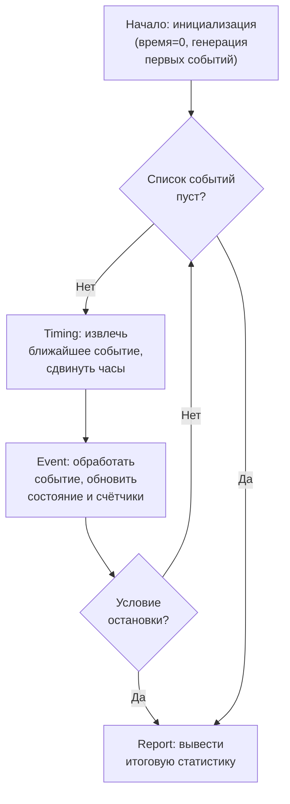
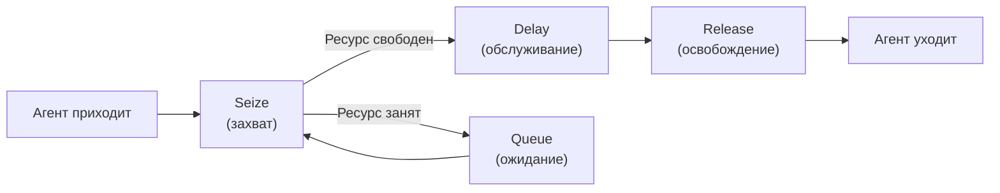
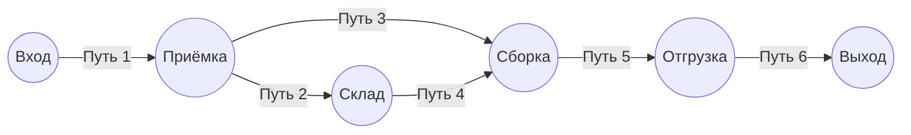
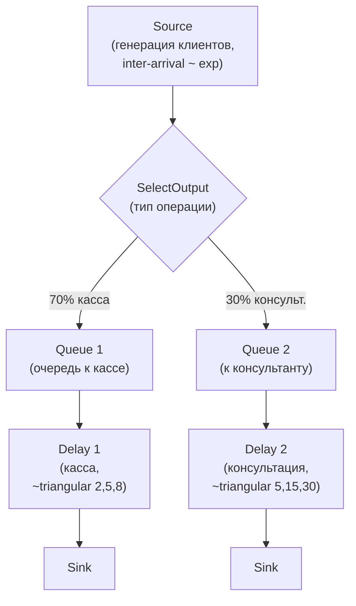

# Дискретно-событийное моделирование

Суть в том, что ==дискретно-событийное моделирование== (Discrete-Event Simulation, DES) — один из самых практичных подходов к имитационному моделированию. Это рабочая лошадка для задач, где нужно смоделировать очереди, потоки заявок, логистику и производство. Погнали.

---

## Зачем это нужно

Дискретно-событийное моделирование применяется на **операционном (микро) уровне**, когда нас интересует детальное поведение системы: как заявки проходят через обслуживание, где возникают узкие места, какой ресурс перегружен.

Типичные области применения:

- **Очереди и системы массового обслуживания** — банки, колл-центры, поликлиники
- **Производство** — конвейеры, сборочные линии, цеха
- **Логистика** — цепочки поставок, распределительные центры
- **Склады** — приёмка, хранение, комплектация заказов
- **Пешеходные потоки** — вокзалы, аэропорты, эвакуация

!!! info "Историческая справка"
    Дискретно-событийное моделирование зародилось в 1960-х годах. Джеффри Гордон (Geoffrey Gordon) из IBM создал язык GPSS (General Purpose Simulation System) — один из первых специализированных языков для имитационного моделирования. Идея оказалась настолько мощной, что DES и сегодня остаётся самым распространённым подходом в практическом моделировании.

---

## Ключевые понятия

### Событие

==Событие== — это мгновенное изменение состояния системы, которое происходит за **нулевое модельное время**. Между событиями система не меняется.

Событие — это точка, в которой что-то меняется. Между событиями система стоит на паузе. Это как кино, снятое не камерой (непрерывно), а фотоаппаратом (только в важные моменты). Время перескакивает от фото к фото. Если клиент зашёл в банк в 10:00, а следующий — в 10:07, то модель не считает ничего для 10:01, 10:02, ..., 10:06. Она просто перепрыгивает сразу к 10:07. Всё интересное происходит только в моменты событий, а между ними — тишина.

Примеры событий:

| Система | Событие |
|---|---|
| Банковское отделение | Клиент приходит в банк |
| Производство | Заканчивается обработка заказа |
| Склад | Уровень материала достигает минимума |
| Колл-центр | Оператор освобождается |
| Аэропорт | Самолёт прибывает на посадочную полосу |

### Дискретное время

В DES модельное время — это **не непрерывная ось**, а последовательность дискретных моментов, в которые происходят события. Между событиями **ничего не происходит**: модельное время просто «перепрыгивает» от одного события к следующему.

Главное тут — принципиальное отличие от непрерывного моделирования (где состояние системы меняется в каждый момент времени) и от агентного моделирования (где агенты действуют параллельно).

```mermaid
gantt
    title Продвижение модельного времени
    dateFormat X
    axisFormat %s

    section События
    Приход кл. 1           :milestone, e1, 0, 0
    Приход кл. 2           :milestone, e2, 5, 5
    Конец обсл. 1          :milestone, e3, 8, 8
    Приход кл. 3           :milestone, e4, 12, 12
    Конец обсл. 2          :milestone, e5, 17, 17

    section Модельное время
    Прыжок 0-5   :active, t1, 0, 5
    Прыжок 5-8   :active, t2, 5, 8
    Прыжок 8-12  :active, t3, 8, 12
    Прыжок 12-17 :active, t4, 12, 17
```

!!! tip "Главная идея"
    Модельное время продвигается не равномерно (как тиканье часов), а скачками — от события к событию. Если ближайшее событие через 5 минут модельного времени, часы сразу перескакивают на 5 минут вперёд. Это делает DES очень эффективным: мы не тратим вычислительные ресурсы на «пустые» промежутки.

### Состояние системы

==Состояние системы== — это набор переменных, которые полностью описывают систему в данный момент модельного времени. Например:

- Число клиентов в очереди
- Статус каждого сервера (свободен / занят)
- Время прихода каждого клиента в очереди

Состояние меняется **только в моменты наступления событий**.

---

## Компоненты ДС-модели

По классификации Лоу (Law, «Simulation Modeling and Analysis»), любая дискретно-событийная модель состоит из следующих компонентов:

| Компонент | Назначение |
|---|---|
| **System state** (состояние системы) | Набор переменных, описывающих систему в текущий момент. Это как "фотография" игрового поля: кто где стоит, что занято, что свободно. |
| **Simulation clock** (модельные часы) | Переменная, хранящая текущее модельное время. Это не настоящие часы, а счётчик: "сейчас в модели 13:42". Он не тикает каждую секунду — он прыгает к моменту следующего события. |
| **Event list** (список событий) | Список запланированных будущих событий с указанием времени наступления. Это стопка карточек "что дальше", отсортированная по времени. Верхняя карточка — ближайшее событие, её и берём. |
| **Statistical counters** (счётчики) | Переменные для накопления статистики (среднее время ожидания, загрузка ресурсов и т.д.). Ведут подсчёт по ходу игры — сколько очков набрано, сколько раундов сыграно. |
| **Initialization routine** (инициализация) | Устанавливает начальное состояние модели (время = 0, пустые очереди и т.д.). Раскладка перед началом партии: обнулить счёт, раздать карты, расставить фигуры. |
| **Timing routine** (продвижение времени) | Определяет ближайшее событие из списка и продвигает модельное время. Это "ведущий", который объявляет: "следующий ход — событие X в момент T". |
| **Event routine** (обработка событий) | Обновляет состояние системы при наступлении события каждого типа. Правила игры: что именно происходит, когда выпала та или иная карточка. |
| **Library routines** (библиотеки) | Генераторы случайных чисел и распределений. Это "кубик" игры — вносит случайность: сколько времени займёт обслуживание, когда придёт следующий клиент. |
| **Report generator** (отчёты) | Вычисляет итоговую статистику и выдаёт результаты. Подводит итоги, как табло счёта после матча: средние, максимумы, загрузка. |
| **Main program** (главная программа) | Управляющая программа, связывающая все компоненты. Это сам "движок" игры, который запускает всё по кругу, пока партия не кончится. |

### Алгоритм продвижения по событиям (next-event time advance)

Короче, вот как работает «главный цикл» любой ДС-модели:

!!! note "На заметку"
    Этот алгоритм — сердце любого DES-движка, будь то AnyLogic, SimPy, Arena или самописная программа. Понимание этого цикла — ключ к пониманию всего дискретно-событийного моделирования.

---

## Библиотека моделирования процессов

В AnyLogic для построения ДС-моделей используется **Библиотека моделирования процессов** (Process Modeling Library). Модель строится как ==блок-схема (flowchart)==, по которой проходят агенты (заявки, клиенты, детали, документы и т.д.).

### Основные блоки

| Блок | Описание |
|---|---|
| **Source** | Генерирует агентов (заявки) и отправляет их в модель. Задаётся интенсивность или расписание прихода. Это дверь, из которой заходят клиенты. |
| **Sink** | Уничтожает агентов, покинувших модель. Конечная точка потока. Это выход — клиент обслужен и ушёл, больше нас не интересует. |
| **Queue** | Очередь ожидания. Агенты ждут, пока не смогут пройти дальше. Можно задать вместимость, приоритеты, время нахождения. Тут ждут — как очередь в столовой. |
| **Delay** | Задержка на заданное время (обслуживание, обработка). Время может быть фиксированным или случайным. Тут обслуживают — это занимает время, и клиент "залипает" здесь, пока не готово. |
| **Hold** | Блокирует поток агентов до выполнения условия. Управляется программно. Это шлагбаум — стоит закрытым, пока кто-то не нажмёт кнопку. |
| **SelectOutput** | Разветвление потока: направляет агента по одному из выходов на основе условия или вероятности. Это развилка — налево в кассу, направо к консультанту. |
| **Conveyor** | Моделирует конвейерную ленту с заданной длиной и скоростью. Лента в суши-баре — тарелки едут с фиксированной скоростью. |
| **Split** | Создаёт копии агента (например, документ порождает несколько задач). Один заказ превращается в несколько подзадач — как пицца, разрезанная на куски. |
| **Combine** | Объединяет два агента в один (например, деталь + упаковка). Обратная операция — собираем бургер из булки и котлеты. |
| **Match** | Ожидает совпадения агентов из двух потоков по заданному условию. Это зона встречи — водитель такси ждёт своего пассажира, пассажир ждёт своё такси. |
| **Batch** | Собирает группу агентов в пакет (batch). Набираем группу туристов на экскурсию — пока не соберётся 10 человек, автобус не поедет. |
| **Unbatch** | Разбивает пакет обратно на отдельных агентов. Автобус приехал — туристы разбрелись кто куда. |
| **Enter** | Точка входа в подпроцесс (для структурирования сложных моделей). |
| **Exit** | Точка выхода из подпроцесса. |

### Параметры блоков

Каждый блок имеет набор параметров, которые можно задавать разными способами:

- **Статические значения** — фиксированные числа или строки (например, вместимость очереди = 10)
- **Динамические выражения** — формулы и ссылки на переменные (например, время обслуживания = `exponential(1.0 / meanServiceTime)`)
- **Исполняемый код** — произвольный Java-код, вызываемый при наступлении определённого условия (например, «при входе агента в блок — записать время прихода»)

!!! tip "Совет"
    Начинайте строить модель с самой простой блок-схемы (Source -> Queue -> Delay -> Sink) и постепенно усложняйте, добавляя ветвления, ресурсы и логику. Так гораздо проще отлаживать.

---

## Агенты и ресурсы

### Агенты

В контексте DES **агент** — это заявка (entity), которая проходит через блок-схему. У каждого агента могут быть свои **свойства** (параметры), которые определяются графически в среде AnyLogic:

- Тип клиента (VIP / обычный)
- Время прихода
- Требуемая услуга
- Приоритет обслуживания
- Любые пользовательские атрибуты

Агенты создаются блоком **Source** и уничтожаются блоком **Sink**. По пути они могут менять свои свойства, разветвляться, объединяться.

### Ресурсы

==Ресурсы== — это то, что агенты используют для обслуживания (сотрудники, оборудование, транспорт). В AnyLogic есть три типа ресурсов:

| Тип ресурса | Описание | Пример |
|---|---|---|
| **Статический (static)** | Привязан к фиксированному местоположению | Кассовый аппарат, станок |
| **Переносной (movable)** | Может перемещаться вместе с агентом, но сам не имеет маршрута | Набор инструментов, тележка |
| **Движущийся (moving)** | Самостоятельно перемещается по сети | Сотрудник, погрузчик, робот |

### Управление ресурсами

Работа с ресурсами включает:

- **Захват (seize)** — агент запрашивает и занимает ресурс
- **Освобождение (release)** — агент отпускает ресурс после использования
- **Вытеснение (preemption)** — высокоприоритетный агент может отобрать ресурс у менее приоритетного
- **Перерывы (breaks)** — ресурсы могут уходить на перерыв по расписанию
- **Техобслуживание (maintenance)** — плановые остановки оборудования

!!! warning "Важно"
    Правильное управление ресурсами — ключ к реалистичной модели. Не забывайте про перерывы и обслуживание: они сильно влияют на пропускную способность системы.

---

## Транспортные сети и склады

### Транспортные сети

Для моделирования перемещения агентов и ресурсов в пространстве используются **транспортные сети**. Сеть состоит из:

- **Узлы (nodes)** — точки, где агенты могут останавливаться, менять направление, обслуживаться
- **Пути (paths)** — соединения между узлами с заданной длиной и скоростью движения

Транспортные сети позволяют:

- Моделировать реальную планировку помещений
- Учитывать расстояния и время перемещения
- Визуализировать движение в 2D и 3D
- Обнаруживать «пробки» и заторы

### Складское моделирование

Для моделирования складских операций в AnyLogic предусмотрены специализированные блоки:

| Блок | Назначение |
|---|---|
| **RackSystem** | Описывает физическую структуру стеллажной системы: количество стеллажей, полок, ячеек, размеры |
| **RackStore** | Операция размещения товара в ячейку стеллажа (put-away) |
| **RackPick** | Операция извлечения товара из ячейки стеллажа (picking) |

С помощью этих блоков можно моделировать:

- Приёмку и размещение товаров
- Комплектацию заказов
- Оптимизацию маршрутов комплектовщиков
- Анализ заполненности стеллажей

!!! tip "Практика"
    Складское моделирование — одна из самых востребованных областей DES. Если хотите применить имитационное моделирование на практике, начните с задач складской логистики: данные обычно доступны, а эффект от оптимизации — ощутимый.

---

## Пример: отделение банка

Классический пример — модель банковского отделения. Клиенты приходят, выбирают тип операции и обслуживаются у соответствующего окна.

### Блок-схема модели

### Пошаговый разбор: как это работает

Давай проследим за первыми клиентами руками, чтобы почувствовать механику.

**0:00** — Модель стартует. Очереди пусты, кассир и консультант свободны. Список событий содержит одну карточку: "приход первого клиента в 1:12".

**1:12** — Часы прыгают к 1:12. Заходит клиент 1. SelectOutput бросает "кубик" — выпало "касса" (70% шанс). Кассир свободен? Да. Клиент 1 садится к кассиру. Модель планирует новое событие: "конец обслуживания клиента 1 в 5:48" (время обслуживания вытянуто из треугольного распределения). Заодно планируется приход следующего клиента — "клиент 2 в 2:42".

**2:42** — Часы прыгают к 2:42. Заходит клиент 2, попадает на "консультацию" (30%). Консультант свободен — клиент 2 идёт к нему. Планируется конец консультации в 14:10.

**3:06** — Заходит клиент 3, попадает на кассу. Но кассир занят клиентом 1. Клиент 3 встаёт в очередь Queue 1 и ждёт.

**5:48** — Кассир заканчивает обслуживание клиента 1. Клиент 1 уходит в Sink. Очередь не пуста — в ней стоит клиент 3. Он сразу садится к кассиру. Планируется конец его обслуживания.

Видишь паттерн? Модель не считает каждую секунду. Она прыгает от события к событию, каждый раз спрашивая: "что изменилось? кто свободен? кто ждёт?" Именно так и работает DES — элегантно и экономно.

### Что можно исследовать

С помощью этой модели можно ответить на вопросы:

1. **Какова средняя длина очереди** к каждому окну?
2. **Какое среднее время ожидания** клиента?
3. **Какова загрузка** кассиров и консультантов?
4. **Что будет, если** добавить ещё одного кассира?
5. **Что будет, если** поток клиентов вырастет на 20%?

### Ход моделирования (трассировка событий)

| Модельное время | Событие | Состояние |
|---|---|---|
| 0.0 | Инициализация | Очереди пусты, все свободны |
| 1.2 | Приход клиента 1 (касса) | Касса свободна — начало обслуживания |
| 2.7 | Приход клиента 2 (консультант) | Консультант свободен — начало обслуживания |
| 3.1 | Приход клиента 3 (касса) | Касса занята — клиент встаёт в очередь |
| 5.8 | Конец обслуживания клиента 1 | Касса освобождается — берёт клиента 3 |
| 8.4 | Конец обслуживания клиента 3 | Касса свободна, очередь пуста |
| 14.1 | Конец обслуживания клиента 2 | Консультант свободен |

!!! note "Обратите внимание"
    Модельное время прыгает от события к событию: $0.0 \to 1.2 \to 2.7 \to 3.1 \to 5.8 \to \ldots$ Между событиями ничего не вычисляется — это и есть суть дискретно-событийного подхода.

---

## Итоги

| Характеристика | Дискретно-событийное моделирование |
|---|---|
| **Уровень** | Операционный, микро |
| **Время** | Дискретное, продвижение по событиям |
| **Основная единица** | Событие (мгновенное изменение состояния) |
| **Типичные задачи** | Очереди, производство, логистика, склады |
| **Инструменты** | AnyLogic, Arena, SimPy, GPSS |
| **Сильные стороны** | Детальность, точность, возможность анализа «что если» |
| **Ограничения** | Большой объём входных данных, сложность валидации |

!!! success "Главное"
    DES — это подход, при котором модельное время перескакивает от события к событию, а состояние системы меняется только в эти дискретные моменты. Всё остальное — блоки, ресурсы, очереди — это надстройки, делающие моделирование удобным.
