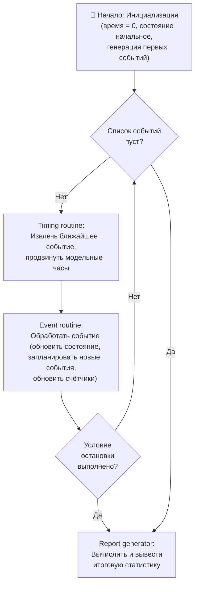
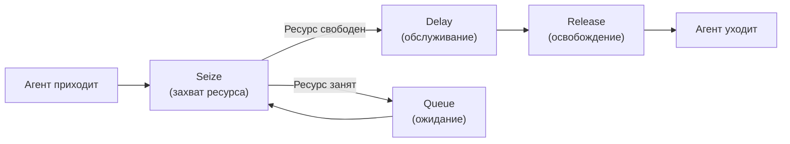
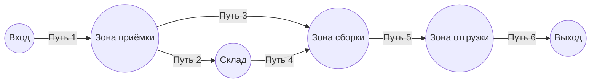
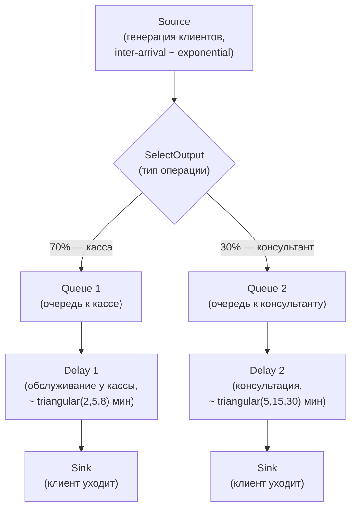

# Дискретно-событийное моделирование

Привет! Сегодня разберёмся с одним из самых практичных подходов к имитационному моделированию — **дискретно-событийным моделированием** (Discrete-Event Simulation, DES). Это рабочая лошадка для всех задач, где нужно смоделировать очереди, потоки заявок, логистику и производство. Поехали!

---

## Зачем это нужно

Дискретно-событийное моделирование применяется на **операционном (микро) уровне**, когда нас интересует детальное поведение системы: как заявки проходят через обслуживание, где возникают узкие места, какой ресурс перегружен.

Типичные области применения:

- **Очереди и системы массового обслуживания** — банки, колл-центры, поликлиники
- **Производство** — конвейеры, сборочные линии, цеха
- **Логистика** — цепочки поставок, распределительные центры
- **Склады** — приёмка, хранение, комплектация заказов
- **Пешеходные потоки** — вокзалы, аэропорты, эвакуация

> **Историческая справка.** Дискретно-событийное моделирование зародилось в 1960-х годах. Джеффри Гордон (Geoffrey Gordon) из IBM создал язык GPSS (General Purpose Simulation System) — один из первых специализированных языков для имитационного моделирования. Идея оказалась настолько мощной, что DES и сегодня остаётся самым распространённым подходом в практическом моделировании.

---

## Ключевые понятия

### Событие

**Событие** — это мгновенное изменение состояния системы, которое происходит за **нулевое модельное время**. Между событиями система не меняется.

Примеры событий:

| Система | Событие |
|---|---|
| Банковское отделение | Клиент приходит в банк |
| Производство | Заканчивается обработка заказа |
| Склад | Уровень материала достигает минимума |
| Колл-центр | Оператор освобождается |
| Аэропорт | Самолёт прибывает на посадочную полосу |

### Дискретное время

В DES модельное время — это **не непрерывная ось**, а последовательность дискретных моментов, в которые происходят события. Между событиями **ничего не происходит**: модельное время просто «перепрыгивает» от одного события к следующему.

Это принципиальное отличие от непрерывного моделирования (где состояние системы меняется в каждый момент времени) и от агентного моделирования (где агенты действуют параллельно).

```mermaid
gantt
    title Продвижение модельного времени (next-event time advance)
    dateFormat X
    axisFormat %s

    section События
    Приход клиента 1       :milestone, e1, 0, 0
    Приход клиента 2       :milestone, e2, 5, 5
    Конец обслуживания 1   :milestone, e3, 8, 8
    Приход клиента 3       :milestone, e4, 12, 12
    Конец обслуживания 2   :milestone, e5, 17, 17

    section Модельное время
    Прыжок 0→5   :active, t1, 0, 5
    Прыжок 5→8   :active, t2, 5, 8
    Прыжок 8→12  :active, t3, 8, 12
    Прыжок 12→17 :active, t4, 12, 17
```

> **Главная идея.** Модельное время продвигается не равномерно (как тиканье часов), а скачками — от события к событию. Если ближайшее событие через 5 минут модельного времени, часы сразу перескакивают на 5 минут вперёд. Это делает DES очень эффективным: мы не тратим вычислительные ресурсы на «пустые» промежутки.

### Состояние системы

**Состояние системы** — это набор переменных, которые полностью описывают систему в данный момент модельного времени. Например:

- Число клиентов в очереди
- Статус каждого сервера (свободен / занят)
- Время прихода каждого клиента в очереди

Состояние меняется **только в моменты наступления событий**.

---

## Компоненты ДС-модели

По классификации Лоу (Law, «Simulation Modeling and Analysis»), любая дискретно-событийная модель состоит из следующих компонентов:

| Компонент | Назначение |
|---|---|
| **System state** (состояние системы) | Набор переменных, описывающих систему в текущий момент |
| **Simulation clock** (модельные часы) | Переменная, хранящая текущее модельное время |
| **Event list** (список событий) | Список запланированных будущих событий с указанием времени наступления |
| **Statistical counters** (статистические счётчики) | Переменные для накопления статистики (среднее время ожидания, загрузка ресурсов и т.д.) |
| **Initialization routine** (подпрограмма инициализации) | Устанавливает начальное состояние модели (время = 0, пустые очереди и т.д.) |
| **Timing routine** (подпрограмма продвижения времени) | Определяет ближайшее событие из списка и продвигает модельное время |
| **Event routine** (подпрограмма обработки событий) | Обновляет состояние системы при наступлении события каждого типа |
| **Library routines** (библиотечные подпрограммы) | Генераторы случайных чисел и распределений |
| **Report generator** (генератор отчётов) | Вычисляет итоговую статистику и выдаёт результаты |
| **Main program** (главная программа) | Управляющая программа, связывающая все компоненты |

### Алгоритм продвижения по событиям (next-event time advance)

Вот как работает «главный цикл» любой ДС-модели:

```mermaid
flowchart TD
    A["🏁 Начало: Инициализация
    (время = 0, состояние начальное,
    генерация первых событий)"]
    B{"Список событий
    пуст?"}
    C["Timing routine:
    Извлечь ближайшее событие,
    продвинуть модельные часы"]
    D["Event routine:
    Обработать событие
    (обновить состояние,
    запланировать новые события,
    обновить счётчики)"]
    E{"Условие
    остановки
    выполнено?"}
    F["Report generator:
    Вычислить и вывести
    итоговую статистику"]

    A --> B
    B -- Нет --> C
    C --> D
    D --> E
    E -- Нет --> B
    E -- Да --> F
    B -- Да --> F
```

> **На заметку.** Этот алгоритм — сердце любого DES-движка, будь то AnyLogic, SimPy, Arena или самописная программа. Понимание этого цикла — ключ к пониманию всего дискретно-событийного моделирования.

---

## Библиотека моделирования процессов

В AnyLogic для построения ДС-моделей используется **Библиотека моделирования процессов** (Process Modeling Library). Модель строится как **блок-схема (flowchart)**, по которой проходят агенты (заявки, клиенты, детали, документы и т.д.).

### Основные блоки

| Блок | Описание |
|---|---|
| **Source** | Генерирует агентов (заявки) и отправляет их в модель. Задаётся интенсивность или расписание прихода. |
| **Sink** | Уничтожает агентов, покинувших модель. Конечная точка потока. |
| **Queue** | Очередь ожидания. Агенты ждут, пока не смогут пройти дальше. Можно задать вместимость, приоритеты, время нахождения. |
| **Delay** | Задержка на заданное время (обслуживание, обработка). Время может быть фиксированным или случайным. |
| **Hold** | Блокирует поток агентов до выполнения условия. Управляется программно. |
| **SelectOutput** | Разветвление потока: направляет агента по одному из выходов на основе условия или вероятности. |
| **Conveyor** | Моделирует конвейерную ленту с заданной длиной и скоростью. |
| **Split** | Создаёт копии агента (например, документ порождает несколько задач). |
| **Combine** | Объединяет два агента в один (например, деталь + упаковка). |
| **Match** | Ожидает совпадения агентов из двух потоков по заданному условию. |
| **Batch** | Собирает группу агентов в пакет (batch). |
| **Unbatch** | Разбивает пакет обратно на отдельных агентов. |
| **Enter** | Точка входа в подпроцесс (для структурирования сложных моделей). |
| **Exit** | Точка выхода из подпроцесса. |

### Параметры блоков

Каждый блок имеет набор параметров, которые можно задавать разными способами:

- **Статические значения** — фиксированные числа или строки (например, вместимость очереди = 10)
- **Динамические выражения** — формулы и ссылки на переменные (например, время обслуживания = `exponential(1.0 / meanServiceTime)`)
- **Исполняемый код** — произвольный Java-код, вызываемый при наступлении определённого условия (например, «при входе агента в блок — записать время прихода»)

> **Совет.** Начинайте строить модель с самой простой блок-схемы (Source -> Queue -> Delay -> Sink) и постепенно усложняйте, добавляя ветвления, ресурсы и логику. Так гораздо проще отлаживать!

---

## Агенты и ресурсы

### Агенты

В контексте DES **агент** — это заявка (entity), которая проходит через блок-схему. У каждого агента могут быть свои **свойства** (параметры), которые определяются графически в среде AnyLogic:

- Тип клиента (VIP / обычный)
- Время прихода
- Требуемая услуга
- Приоритет обслуживания
- Любые пользовательские атрибуты

Агенты создаются блоком **Source** и уничтожаются блоком **Sink**. По пути они могут менять свои свойства, разветвляться, объединяться.

### Ресурсы

**Ресурсы** — это то, что агенты используют для обслуживания (сотрудники, оборудование, транспорт). В AnyLogic есть три типа ресурсов:

| Тип ресурса | Описание | Пример |
|---|---|---|
| **Статический (static)** | Привязан к фиксированному местоположению | Кассовый аппарат, станок |
| **Переносной (movable)** | Может перемещаться вместе с агентом, но сам не имеет маршрута | Набор инструментов, тележка |
| **Движущийся (moving)** | Самостоятельно перемещается по сети | Сотрудник, погрузчик, робот |

### Управление ресурсами

Работа с ресурсами включает:

- **Захват (seize)** — агент запрашивает и занимает ресурс
- **Освобождение (release)** — агент отпускает ресурс после использования
- **Вытеснение (preemption)** — высокоприоритетный агент может отобрать ресурс у менее приоритетного
- **Перерывы (breaks)** — ресурсы могут уходить на перерыв по расписанию
- **Техническое обслуживание (maintenance)** — плановые остановки оборудования

```mermaid
flowchart LR
    A[Агент приходит] --> B["Seize
    (захват ресурса)"]
    B -->|Ресурс свободен| C["Delay
    (обслуживание)"]
    B -->|Ресурс занят| D["Queue
    (ожидание)"]
    D --> B
    C --> E["Release
    (освобождение)"]
    E --> F[Агент уходит]
```

> **Важно.** Правильное управление ресурсами — ключ к реалистичной модели. Не забывайте про перерывы и обслуживание: они сильно влияют на пропускную способность системы!

---

## Транспортные сети и склады

### Транспортные сети

Для моделирования перемещения агентов и ресурсов в пространстве используются **транспортные сети**. Сеть состоит из:

- **Узлы (nodes)** — точки, где агенты могут останавливаться, менять направление, обслуживаться
- **Пути (paths)** — соединения между узлами с заданной длиной и скоростью движения

```mermaid
graph LR
    N1((Вход)) -->|Путь 1| N2((Зона приёмки))
    N2 -->|Путь 2| N3((Склад))
    N2 -->|Путь 3| N4((Зона сборки))
    N3 -->|Путь 4| N4
    N4 -->|Путь 5| N5((Зона отгрузки))
    N5 -->|Путь 6| N6((Выход))
```

Транспортные сети позволяют:

- Моделировать реальную планировку помещений
- Учитывать расстояния и время перемещения
- Визуализировать движение в 2D и 3D
- Обнаруживать «пробки» и заторы

### Складское моделирование

Для моделирования складских операций в AnyLogic предусмотрены специализированные блоки:

| Блок | Назначение |
|---|---|
| **RackSystem** | Описывает физическую структуру стеллажной системы: количество стеллажей, полок, ячеек, размеры |
| **RackStore** | Операция размещения товара в ячейку стеллажа (put-away) |
| **RackPick** | Операция извлечения товара из ячейки стеллажа (picking) |

С помощью этих блоков можно моделировать:

- Приёмку и размещение товаров
- Комплектацию заказов
- Оптимизацию маршрутов комплектовщиков
- Анализ заполненности стеллажей

> **Практика.** Складское моделирование — одна из самых востребованных областей DES. Если вы хотите применить имитационное моделирование на практике, начните с задач складской логистики: данные обычно доступны, а эффект от оптимизации — ощутимый.

---

## Пример: отделение банка

Рассмотрим классический пример — модель банковского отделения. Клиенты приходят, выбирают тип операции и обслуживаются у соответствующего окна.

### Блок-схема модели

```mermaid
flowchart TD
    SRC["Source
    (генерация клиентов,
    inter-arrival ~ exponential)"]
    SEL{"SelectOutput
    (тип операции)"}
    Q1["Queue 1
    (очередь к кассе)"]
    Q2["Queue 2
    (очередь к консультанту)"]
    D1["Delay 1
    (обслуживание у кассы,
    ~ triangular(2,5,8) мин)"]
    D2["Delay 2
    (консультация,
    ~ triangular(5,15,30) мин)"]
    SNK1["Sink
    (клиент уходит)"]
    SNK2["Sink
    (клиент уходит)"]

    SRC --> SEL
    SEL -->|"70% — касса"| Q1
    SEL -->|"30% — консультант"| Q2
    Q1 --> D1
    Q2 --> D2
    D1 --> SNK1
    D2 --> SNK2
```

### Что можно исследовать

С помощью этой модели можно ответить на вопросы:

1. **Какова средняя длина очереди** к каждому окну?
2. **Какое среднее время ожидания** клиента?
3. **Какова загрузка** кассиров и консультантов?
4. **Что будет, если** добавить ещё одного кассира?
5. **Что будет, если** поток клиентов вырастет на 20%?

### Ход моделирования (трассировка событий)

| Модельное время | Событие | Состояние |
|---|---|---|
| 0.0 | Инициализация | Очереди пусты, все свободны |
| 1.2 | Приход клиента 1 (касса) | Касса свободна → начало обслуживания |
| 2.7 | Приход клиента 2 (консультант) | Консультант свободен → начало обслуживания |
| 3.1 | Приход клиента 3 (касса) | Касса занята → клиент встаёт в очередь |
| 5.8 | Конец обслуживания клиента 1 | Касса освобождается → берёт клиента 3 |
| 8.4 | Конец обслуживания клиента 3 | Касса свободна, очередь пуста |
| 14.1 | Конец обслуживания клиента 2 | Консультант свободен |

> **Обратите внимание**, как модельное время прыгает от события к событию: 0.0 → 1.2 → 2.7 → 3.1 → 5.8 → ... Между событиями ничего не вычисляется — это и есть суть дискретно-событийного подхода!

---

## Итоги

Давайте подведём итог:

| Характеристика | Дискретно-событийное моделирование |
|---|---|
| **Уровень** | Операционный, микро |
| **Время** | Дискретное, продвижение по событиям |
| **Основная единица** | Событие (мгновенное изменение состояния) |
| **Типичные задачи** | Очереди, производство, логистика, склады |
| **Инструменты** | AnyLogic, Arena, SimPy, GPSS |
| **Сильные стороны** | Детальность, точность, возможность анализа «что если» |
| **Ограничения** | Большой объём входных данных, сложность валидации |

> **Главное, что нужно запомнить.** DES — это подход, при котором модельное время перескакивает от события к событию, а состояние системы меняется только в эти дискретные моменты. Всё остальное — блоки, ресурсы, очереди — это надстройки, делающие моделирование удобным.

Удачи в моделировании!
