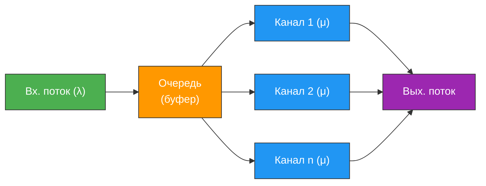
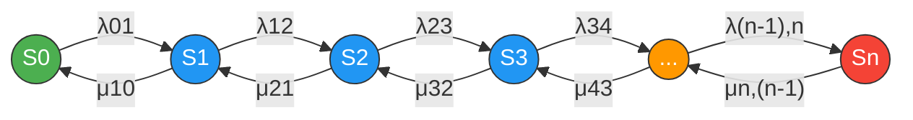
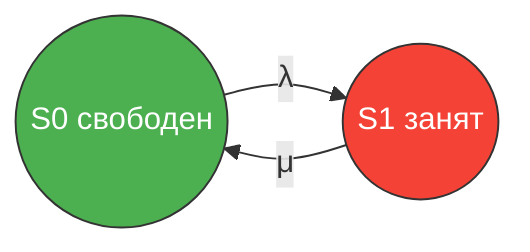
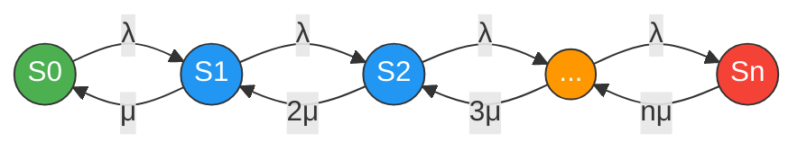
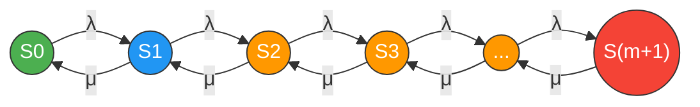

# Основы теории массового обслуживания

**Теория массового обслуживания** (ТМО) — мощный математический аппарат для проектирования и оптимизации самых разных систем: от банковских отделений до серверных кластеров. Погнали разбираться.

---

## Зачем это нужно

Суть в том, что ТМО отвечает на конкретные вопросы: сколько касс открыть, чтобы среднее ожидание не превышало 5 минут? Сколько операторов нанять, чтобы не более 2% звонков оставались без ответа?

Основоположником ТМО считается датский инженер **Агнер Краруп Эрланг** (A.K. Erlang), который в **1909 году** опубликовал первую работу по анализу телефонных сетей. Сам термин **«теория массового обслуживания»** был предложен выдающимся советским математиком **А.Я. Хинчиным**.

Где применяется ТМО на практике:

- **Банки и сервисные центры** — оптимальное число окон/касс
- **Телекоммуникации** — расчёт пропускной способности каналов связи
- **Больницы** — планирование числа коек, врачей, операционных
- **Производство** — организация конвейерных линий, складская логистика
- **IT-системы** — балансировка нагрузки на серверы, проектирование очередей сообщений

!!! info "Ключевая идея"
    ТМО изучает системы, в которых **заявки** (клиенты, запросы, вызовы) поступают **случайным образом** и обслуживаются одним или несколькими **каналами** (серверами, кассами, операторами). Цель — найти оптимальный баланс между качеством обслуживания и затратами на содержание системы.

---

## Структура СМО

Любая СМО — это по сути «вход -> ожидание -> обслуживание -> выход». Стоматология, касса в магазине, сервер обрабатывающий запросы — все это СМО. Разница лишь в деталях: сколько каналов, есть ли очередь, с какой скоростью приходят заявки.

Любая ==система массового обслуживания== (СМО) состоит из четырёх основных элементов:

1. **Входящий поток заявок** — клиенты (или запросы), поступающие в систему случайным образом с некоторой интенсивностью $\lambda$
2. **Очередь** — буфер, в котором заявки ожидают обслуживания (может быть ограниченной или бесконечной длины)
3. **Каналы обслуживания** — устройства или люди, которые непосредственно обрабатывают заявки (каждый канал имеет интенсивность обслуживания $\mu$)
4. **Выходящий поток** — обслуженные заявки, покидающие систему

!!! note "Обрати внимание"
    В зависимости от типа СМО, заявка, заставшая все каналы занятыми, может либо **встать в очередь**, либо **получить отказ** и покинуть систему необслуженной.

---

## Показатели эффективности

Чтобы оценить, насколько хорошо работает СМО, используют различные **показатели эффективности**. Их удобно разделить на три группы.

### Группа 1: Показатели загрузки системы

| Показатель | Обозначение | Описание |
|---|---|---|
| **Абсолютная пропускная способность** | $A$ | Среднее число заявок, обслуживаемых в единицу времени |
| **Относительная пропускная способность** | $Q$ | Доля поступивших заявок, которые будут обслужены: $Q = \frac{A}{\lambda}$ |
| **Коэффициент загрузки** | $\rho$ | Средняя доля времени, в течение которого каналы заняты обслуживанием |

### Группа 2: Показатели качества обслуживания

| Показатель | Обозначение | Описание |
|---|---|---|
| **Среднее время ожидания в очереди** | $T_{\text{оч}}$ | Сколько в среднем заявка проводит в очереди |
| **Среднее время пребывания в системе** | $T_{\text{сист}}$ | Полное время от поступления до завершения: $T_{\text{сист}} = T_{\text{оч}} + T_{\text{обс}}$ |
| **Вероятность отказа** | $P_{\text{отк}}$ | Вероятность того, что поступившая заявка не будет обслужена |
| **Средняя длина очереди** | $L_{\text{оч}}$ | Среднее число заявок, ожидающих в очереди |

### Группа 3: Показатели пары «система -- клиент»

| Показатель | Описание |
|---|---|
| **Средний доход в единицу времени** | Экономический показатель, учитывающий прибыль от обслуживания и потери от отказов/ожидания |

!!! tip "Совет"
    При проектировании СМО обычно стремятся найти **компромисс**: слишком мало каналов — длинные очереди и недовольные клиенты; слишком много каналов — высокие затраты на их содержание при низкой загрузке.

---

## Классификация СМО

Системы массового обслуживания классифицируют по нескольким признакам:

### По числу каналов

- **Одноканальные** — один обслуживающий прибор (одна касса, один сервер)
- **Многоканальные** — несколько параллельно работающих приборов

### По дисциплине обслуживания

- **С отказами** — заявка, заставшая все каналы занятыми, покидает систему (получает отказ). Представь: звонишь в такси, все машины заняты — «перезвоните позже». Заявка потеряна.
- **С ожиданием (очередью)** — заявка встаёт в очередь и ждёт освобождения канала (очередь может быть ограниченной или неограниченной). Очередь в поликлинику — стоишь сколько надо, но в итоге попадёшь.
- **Смешанные** — заявка ждёт ограниченное время, после чего покидает систему. Очередь в МФЦ с талончиком — если прождал больше часа, уходишь.

### По источнику заявок

- **Открытые** — поток заявок не зависит от состояния системы (источник бесконечный)
- **Замкнутые** — число потенциальных заявок ограничено (например, ремонтная бригада обслуживает фиксированный парк станков)

### По числу фаз

- **Однофазные** — обслуживание в один этап
- **Многофазные** — обслуживание проходит несколько последовательных этапов

| Признак | Варианты |
|---|---|
| Число каналов | Одноканальная / Многоканальная |
| Дисциплина обслуживания | С отказами / С ожиданием / Смешанная |
| Источник заявок | Открытая / Замкнутая |
| Число фаз | Однофазная / Многофазная |

---

## Потоки событий

**Поток событий** — это последовательность однородных событий, происходящих одно за другим в случайные моменты времени (например, приход клиентов в магазин). Поток характеризуется **интенсивностью** $\lambda$ — средним числом событий в единицу времени.

### Свойства потоков

Выделяют три ключевых свойства:

**1. Стационарность (стационарный поток)**

Вероятность появления $m$ событий на интервале длиной $\tau$ зависит только от длины интервала $\tau$ и не зависит от того, где именно на временной оси расположен этот интервал. Короче, интенсивность потока **не меняется со временем**.

По-простому: утром и вечером клиенты приходят с одинаковой частотой. В реальности такое бывает редко (вспомни час пик в метро), но как модельное допущение — работает отлично.

**2. Отсутствие последействия (поток без последействия)**

Число событий, попадающих на любой интервал времени, **не зависит** от числа событий на любом другом, не пересекающемся с ним интервале. Прошлое не влияет на будущее.

Аналогия: тот факт, что последние 5 минут в магазин никто не заходил, не означает, что «ну сейчас-то точно кто-то придёт». Поток не помнит, что было раньше. Каждый момент времени — как с чистого листа.

**3. Ординарность (ординарный поток)**

Вероятность одновременного появления двух или более событий в один и тот же момент времени пренебрежимо мала.

Проще говоря, клиенты приходят по одному, а не толпой. В дверь магазина не вваливаются одновременно трое — они заходят друг за другом, пусть и с маленькими интервалами.

!!! success "Простейший (пуассоновский) поток"
    Поток, обладающий **всеми тремя** свойствами — стационарностью, отсутствием последействия и ординарностью — называется ==простейшим== (или ==пуассоновским==) потоком. Это самая удобная и часто используемая модель в ТМО.

    Если все три условия выполняются одновременно — получаем простейший поток. Это как нормальное распределение в статистике — базовый, отправной случай. Реальные потоки сложнее, но начинать анализ почти всегда стоит с него.

### Распределение Пуассона

Для простейшего потока с интенсивностью $\lambda$ вероятность того, что за время $\tau$ произойдёт ровно $m$ событий, определяется **формулой Пуассона**:

$$
P_m(\tau) = \frac{(\lambda\tau)^m}{m!} \, e^{-\lambda\tau}
$$

где:

- $\lambda$ — интенсивность потока (среднее число событий в единицу времени)
- $\tau$ — длина рассматриваемого интервала времени
- $m$ — число событий ($m = 0, 1, 2, \ldots$)

### Экспоненциальное распределение

Время между соседними событиями в простейшем потоке имеет **показательное (экспоненциальное) распределение** с функцией распределения:

$$
F(t) = 1 - e^{-\lambda t}
$$

и плотностью:

$$
f(t) = \lambda \, e^{-\lambda t}, \quad t \geq 0
$$

!!! info "Свойство отсутствия памяти"
    Показательное распределение обладает замечательным свойством **отсутствия памяти**: если уже прождали время $s$, то вероятность прождать ещё время $t$ такая же, как если бы только начали ждать. Формально: $P(T > s + t \mid T > s) = P(T > t)$.

---

## Марковские процессы

==Марковский процесс== — это случайный процесс, в котором будущее зависит от прошлого **только через настоящее**. Если мы знаем текущее состояние системы, то для предсказания будущего нам не нужна информация о том, как система пришла в это состояние.

Формально: вероятность перехода системы в любое будущее состояние зависит только от **текущего состояния** и не зависит от предыстории.

Хорошая аналогия для понимания: шахматы — это **НЕ** марковский процесс. Одна и та же позиция на доске может быть выигрышной или проигрышной в зависимости от того, КАК в неё пришли (квалификация игроков, предыдущие ходы, психологическое состояние). А вот количество клиентов в очереди — марковский процесс: неважно, как набралось 5 человек в очереди (пришли ли они за последнюю минуту или копились полчаса), дальше система ведёт себя одинаково — важно лишь то, что сейчас их ровно 5.

### Примеры

**Марковский процесс:**

- Блуждание частицы, где следующий шаг зависит только от текущей позиции
- СМО с простейшими потоками заявок и экспоненциальным временем обслуживания
- Число клиентов в банке, если приход и уход описываются пуассоновскими потоками

**Не марковский процесс:**

- Система, где время обслуживания распределено по нормальному закону (а не по экспоненциальному)
- Процесс, в котором интенсивность поступления заявок зависит от времени суток (нестационарный поток)
- Очередь, в которой приоритет зависит от того, сколько раз клиент уже обращался ранее

!!! warning "Важная связь"
    Если входящий поток заявок является **простейшим**, а время обслуживания имеет **показательное распределение**, то процесс функционирования СМО является **марковским**. Это ключевое условие, позволяющее применять аналитические методы решения.

---

## Уравнения Колмогорова

Для марковского процесса с конечным числом состояний $S_0, S_1, \ldots, S_n$ можно составить систему **дифференциальных уравнений Колмогорова**, описывающих изменение вероятностей состояний во времени.

Пусть $p_i(t)$ — вероятность того, что в момент $t$ система находится в состоянии $S_i$. Интенсивность перехода из состояния $S_i$ в $S_j$ обозначим $\lambda_{ij}$.

### Правило составления уравнений

!!! info "Мнемоническое правило"
    **Левая часть** — производная $\dfrac{dp_i}{dt}$.

    **Правая часть** — алгебраическая сумма:

    - со знаком **«+»** берутся произведения интенсивностей потоков, **входящих** в состояние $S_i$, на вероятности тех состояний, откуда идут эти потоки;
    - со знаком **«--»** берутся произведения интенсивностей потоков, **выходящих** из состояния $S_i$, на саму вероятность $p_i$.

В формульном виде:

$$
\frac{dp_i(t)}{dt} = \sum_{j \neq i} \lambda_{ji} \, p_j(t) - p_i(t) \sum_{j \neq i} \lambda_{ij}
$$

### Пошаговый разбор: как составить уравнение для конкретного состояния

Звучит абстрактно? Давай разберём на конкретном примере. Возьмём простейшую СМО с отказами и одним каналом. Два состояния: $S_0$ (канал свободен) и $S_1$ (канал занят). Поток заявок с интенсивностью $\lambda$, обслуживание с интенсивностью $\mu$.

Граф переходов: $S_0 \xrightarrow{\lambda} S_1 \xrightarrow{\mu} S_0$.

Составим уравнение для состояния $S_0$:

1. **Левая часть** — производная: $\dfrac{dp_0}{dt}$.
2. **Смотрим, какие потоки ВХОДЯТ в $S_0$**: из $S_1$ идёт поток с интенсивностью $\mu$. Берём со знаком «+»: $+\mu \cdot p_1$.
3. **Смотрим, какие потоки ВЫХОДЯТ из $S_0$**: в $S_1$ идёт поток с интенсивностью $\lambda$. Берём со знаком «-»: $-\lambda \cdot p_0$.
4. **Собираем**: $\dfrac{dp_0}{dt} = \mu \cdot p_1 - \lambda \cdot p_0$.

Для $S_1$ — аналогично, но зеркально: $\dfrac{dp_1}{dt} = \lambda \cdot p_0 - \mu \cdot p_1$.

Логика простая: вероятность состояния **растёт**, когда в него «втекают» потоки из других состояний, и **падает**, когда из него «утекают» потоки в другие состояния. По сути — закон сохранения, как в физике: что втекает минус что вытекает = изменение.

### Стационарный (установившийся) режим

Если система работает достаточно долго, вероятности состояний перестают зависеть от времени и стремятся к ==предельным (установившимся) значениям==:

$$
\lim_{t \to \infty} p_i(t) = p_i = \text{const}
$$

В этом случае все производные равны нулю:

$$
\frac{dp_i}{dt} = 0
$$

и система дифференциальных уравнений превращается в **систему алгебраических уравнений**:

$$
0 = \sum_{j \neq i} \lambda_{ji} \, p_j - p_i \sum_{j \neq i} \lambda_{ij}
$$

К этой системе добавляется **условие нормировки**:

$$
\sum_{i=0}^{n} p_i = 1
$$

!!! tip "Смысл предельных вероятностей"
    Предельная вероятность $p_i$ имеет двойной смысл:

    1. Вероятность застать систему в состоянии $S_i$ в произвольный момент времени
    2. Средняя доля времени, которую система проводит в состоянии $S_i$

---

## Процессы гибели и размножения

Очень важный частный случай марковских процессов — ==процесс гибели и размножения== (birth-death process). В нём переходы возможны **только между соседними состояниями**: из $S_k$ можно перейти либо в $S_{k+1}$ (рождение/приход), либо в $S_{k-1}$ (гибель/уход).

### Формулы для предельных вероятностей

Для процесса гибели и размножения предельные вероятности выражаются через $p_0$ по рекуррентной формуле:

$$
p_k = \frac{\lambda_{01} \cdot \lambda_{12} \cdots \lambda_{k-1,k}}{\mu_{10} \cdot \mu_{21} \cdots \mu_{k,k-1}} \, p_0
$$

где:

- $\lambda_{k-1,k}$ — интенсивность перехода «вправо» (из $S_{k-1}$ в $S_k$)
- $\mu_{k,k-1}$ — интенсивность перехода «влево» (из $S_k$ в $S_{k-1}$)

Значение $p_0$ находится из **условия нормировки**:

$$
p_0 + p_1 + p_2 + \cdots + p_n = 1
$$

Откуда:

$$
p_0 = \left(1 + \sum_{k=1}^{n} \frac{\lambda_{01} \cdot \lambda_{12} \cdots \lambda_{k-1,k}}{\mu_{10} \cdot \mu_{21} \cdots \mu_{k,k-1}}\right)^{-1}
$$

!!! note "Почему это важно"
    Большинство классических моделей СМО (с отказами, с очередью) являются частными случаями процесса гибели и размножения. Освоив эти формулы, можно быстро получать результаты для конкретных систем.

---

## СМО с отказами

В СМО **с отказами** заявка, поступившая в момент, когда все каналы заняты, **получает отказ** и покидает систему. Очередь отсутствует.

### Одноканальная СМО с отказами

Система имеет два состояния:

- $S_0$ — канал свободен
- $S_1$ — канал занят

Предельные вероятности:

$$
p_0 = \frac{\mu}{\lambda + \mu}, \qquad p_1 = \frac{\lambda}{\lambda + \mu}
$$

Вероятность отказа:

$$
P_{\text{отк}} = p_1 = \frac{\lambda}{\lambda + \mu}
$$

Относительная пропускная способность:

$$
Q = 1 - P_{\text{отк}} = \frac{\mu}{\lambda + \mu}
$$

### Многоканальная СМО с отказами (формулы Эрланга)

Рассмотрим систему с $n$ каналами, интенсивностью входящего потока $\lambda$ и интенсивностью обслуживания каждым каналом $\mu$. Введём ==приведённую интенсивность==:

$$
\rho = \frac{\lambda}{\mu}
$$

Состояния системы: $S_0$ (все каналы свободны), $S_1$ (один канал занят), ..., $S_n$ (все каналы заняты).

!!! note "Обрати внимание на интенсивности"
    Когда в системе занято $k$ каналов, суммарная интенсивность обслуживания равна $k\mu$, а не просто $\mu$.

Предельные вероятности (**формулы Эрланга**):

$$
p_0 = \left(\sum_{k=0}^{n} \frac{\rho^k}{k!}\right)^{-1}
$$

$$
p_k = \frac{\rho^k}{k!} \, p_0, \quad k = 1, 2, \ldots, n
$$

**Вероятность отказа** (формула Эрланга):

$$
P_{\text{отк}} = p_n = \frac{\rho^n}{n!} \, p_0 = \frac{\frac{\rho^n}{n!}}{\displaystyle\sum_{k=0}^{n} \frac{\rho^k}{k!}}
$$

**Относительная пропускная способность:**

$$
Q = 1 - P_{\text{отк}}
$$

**Абсолютная пропускная способность:**

$$
A = \lambda \cdot Q
$$

**Среднее число занятых каналов:**

$$
\bar{k} = \rho \cdot Q = \frac{\lambda}{\mu}(1 - P_{\text{отк}})
$$

### Пример: оптимизация банковского отделения

!!! example "Задача"
    В банковское отделение поступает в среднем $\lambda = 10$ клиентов в час. Среднее время обслуживания одного клиента — 12 минут ($\mu = 5$ клиентов/час). Сколько касс нужно открыть, чтобы вероятность отказа не превышала 5%?

**Решение:**

Приведённая интенсивность: $\rho = \frac{\lambda}{\mu} = \frac{10}{5} = 2$.

Подбираем $n$, вычисляя $P_{\text{отк}}$ для разных значений:

| $n$ (число касс) | $p_0$ | $P_{\text{отк}}$ |
|---|---|---|
| 2 | $\left(1 + 2 + \frac{4}{2}\right)^{-1} = 0{,}2$ | $\frac{4/2}{5} = 0{,}4$ (40%) |
| 3 | $\left(1 + 2 + 2 + \frac{8}{6}\right)^{-1} \approx 0{,}157$ | $\approx 0{,}209$ (20,9%) |
| 4 | $\left(1 + 2 + 2 + \frac{4}{3} + \frac{2}{3}\right)^{-1} \approx 0{,}143$ | $\approx 0{,}095$ (9,5%) |
| 5 | $\approx 0{,}138$ | $\approx 0{,}037$ (3,7%) |

**Ответ:** необходимо открыть **5 касс**, чтобы вероятность отказа составила менее 5%.

### Пример: телефонные линии (пошаговый разбор формулы Эрланга)

!!! example "Задача"
    Мини-АТС принимает в среднем $\lambda = 90$ вызовов в час. Средняя продолжительность разговора — 2 минуты, т.е. $\mu = 30$ вызовов/час. Сколько линий нужно, чтобы обслуживать хотя бы 90% звонков?

**Решение по шагам:**

**Шаг 1.** Считаем приведённую интенсивность:

$$
\rho = \frac{\lambda}{\mu} = \frac{90}{30} = 3
$$

Что означает $\rho = 3$? За время одного среднего разговора (2 минуты) в среднем поступает 3 новых вызова. Система явно нагружена.

**Шаг 2.** Пробуем $n = 1$ (одна линия):

$$
p_0 = \left(1 + 3\right)^{-1} = 0{,}25
$$

$$
P_{\text{отк}} = \frac{3^1}{1!} \cdot 0{,}25 = 0{,}75
$$

Относительная пропускная способность: $Q = 1 - 0{,}75 = 0{,}25$. Только каждый 4-й звонок проходит. Катастрофа.

**Шаг 3.** Пробуем $n = 3$ (три линии):

$$
p_0 = \left(1 + 3 + \frac{9}{2} + \frac{27}{6}\right)^{-1} = \left(1 + 3 + 4{,}5 + 4{,}5\right)^{-1} = \frac{1}{13} \approx 0{,}077
$$

$$
P_{\text{отк}} = \frac{27}{6} \cdot \frac{1}{13} = \frac{4{,}5}{13} \approx 0{,}346
$$

$Q \approx 0{,}654$ — уже лучше, но все ещё теряем треть звонков.

**Шаг 4.** Пробуем $n = 5$ (пять линий):

$$
p_0 = \left(1 + 3 + 4{,}5 + 4{,}5 + \frac{81}{24} + \frac{243}{120}\right)^{-1} = \left(1 + 3 + 4{,}5 + 4{,}5 + 3{,}375 + 2{,}025\right)^{-1} \approx \frac{1}{18{,}4} \approx 0{,}054
$$

$$
P_{\text{отк}} = \frac{243}{120} \cdot 0{,}054 \approx 0{,}11
$$

$Q \approx 0{,}89$ — почти 90%, но чуть не дотягиваем.

**Шаг 5.** Пробуем $n = 6$:

$$
P_{\text{отк}} \approx 0{,}054
$$

$Q \approx 0{,}946$ — отлично, проходит более 94% звонков.

**Ответ:** нужно **6 линий**, чтобы обслуживать более 90% вызовов.

Обрати внимание на нелинейность: переход от 1 до 3 линий поднял $Q$ с 25% до 65%, а переход от 3 до 6 — с 65% до 95%. Каждая следующая линия даёт всё меньший прирост. Это типичная картина убывающей отдачи, и именно поэтому ТМО помогает найти «золотую середину» между качеством и затратами.

---

## СМО с ожиданием

В СМО **с ожиданием** заявка, заставшая все каналы занятыми, **не уходит**, а встаёт в очередь. Рассмотрим наиболее практичный случай: **одноканальная СМО с ограниченной очередью**.

### Одноканальная СМО с ограниченной очередью

Пусть в системе **1 канал** обслуживания и очередь вмещает не более **$m$ заявок**. Интенсивность входящего потока — $\lambda$, интенсивность обслуживания — $\mu$.

Состояния системы:

- $S_0$ — канал свободен, очередь пуста
- $S_1$ — канал занят, очередь пуста
- $S_2$ — канал занят, 1 заявка в очереди
- ...
- $S_{m+1}$ — канал занят, $m$ заявок в очереди (очередь заполнена)

Это процесс гибели и размножения с интенсивностями:

- $\lambda_{k,k+1} = \lambda$ для всех $k = 0, 1, \ldots, m$
- $\mu_{k,k-1} = \mu$ для всех $k = 1, 2, \ldots, m+1$

Обозначим $\rho = \frac{\lambda}{\mu}$.

### Предельные вероятности

**Случай $\rho \neq 1$:**

$$
p_k = \rho^k \, p_0, \quad k = 0, 1, \ldots, m+1
$$

Из условия нормировки:

$$
p_0 \left(1 + \rho + \rho^2 + \cdots + \rho^{m+1}\right) = 1
$$

$$
p_0 = \frac{1 - \rho}{1 - \rho^{m+2}}
$$

$$
p_k = \frac{(1 - \rho) \, \rho^k}{1 - \rho^{m+2}}, \quad k = 0, 1, \ldots, m+1
$$

**Случай $\rho = 1$ ($\lambda = \mu$):**

$$
p_k = \frac{1}{m + 2}, \quad k = 0, 1, \ldots, m+1
$$

(все состояния равновероятны)

### Вероятность отказа

Отказ происходит, когда система находится в состоянии $S_{m+1}$ (очередь заполнена):

$$
P_{\text{отк}} = p_{m+1} = \begin{cases} \dfrac{(1 - \rho) \, \rho^{m+1}}{1 - \rho^{m+2}}, & \text{если } \rho \neq 1 \\[10pt] \dfrac{1}{m + 2}, & \text{если } \rho = 1 \end{cases}
$$

### Средняя длина очереди

Средняя длина очереди — это математическое ожидание числа заявок в очереди:

$$
L_{\text{оч}} = \sum_{k=1}^{m} k \cdot p_{k+1} = \sum_{k=1}^{m} k \cdot \rho^{k+1} \, p_0
$$

**Для $\rho \neq 1$:**

$$
L_{\text{оч}} = \frac{\rho^2 \left[1 - (m+1)\rho^m + m\rho^{m+1}\right]}{(1 - \rho)(1 - \rho^{m+2})}
$$

**Для $\rho = 1$:**

$$
L_{\text{оч}} = \frac{m(m+1)}{2(m+2)}
$$

### Среднее время ожидания в очереди

По ==формуле Литтла== среднее время ожидания связано со средней длиной очереди:

$$
T_{\text{оч}} = \frac{L_{\text{оч}}}{\lambda_{\text{эф}}}
$$

где $\lambda_{\text{эф}} = \lambda(1 - P_{\text{отк}})$ — эффективная интенсивность (интенсивность потока заявок, фактически поступающих на обслуживание).

Таким образом:

$$
T_{\text{оч}} = \frac{L_{\text{оч}}}{\lambda(1 - P_{\text{отк}})}
$$

### Среднее время пребывания в системе

$$
T_{\text{сист}} = T_{\text{оч}} + \frac{1}{\mu}
$$

!!! success "Формула Литтла"
    **Формула Литтла** — одна из самых красивых и полезных формул ТМО. Она связывает три фундаментальные характеристики **любой** стационарной СМО:

    $$L = \lambda_{\text{эф}} \cdot T$$

    где $L$ — среднее число заявок в системе (или в очереди), $\lambda_{\text{эф}}$ — эффективная интенсивность потока, $T$ — среднее время пребывания (в системе или в очереди соответственно).

---

!!! abstract "Итоги"
    Главное, что разобрали:

    1. **Структура СМО**: входящий поток, очередь, каналы, выходящий поток
    2. **Показатели эффективности**: пропускная способность, время ожидания, вероятность отказа
    3. **Простейший (пуассоновский) поток**: распределение Пуассона и экспоненциальное распределение
    4. **Марковские процессы** и **уравнения Колмогорова**: аналитический аппарат для анализа СМО
    5. **Процесс гибели и размножения**: базовая модель для большинства СМО
    6. **СМО с отказами** и **формулы Эрланга**: расчёт систем без очереди
    7. **СМО с ожиданием**: расчёт систем с ограниченной очередью и формула Литтла

    Эти инструменты позволяют решать широкий круг практических задач — от проектирования банковских отделений до оптимизации серверной инфраструктуры.
