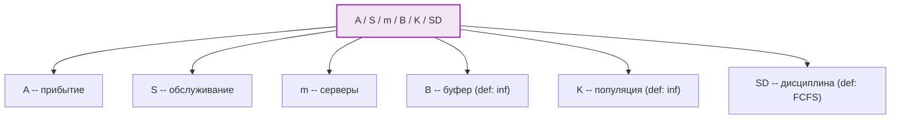
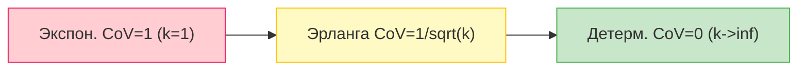
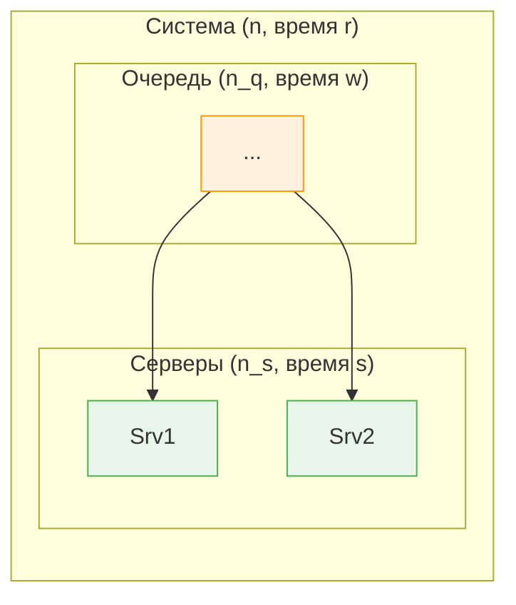
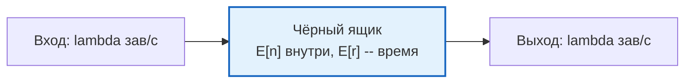
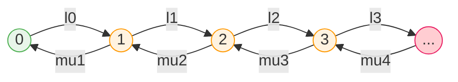

# Теория очередей -- введение

Погнали разбираться с ==теорией массового обслуживания== (она же теория очередей, она же *queueing theory*). Суть вот в чём: абстрактные формулы напрямую объясняют, почему ты стоишь в очереди в супермаркете, почему HTTP-запрос тормозит и сколько серверов нужно добавить, чтобы всё летало.

---

## Зачем это нужно

Теория очередей даёт **формальный язык** для описания систем массового обслуживания и набор **фундаментальных законов**, которые работают для **любой** очереди -- касса в магазине, процессор в компьютере или сетевой маршрутизатор.

!!! tip "Главная идея"
    Очереди возникают всегда, когда **спрос** (заявки) временно превышает **предложение** (ресурсы обслуживания). Даже если в среднем ресурсов хватает, **случайность** в моментах прихода и времени обслуживания порождает очереди.

Конкретнее, теория очередей позволяет:

- **Предсказывать** среднее время ожидания и длину очереди
- **Оптимизировать** количество серверов / каналов обслуживания
- **Сравнивать** дисциплины обслуживания (кого обслуживать первым?)
- **Планировать** ёмкость системы (capacity planning)

---

## Компоненты системы очередей

Любая система массового обслуживания описывается шестью компонентами:

| # | Компонент | Описание | Пример |
|---|-----------|----------|--------|
| 1 | **Процесс прибытия** (Arrival process) | Как заявки поступают в систему -- распределение интервалов между прибытиями | Пуассоновский поток с интенсивностью $\lambda = 5$ заявок/сек |
| 2 | **Распределение времени обслуживания** (Service time distribution) | Сколько времени сервер тратит на одну заявку | Экспоненциальное со средним $\frac{1}{\mu} = 200$ мс |
| 3 | **Число серверов** (Number of servers, $m$) | Сколько каналов обслуживания работают параллельно | 3 кассы, 8 ядер CPU |
| 4 | **Число мест ожидания** (Buffer, $B$) | Максимальная длина очереди | Буфер маршрутизатора на 1000 пакетов |
| 5 | **Размер популяции** (Population size, $K$) | Общее число потенциальных источников заявок | 10 000 терминалов |
| 6 | **Дисциплина обслуживания** (Service discipline, SD) | Правило выбора следующей заявки из очереди | FCFS, приоритетная, round-robin |

---

## Нотация Кендалла

Короче говоря, чтобы не описывать каждый раз все шесть компонентов словами, Дэвид Кендалл предложил компактную запись -- ==нотацию Кендалла==:

$$
\boxed{A \;/\; S \;/\; m \;/\; B \;/\; K \;/\; SD}
$$

где каждая позиция означает:

| Позиция | Что обозначает | Возможные значения |
|---------|---------------|--------------------|
| **A** | Процесс прибытия | $M$ -- пуассоновский (Memoryless / Markovian / экспоненциальные интервалы) |
| | | $E_k$ -- Эрланга порядка $k$ |
| | | $H_k$ -- гиперэкспоненциальное ($k$ фаз) |
| | | $D$ -- детерминированный (постоянные интервалы) |
| | | $G$ -- произвольное (General) |
| **S** | Распределение времени обслуживания | Те же обозначения: $M$, $E_k$, $H_k$, $D$, $G$ |
| **m** | Число серверов | $1, 2, 3, \ldots$ |
| **B** | Размер буфера (мест ожидания) | По умолчанию $\infty$ |
| **K** | Размер популяции | По умолчанию $\infty$ |
| **SD** | Дисциплина обслуживания | По умолчанию FCFS |

!!! note "Соглашение о значениях по умолчанию"
    Последние три параметра можно опускать, если они принимают значения по умолчанию:

    $$G/G/1 \;\equiv\; G/G/1/\infty/\infty/\text{FCFS}$$

**Примеры:**

- ==M/M/1== -- простейшая система: пуассоновский вход, экспоненциальное обслуживание, один сервер, бесконечный буфер, бесконечная популяция, FCFS.
- $M/M/3/20/1500/\text{FCFS}$ -- три сервера, буфер на 20 мест, популяция из 1500 источников.
- $M/D/1$ -- пуассоновский вход, детерминированное (постоянное) время обслуживания, один сервер.
- $M/G/1$ -- пуассоновский вход, произвольное обслуживание -- очень важная модель!

!!! example "Расшифровка нотации: разбираем M/M/1 по буквам"
    M/M/1 расшифровывается так: первая **M** -- пуассоновские приходы (случайные, без памяти), вторая **M** -- экспоненциальное обслуживание (тоже без памяти), **1** -- один сервер. Всё остальное по умолчанию: бесконечная очередь, бесконечное население, FIFO.

    Это как адрес: страна / город / дом. Если не указал индекс -- значит стандартный. Так и тут: не написал буфер -- значит бесконечный.

---

## Дисциплины обслуживания

Дисциплина обслуживания определяет, **в каком порядке** заявки из очереди поступают на обслуживание. Выбор дисциплины может кардинально влиять на характеристики системы.

| Аббревиатура | Название | Описание |
|-------------|----------|----------|
| **FCFS** (FIFO) | First Come, First Served | Кто первый пришёл -- того первым обслужат. Самая "честная" и самая распространённая дисциплина. |
| **LCFS** | Last Come, First Served | Последний пришёл -- первым обслужен (стек). Без вытеснения: текущая заявка дообслуживается. |
| **LCFS-PR** | LCFS with Preemptive Resume | Как LCFS, но новая заявка **вытесняет** текущую. Вытесненная возвращается в очередь и дообслуживается с того места, где остановилась. |
| **RR** | Round-Robin | Каждой заявке выделяется фиксированный квант времени. Если не успела -- в конец очереди. Знакомо по планировщику CPU. |
| **PS** | Processor Sharing | Предельный случай Round-Robin при кванте $\to 0$. Все заявки обслуживаются одновременно, каждая получает $\frac{1}{n}$ мощности сервера. |
| **IS** | Infinite Server | Каждая заявка мгновенно получает свой собственный сервер. Очередь не образуется. Удобная модельная абстракция. |
| **SPT** | Shortest Processing Time | Первой обслуживается заявка с наименьшим **полным** временем обслуживания. |
| **SRPT** | Shortest Remaining Processing Time | Первой обслуживается заявка с наименьшим **оставшимся** временем. Вытесняющая версия SPT -- оптимальная по среднему времени отклика! |
| **Priority** | Приоритетное обслуживание | Заявки делятся на классы с разными приоритетами. Внутри класса -- обычно FCFS. |

!!! warning "Внимание"
    Дисциплина обслуживания **не влияет** на среднее число заявок в системе $E[n]$ и среднее время отклика $E[r]$, если она **не зависит от времени обслуживания** (work-conserving). Но она сильно влияет на **дисперсию** и на распределение по классам заявок.

---

## Распределения

В теории очередей постоянно встречаются несколько ключевых распределений. Разберём каждое.

### Экспоненциальное распределение ($M$)

==Экспоненциальное распределение== -- "рабочая лошадка" теории очередей. Оно описывает интервалы между событиями в пуассоновском потоке.

$$
f(x) = \frac{1}{a} e^{-x/a}, \quad x \geq 0
$$

| Характеристика | Значение |
|---------------|----------|
| Среднее | $E[X] = a$ |
| Дисперсия | $Var[X] = a^2$ |
| Коэффициент вариации (CoV) | $C = \frac{\sigma}{\mu} = 1$ |

!!! important "Свойство отсутствия памяти (Memoryless property)"
    Ключевое свойство экспоненциального распределения:

    $$P(X > s + t \mid X > s) = P(X > t)$$

    Это значит, что **сколько бы ты уже ни ждал, оставшееся время ожидания имеет то же распределение**, что и в начале. Прошлое не влияет на будущее -- отсюда буква $M$ (Markovian / Memoryless).

    Интуитивно: если лампочка работает по экспоненциальному закону, то старая лампочка "не помнит" свой возраст и с точки зрения вероятности отказа ничем не отличается от новой.

Если перевести на человеческий язык: экспоненциальное распределение не помнит прошлого. Если ты уже ждёшь 10 минут, среднее оставшееся время ожидания -- такое же, как было в начале. Никакого "ну, уже скоро точно" -- это иллюзия. Автобус не "должен вот-вот приехать" только потому, что ты долго стоишь на остановке. Для экспоненциального распределения каждый момент -- как первый.

Именно это свойство делает экспоненциальное распределение таким удобным для математики: состояние системы полностью описывается тем, что происходит *сейчас*, без необходимости помнить историю.

### Распределение Эрланга ($E_k$)

Распределение Эрланга порядка $k$ -- это сумма $k$ **независимых** экспоненциальных случайных величин с одинаковым параметром.

$$
f(x) = \frac{x^{k-1} e^{-x/a}}{(k-1)!\; a^k}, \quad x \geq 0
$$

| Характеристика | Значение |
|---------------|----------|
| Среднее | $E[X] = ka$ |
| Дисперсия | $Var[X] = ka^2$ |
| Коэффициент вариации | $C = \frac{1}{\sqrt{k}}$ |

!!! tip "Зачем нужно Эрланга?"
    При $k = 1$ это обычная экспонента ($C = 1$). При $k \to \infty$ распределение стремится к детерминированному ($C \to 0$). Таким образом, Эрланга позволяет моделировать **промежуточную вариабельность** между полностью случайным ($M$) и полностью детерминированным ($D$) случаями.

### Гиперэкспоненциальное распределение ($H_k$)

Гиперэкспоненциальное распределение -- это **смесь** экспоненциальных распределений. С вероятностью $p_i$ выбирается экспонента с параметром $a_i$:

$$
f(x) = \sum_{i=1}^{k} \frac{p_i}{a_i} e^{-x/a_i}, \quad \sum_{i=1}^{k} p_i = 1
$$

| Характеристика | Значение |
|---------------|----------|
| Коэффициент вариации | $C > 1$ (всегда!) |

!!! note "Когда использовать?"
    Гиперэкспоненциальное распределение моделирует ситуации с **высокой вариабельностью** ($C > 1$): например, когда одни запросы обрабатываются очень быстро, а другие -- очень долго (разные типы файлов, разные SQL-запросы и т.д.).

**Итого по распределениям и CoV:**

| Распределение | CoV ($C$) | Вариабельность |
|--------------|-----------|----------------|
| Детерминированное ($D$) | $0$ | Нулевая |
| Эрланга ($E_k$) | $\frac{1}{\sqrt{k}}$ | Низкая ($0 < C < 1$) |
| Экспоненциальное ($M$) | $1$ | Средняя |
| Гиперэкспоненциальное ($H_k$) | $> 1$ | Высокая |

---

## Ключевые переменные

Главное -- зафиксировать обозначения, которые будут использоваться во всех формулах.

### Входные параметры

| Переменная | Описание |
|-----------|----------|
| $\tau$ | Интервал между прибытиями заявок (inter-arrival time) |
| $\lambda = \frac{1}{E[\tau]}$ | **Интенсивность входящего потока** (arrival rate) -- среднее число прибытий в единицу времени |
| $s$ | Время обслуживания одной заявки (service time) |
| $\mu = \frac{1}{E[s]}$ | **Интенсивность обслуживания** (service rate) -- среднее число заявок, обслуживаемых одним сервером в единицу времени |

### Характеристики состояния системы

| Переменная | Описание |
|-----------|----------|
| $n$ | **Число заявок в системе** (и в очереди, и на обслуживании) |
| $n_q$ | Число заявок **в очереди** (ожидающих) |
| $n_s$ | Число заявок **на обслуживании** |
| $r$ | **Время отклика** (response time) -- полное время пребывания заявки в системе |
| $w$ | **Время ожидания** (waiting time) -- время в очереди до начала обслуживания |

### Фундаментальные соотношения

Эти два соотношения верны **всегда**, для любой системы:

$$
n = n_q + n_s
$$

$$
r = w + s
$$

### Утилизация (загрузка) и стабильность

Ещё одна критически важная величина -- ==traffic intensity== (утилизация):

$$
\rho = \frac{\lambda}{m\mu}
$$

Это **утилизация** (utilization) -- доля времени, в течение которой серверы заняты.

!!! warning "Условие стабильности"
    Система стабильна (очередь не растёт до бесконечности) тогда и только тогда, когда:

    $$\lambda < m\mu \quad \Longleftrightarrow \quad \rho < 1$$

    Если $\rho \geq 1$, очередь будет расти неограниченно, и стационарного режима не существует.

---

## Правила для всех очередей

Три факта, которые верны для **любой** системы массового обслуживания (при условии стабильности):

1. **Условие стабильности:**

$$\lambda < m\mu$$

2. **Декомпозиция числа заявок:**

$$E[n] = E[n_q] + E[n_s]$$

3. **Декомпозиция времени отклика:**

$$E[r] = E[w] + E[s]$$

!!! note "Заметьте"
    Эти соотношения не требуют никаких предположений о распределениях -- они следуют из определений. Но сейчас мы увидим закон, который гораздо глубже и не менее универсален.

---

## Закон Литтла

==Закон Литтла== (Little's Law, 1961) -- один из самых элегантных и полезных результатов во всей теории очередей. Это как E=mc^2 для очередей. Три величины, одна формула, работает ВСЕГДА. Не нужно знать распределения, дисциплину обслуживания -- ничего. Просто $E[n] = \lambda \cdot E[r]$.

$$
\boxed{E[n] = \lambda \cdot E[r]}
$$

> **Среднее число заявок в системе** = **интенсивность прибытия** x **среднее время отклика**

!!! example "Пример: кофейня"
    В кофейне в среднем **4 человека**. Приходит **2 человека в минуту**. Значит среднее время от входа до кофе в руках = 4 / 2 = **2 минуты**. Вот и весь закон Литтла. Никакой информации о том, сколько бариста, какая очередь, кто первый -- ничего не нужно. Только три числа.

### Почему это так важно?

==Закон Литтла== работает для **любой** системы, в которой выполняется единственное условие: **поток прибытий равен потоку убытий** (стационарный режим). Не нужно знать:

- Какое распределение у времени обслуживания
- Сколько серверов
- Какая дисциплина обслуживания
- Коррелированы ли прибытия

Это настоящий **чёрный ящик**: мы смотрим только на вход ($\lambda$), выход ($\lambda$, раз система стабильна) и среднее время внутри ($E[r]$).

### Варианты закона Литтла

Закон можно применить к **любой подсистеме**:

| Подсистема | Формула |
|-----------|---------|
| Вся система | $E[n] = \lambda \cdot E[r]$ |
| Только очередь | $E[n_q] = \lambda \cdot E[w]$ |
| Только серверы | $E[n_s] = \lambda \cdot E[s]$ |

!!! tip "Полезное следствие"
    Из $E[n_s] = \lambda \cdot E[s] = \frac{\lambda}{\mu} = \rho \cdot m$ видно, что среднее число занятых серверов напрямую связано с утилизацией. Для одного сервера ($m = 1$): $E[n_s] = \rho$.

### Набросок доказательства (аргумент площади)

Представь график, где по оси $x$ -- время, а по оси $y$ -- число заявок в системе $n(t)$.

Рассмотрим отрезок времени $[0, T]$, за который пришло $N$ заявок.

**Площадь под кривой $n(t)$** можно посчитать двумя способами:

1. **По горизонтали (время):** Площадь $\approx$ среднее число заявок $\times$ время $= E[n] \cdot T$
2. **По вертикали (заявки):** Каждая заявка $i$ вносит "столбик" высоты 1 и ширины $r_i$ (время пребывания). Площадь $= \sum_{i=1}^{N} r_i = N \cdot E[r]$

Приравниваем:

$$
E[n] \cdot T = N \cdot E[r]
$$

$$
E[n] = \frac{N}{T} \cdot E[r] = \lambda \cdot E[r] \qquad \blacksquare
$$

!!! note "Строгое доказательство"
    Строгое доказательство Литтла (1961) использует предельные аргументы и не требует никаких вероятностных предположений -- только существование средних в стационарном режиме.

### Пример: дисковый сервер

> **Условие:** На дисковый сервер поступает $\lambda = 100$ запросов в секунду. Среднее время обслуживания одного запроса $E[s] = 100$ мс $= 0.1$ с.
>
> **Вопрос:** Сколько в среднем запросов находится "в системе" (ожидают + обслуживаются)?
>
> **Решение по закону Литтла:**
> $$E[n] = \lambda \cdot E[r]$$
> Если очереди нет и сервер один, то $E[r] = E[s] = 0.1$ с.
> $$E[n] = 100 \cdot 0.1 = 10 \text{ запросов}$$
>
> Утилизация: $\rho = \lambda \cdot E[s] = 100 \cdot 0.1 = 10$ -- Стоп! $\rho = 10 > 1$, система **нестабильна** для одного сервера! Нужно как минимум $m > 10$ серверов.
>
> Если $m = 20$ серверов, то $\rho = \frac{100}{20 \cdot 10} = 0.5$, и система стабильна. Среднее число занятых серверов: $E[n_s] = \frac{\lambda}{\mu} = \frac{100}{10} = 10$.

---

## Стохастические процессы

Для анализа очередей нужно понимание некоторых классов **стохастических процессов** -- случайных процессов, эволюционирующих во времени.

### Классификация по пространству состояний и времени

|  | Дискретное время | Непрерывное время |
|--|-----------------|------------------|
| **Дискретные состояния** | Цепи Маркова | Марковские процессы с непрерывным временем |
| **Непрерывные состояния** | Авторегрессия, случайные блуждания | Броуновское движение, диффузия |

Для теории очередей нас в первую очередь интересуют процессы с **дискретными состояниями** (число заявок -- целое число) и **непрерывным временем**.

### Марковские процессы

!!! important "Марковское свойство"
    Процесс $\{X(t)\}$ является **марковским**, если:

    $$P(X(t+\Delta) = j \mid X(t) = i, X(t_1) = i_1, \ldots, X(t_k) = i_k) = P(X(t+\Delta) = j \mid X(t) = i)$$

    Иными словами, **будущее зависит от прошлого только через настоящее**. Зная текущее состояние, вся предыстория становится несущественной.

Это свойство напрямую связано с **отсутствием памяти** экспоненциального распределения. Именно поэтому системы с пуассоновским входом и экспоненциальным обслуживанием (буква $M$) так удобны для анализа -- они порождают марковские процессы.

### Процессы рождения и гибели (Birth-Death Processes)

==Процесс рождения и гибели== -- частный случай марковского процесса, в котором переходы возможны **только в соседние состояния**:

- Из состояния $i$ можно перейти в $i+1$ (рождение, rate $\lambda_i$)
- Из состояния $i$ можно перейти в $i-1$ (гибель, rate $\mu_i$)

В контексте очередей:

- **Рождение** = прибытие новой заявки ($\lambda_i$ -- интенсивность прибытия при $i$ заявках в системе)
- **Гибель** = завершение обслуживания ($\mu_i$ -- суммарная интенсивность обслуживания при $i$ заявках)

Для системы ==M/M/m==:

- $\lambda_i = \lambda$ (постоянная интенсивность прибытия)
- $\mu_i = \min(i, m) \cdot \mu$ (каждый занятый сервер обслуживает с интенсивностью $\mu$)

### Пуассоновский процесс

==Пуассоновский процесс== -- это процесс подсчёта событий, при котором интервалы между событиями -- **независимые и одинаково распределённые** (i.i.d.) экспоненциальные случайные величины.

**Ключевые свойства пуассоновского процесса:**

1. **Стационарность:** Вероятность $k$ событий на интервале длины $t$ зависит только от $t$:

$$P(N(t) = k) = \frac{(\lambda t)^k e^{-\lambda t}}{k!}$$

2. **Отсутствие последействия:** Числа событий на непересекающихся интервалах независимы.

3. **Ординарность:** Вероятность двух и более событий одновременно пренебрежимо мала.

4. **Суперпозиция:** Сумма независимых пуассоновских потоков с интенсивностями $\lambda_1, \lambda_2, \ldots$ -- тоже пуассоновский поток с интенсивностью $\lambda_1 + \lambda_2 + \ldots$

5. **Разреживание:** Если каждое событие пуассоновского потока ($\lambda$) независимо принимается с вероятностью $p$, получаем пуассоновский поток с интенсивностью $p\lambda$.

### Свойство PASTA

!!! important "PASTA: Poisson Arrivals See Time Averages"
    Если поток прибытий -- пуассоновский, то **доля прибывающих заявок, заставших систему в состоянии $i$**, равна **доле времени, которую система проводит в состоянии $i$**.

    Формально: $a_i = p_i$, где

    - $a_i$ -- вероятность, что прибывающая заявка видит $i$ заявок в системе
    - $p_i$ -- стационарная вероятность $i$ заявок в системе

Проще говоря: если приходы пуассоновские, то в среднем клиент видит ровно ту же картину, что и внешний наблюдатель. Нет "невезения" -- ты не приходишь чаще именно в пиковые моменты. Пуассоновский поток "не подстраивается" под состояние системы -- он абсолютно случайный, поэтому честно семплирует реальность.

Это удивительно нетривиальное свойство! Для **непуассоновских** потоков оно, вообще говоря, **не выполняется**.

!!! example "Контрпример к PASTA"
    Представь автобус, приходящий строго каждые 10 минут ($D$), и пассажира, приходящего на остановку тоже строго каждые 10 минут ($D$). Если они синхронизированы -- пассажир всегда видит пустую остановку. Если сдвинуты на 5 минут -- пассажир всегда ждёт ровно 5 минут. Но случайный наблюдатель в произвольный момент видит другую картину. Прибытие "видит" не среднюю по времени ситуацию!

==PASTA== -- одна из причин, почему пуассоновский поток так удобен для анализа: **то, что видит прибывающая заявка, совпадает с тем, что видит сторонний наблюдатель**.

---

## Итоги

| Концепция | Суть |
|-----------|------|
| **Компоненты системы** | 6 элементов: прибытие, обслуживание, серверы, буфер, популяция, дисциплина |
| ==Нотация Кендалла== | $A/S/m/B/K/SD$ -- компактное описание системы |
| **Экспоненциальное распределение** | CoV = 1, свойство отсутствия памяти -- основа марковских моделей |
| **Эрланга и гиперэкспоненциальное** | Моделируют $C < 1$ и $C > 1$ соответственно |
| ==Закон Литтла== | $E[n] = \lambda \cdot E[r]$ -- работает для ЛЮБОЙ стабильной системы |
| **Марковские процессы** | Будущее зависит только от настоящего |
| ==PASTA== | Пуассоновские прибытия видят средние по времени характеристики |

!!! success "Что дальше?"
    Дальше применяем эти инструменты к конкретным моделям: начнём с ==M/M/1==, затем перейдём к ==M/M/m==, $M/G/1$ и более сложным системам. Фундамент заложен -- теперь строим!
