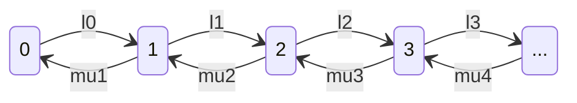
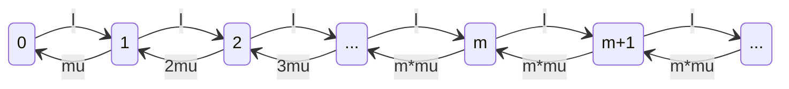
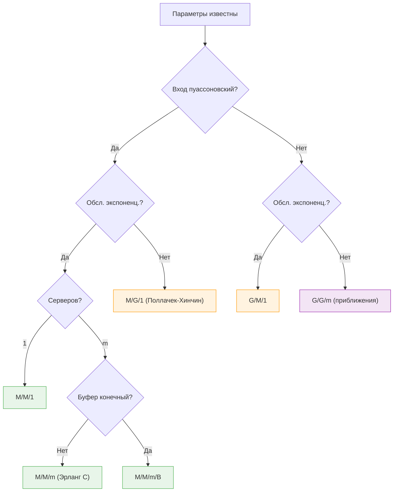

# Анализ одиночной очереди

Суть вот в чём: здесь мы считаем характеристики очередей **по формулам**, без единой симуляции. Аналитический подход к теории массового обслуживания -- подставил параметры, получил метрику.

---

## Зачем это нужно

Весь этот раздел -- **аналитический тулкит** для оценки производительности систем обслуживания. Вместо того чтобы запускать дискретно-событийную симуляцию и ждать, пока она сойдётся, мы получаем точные формулы.

Три ключевые модели:

| Модель | Что это | Когда использовать |
|---|---|---|
| ==M/M/1== | Один сервер, бесконечная очередь | Фундамент всей теории -- начинаем отсюда |
| ==M/M/m== | $m$ серверов, бесконечная очередь | Несколько одинаковых каналов обслуживания |
| ==M/M/m/B== | $m$ серверов, конечный буфер $B$ | Реальные системы с ограниченной памятью |

!!! tip "Почему формулы, а не симуляция?"
    Формулы дают **мгновенный** ответ: подставил параметры -- получил метрику. Симуляция может потребовать миллионы итераций для получения стабильной оценки. Конечно, формулы работают только для "красивых" моделей с экспоненциальными распределениями, но они дают отличную интуицию и первое приближение для любой реальной системы.

---

## Процессы рождения и гибели

В основе всех наших моделей лежит ==процесс рождения и гибели== (Birth-Death Process). Это непрерывная марковская цепь, где состояние -- число заявок в системе.

### Идея

- **Состояние** $n$ = в системе находится $n$ заявок (и в очереди, и на обслуживании).
- **Рождение** (birth) -- приход новой заявки. Интенсивность перехода из $n$ в $n+1$ равна $\lambda_n$.
- **Гибель** (death) -- завершение обслуживания. Интенсивность перехода из $n$ в $n-1$ равна $\mu_n$.
- Переходы возможны только на $\pm 1$ (никаких "прыжков" через состояния).

### Диаграмма состояний

### Стационарное распределение

В стационарном режиме (steady state) поток вероятности "влево" из каждого состояния равен потоку "вправо". Это даёт уравнения баланса:

$$
\lambda_n \, p_n = \mu_{n+1} \, p_{n+1}, \quad n = 0, 1, 2, \ldots
$$

Отсюда можно выразить любую $p_n$ через $p_0$:

$$
p_n = p_0 \prod_{i=0}^{n-1} \frac{\lambda_i}{\mu_{i+1}}
$$

А $p_0$ находится из условия нормировки $\sum_{n=0}^{\infty} p_n = 1$:

$$
p_0 = \left( \sum_{n=0}^{\infty} \prod_{i=0}^{n-1} \frac{\lambda_i}{\mu_{i+1}} \right)^{-1}
$$

!!! note "Условие существования стационара"
    Стационарное распределение существует тогда и только тогда, когда ряд $\sum p_n$ сходится. Если заявки приходят быстрее, чем система успевает обслуживать, -- стационара нет, очередь растёт до бесконечности.

---

## Очередь M/M/1

Это самая простая и самая знаменитая модель. ==Нотация Кендалла==: ==M/M/1== -- марковские (экспоненциальные) приходы, марковское обслуживание, один сервер.

### Предположения

- Заявки приходят по пуассоновскому процессу с интенсивностью $\lambda$.
- Время обслуживания -- экспоненциальное с параметром $\mu$ (среднее время обслуживания $\frac{1}{\mu}$).
- Один сервер.
- Очередь бесконечная (FIFO).
- Нет ограничений на число заявок в системе.

### Трафик-интенсивность

$$
\rho = \frac{\lambda}{\mu}
$$

$\rho$ -- это загрузка системы, и именно она определяет, как себя чувствует очередь. При $\rho = 0.5$ сервер занят половину времени, очереди маленькие, всё спокойно. При $\rho = 0.9$ -- очереди начинают взрываться. При $\rho = 0.99$ -- средняя длина очереди порядка 99 заявок. Мораль простая: не нагружай систему выше 70-80%, если хочешь спать спокойно.

Зависимость нелинейная и коварная. Кажется, что разница между 80% и 90% загрузки -- "всего 10 процентных пунктов". Но среднее число заявок в системе при этом растёт с 4 до 9 -- больше чем вдвое. А с 90% до 99% -- рост с 9 до 99, в одиннадцать раз. Вот почему опытные инженеры закладывают серьёзный запас по мощности.

!!! warning "Условие стабильности"
    Система стабильна (стационарное распределение существует) тогда и только тогда, когда $\rho < 1$. Если $\rho \geq 1$, очередь будет расти неограниченно.

### Основные формулы

Для ==M/M/1== это частный случай процесса рождения-гибели с $\lambda_n = \lambda$ и $\mu_n = \mu$ для всех $n$. Получаем геометрическое распределение числа заявок:

$$
p_n = (1 - \rho)\,\rho^n, \quad n = 0, 1, 2, \ldots
$$

### Полная таблица результатов M/M/1

Погнали -- все 26 ключевых результатов в одной таблице.

| # | Метрика | Формула | Описание |
|---|---|---|---|
| 1 | ==Traffic intensity== | $\rho = \frac{\lambda}{\mu}$ | Доля времени, когда сервер занят |
| 2 | Условие стабильности | $\rho < 1$ | Иначе очередь растёт бесконечно |
| 3 | Вероятность пустой системы | $p_0 = 1 - \rho$ | Доля времени, когда сервер простаивает |
| 4 | Вероятность $n$ заявок | $p_n = (1-\rho)\,\rho^n$ | Геометрическое распределение |
| 5 | Среднее число заявок в системе | $E[n] = \frac{\rho}{1-\rho}$ | Включает и очередь, и обслуживание |
| 6 | Дисперсия числа заявок | $Var[n] = \frac{\rho}{(1-\rho)^2}$ | Большой разброс при $\rho \to 1$ |
| 7 | Среднее число в очереди | $E[n_q] = \frac{\rho^2}{1-\rho}$ | Только ждущие (без обслуживаемых) |
| 8 | Среднее число на сервере | $E[n_s] = \rho$ | Равно загрузке сервера |
| 9 | Среднее время отклика | $E[r] = \frac{1/\mu}{1-\rho}$ | Полное время в системе (ожидание + обслуживание) |
| 10 | Среднее время ожидания | $E[w] = \frac{\rho/\mu}{1-\rho}$ | Только время в очереди |
| 11 | Среднее время обслуживания | $E[s] = \frac{1}{\mu}$ | По условию -- экспоненциальное |
| 12 | Связь $E[r]$ и $E[w]$ | $E[r] = E[w] + E[s]$ | Время отклика = ожидание + обслуживание |
| 13 | ==Закон Литтла== (система) | $E[n] = \lambda \cdot E[r]$ | Фундаментальная связь |
| 14 | ==Закон Литтла== (очередь) | $E[n_q] = \lambda \cdot E[w]$ | Применён к подсистеме "очередь" |
| 15 | ==Закон Литтла== (сервер) | $E[n_s] = \lambda \cdot E[s] = \rho$ | Применён к подсистеме "сервер" |
| 16 | Утилизация сервера | $U = \rho$ | Доля времени занятости |
| 17 | Пропускная способность | $X = \lambda$ | В стационаре = интенсивности прихода |
| 18 | P(сервер занят) | $1 - p_0 = \rho$ | Совпадает с утилизацией |
| 19 | P($\geq k$ заявок) | $\rho^k$ | Вероятность хвоста |
| 20 | P($> k$ заявок) | $\rho^{k+1}$ | Строго больше $k$ |
| 21 | Дисперсия времени отклика | $Var[r] = \frac{1}{\mu^2(1-\rho)^2}$ | Растёт квадратично при $\rho \to 1$ |
| 22 | Дисперсия времени ожидания | $Var[w] = \frac{\rho(2-\rho)}{\mu^2(1-\rho)^2}$ | Большой разброс при загрузке |
| 23 | Распределение времени отклика | $F_r(t) = 1 - e^{-\mu(1-\rho)t}$ | Экспоненциальное с параметром $\mu(1-\rho)$ |
| 24 | Квантиль времени отклика | $r_p = \frac{-\ln(1-p)}{\mu(1-\rho)}$ | $p$-й перцентиль |
| 25 | Коэфф. вариации $n$ | $C_n = \frac{1}{\sqrt{\rho}}$ | Относительный разброс |
| 26 | Остаточное время обслуживания | $E[s_e] = \frac{1}{\mu}$ | Для экспоненциального -- равно среднему (memoryless!) |

!!! info "Закон Литтла -- универсальный инструмент"
    ==Закон Литтла== ($L = \lambda W$) не требует никаких предположений о распределениях -- он работает для **любой** стабильной системы. Его можно применять к системе в целом, к очереди отдельно, к серверу отдельно. Это, пожалуй, самый мощный результат во всей теории очередей.

### Поведение при росте нагрузки

Главное -- при $\rho \to 1$ практически все метрики уходят в бесконечность. Это не баг, а фича -- система на пределе работает крайне нестабильно.

| $\rho$ | $E[n]$ | $E[r]$ (при $\mu=1$) | $E[n_q]$ |
|---|---|---|---|
| 0.1 | 0.11 | 1.11 | 0.01 |
| 0.5 | 1.00 | 2.00 | 0.50 |
| 0.8 | 4.00 | 5.00 | 3.20 |
| 0.9 | 9.00 | 10.00 | 8.10 |
| 0.95 | 19.00 | 20.00 | 18.05 |
| 0.99 | 99.00 | 100.00 | 98.01 |

!!! warning "Нелинейный рост"
    Увеличение загрузки с 0.9 до 0.99 (всего на 10%) увеличивает среднюю длину очереди в **12 раз**! Это интуитивно неочевидно и является одной из главных причин, почему системы проектируют с запасом по мощности.

    Посмотри на таблицу выше -- рост E[n] от $\rho$ выглядит как хоккейная клюшка. До 0.5 -- почти плоско. После 0.8 -- начинается вертикальный взлёт. Формула $\frac{\rho}{1-\rho}$ содержит $(1-\rho)$ в знаменателе, и когда $\rho$ подбирается к единице, знаменатель стремится к нулю, а дробь -- к бесконечности. Вот почему золотое правило -- держи загрузку ниже 70-80%.

---

## Пример: сетевой шлюз

Рассмотрим конкретный пример -- сетевой маршрутизатор (gateway), который обрабатывает пакеты.

### Условия задачи

- Интенсивность поступления пакетов: $\lambda = 125$ пакетов/с
- Скорость обработки: $\mu = 500$ пакетов/с
- ==Traffic intensity==: $\rho = \frac{125}{500} = 0.25$

### Вычисление метрик

$$
E[n] = \frac{0.25}{1 - 0.25} = \frac{0.25}{0.75} = 0.333 \text{ пакета}
$$

$$
E[r] = \frac{1/500}{1 - 0.25} = \frac{0.002}{0.75} = 0.00267 \text{ с} = 2.67 \text{ мс}
$$

$$
E[w] = \frac{0.25/500}{1 - 0.25} = \frac{0.0005}{0.75} = 0.00067 \text{ с} = 0.67 \text{ мс}
$$

$$
E[n_q] = \frac{0.25^2}{1 - 0.25} = \frac{0.0625}{0.75} = 0.083
$$

!!! success "Результаты"
    При загрузке 25% шлюз работает комфортно: в среднем в системе всего **0.33 пакета**, а полное время обработки -- **2.67 мс**. Из них 2 мс -- само обслуживание, и только 0.67 мс -- ожидание в очереди.

### Вероятность переполнения буфера

Практический вопрос: **сколько буферов нужно**, чтобы вероятность потери пакета была пренебрежимо мала?

Вероятность того, что в системе больше $B$ пакетов (буфер переполнен):

$$
P(n > B) = \rho^{B+1} = 0.25^{B+1}
$$

| Буфер $B$ | $P(\text{потеря}) = 0.25^{B+1}$ |
|---|---|
| 1 | 0.0625 |
| 2 | 0.0156 |
| 3 | 0.00391 |
| 5 | $2.44 \times 10^{-4}$ |
| 7 | $1.53 \times 10^{-5}$ |
| 9 | $9.54 \times 10^{-7}$ |
| 10 | $2.38 \times 10^{-7}$ |

!!! tip "Сколько буферов для потерь < $10^{-6}$?"
    Нужно $0.25^{B+1} < 10^{-6}$, то есть $(B+1) \cdot \ln(0.25) < -6 \cdot \ln(10)$.

    $$B + 1 > \frac{6 \cdot \ln 10}{\ln 4} = \frac{6 \cdot 2.303}{1.386} \approx 9.97$$

    Значит, $B \geq 9$ -- достаточно **всего 9 буферных позиций** для гарантии потерь менее одной на миллион! При низкой загрузке ($\rho = 0.25$) буферы почти не нужны.

9 буферов для $\rho = 0.25$ -- это действительно немного, потому что при низкой загрузке очередь почти всегда пуста. Но если бы $\rho = 0.9$, для той же гарантии потерь $< 10^{-6}$ потребовалось бы уже около **131 буферной позиции** (считай: $0.9^{B+1} < 10^{-6}$, то есть $B + 1 > \frac{6 \ln 10}{\ln(1/0.9)} \approx 131.1$). Вот почему архитекторы систем закладывают запас -- при росте нагрузки потребности в буферах растут драматически.

---

## Очередь M/M/m

Теперь усложняем: вместо одного сервера -- $m$ параллельных одинаковых серверов. Заявка занимает первый свободный сервер; если все заняты -- встаёт в общую очередь.

### Параметры

- $m$ серверов, каждый с интенсивностью обслуживания $\mu$
- Суммарная интенсивность обслуживания (когда все заняты): $m\mu$
- ==Traffic intensity== **на один сервер**: $\rho = \frac{\lambda}{m\mu}$ (должна быть $< 1$)
- Суммарная нагрузка: $a = \frac{\lambda}{\mu} = m\rho$

### Диаграмма состояний

Пока $n \leq m$, интенсивность обслуживания растёт (подключаются новые серверы: $\mu_n = n\mu$). Когда $n > m$, все серверы заняты и $\mu_n = m\mu$.

### Вероятность пустой системы

$$
p_0 = \left[ \sum_{k=0}^{m-1} \frac{(m\rho)^k}{k!} + \frac{(m\rho)^m}{m!(1-\rho)} \right]^{-1}
$$

### Формула Эрланга C

Вероятность того, что все серверы заняты и заявка будет ждать в очереди -- ==формула Эрланга C==:

$$
C(m, a) = \frac{\frac{a^m}{m!} \cdot \frac{1}{1-\rho}}{\displaystyle\sum_{k=0}^{m-1} \frac{a^k}{k!} + \frac{a^m}{m!} \cdot \frac{1}{1-\rho}}
$$

где $a = m\rho = \frac{\lambda}{\mu}$.

!!! note "Формула Эрланга C"
    Названа в честь **Агнера Краруп Эрланга** -- датского инженера, который в начале XX века разработал математическую теорию телефонных сетей. Его работы -- фундамент всей теории массового обслуживания.

### Метрики M/M/m

$$
E[n_q] = \frac{\rho}{1-\rho} \cdot C(m, a)
$$

$$
E[w] = \frac{E[n_q]}{\lambda} = \frac{C(m,a)}{m\mu(1-\rho)}
$$

$$
E[r] = E[w] + \frac{1}{\mu}
$$

$$
E[n] = E[n_q] + a
$$

### Сравнение M/M/1 и M/M/m

| Метрика | ==M/M/1== | ==M/M/m== |
|---|---|---|
| Серверы | 1 | $m$ |
| Загрузка | $\rho = \frac{\lambda}{\mu}$ | $\rho = \frac{\lambda}{m\mu}$ |
| Условие стабильности | $\rho < 1$ | $\rho < 1$ |
| $p_0$ | $1 - \rho$ | $\left[\sum_{k=0}^{m-1}\frac{a^k}{k!} + \frac{a^m}{m!(1-\rho)}\right]^{-1}$ |
| $E[n_q]$ | $\frac{\rho^2}{1-\rho}$ | $\frac{\rho \cdot C(m,a)}{1-\rho}$ |
| $E[w]$ | $\frac{\rho/\mu}{1-\rho}$ | $\frac{C(m,a)}{m\mu(1-\rho)}$ |
| $E[r]$ | $\frac{1/\mu}{1-\rho}$ | $E[w] + \frac{1}{\mu}$ |
| $E[n]$ | $\frac{\rho}{1-\rho}$ | $E[n_q] + \frac{\lambda}{\mu}$ |

!!! info "Эффект масштаба"
    Один сервер с производительностью $m\mu$ **всегда лучше**, чем $m$ серверов с производительностью $\mu$ каждый (при одинаковой суммарной мощности). При нескольких серверах возможна ситуация, когда один сервер простаивает, а перед другим -- очередь. Единый быстрый сервер такого не допускает.

Важно понимать: добавление серверов -- это не линейное улучшение. Два сервера при $\rho = 0.8$ -- это не "вдвое лучше", чем один. Работает закон убывающей отдачи: первый дополнительный сервер даёт огромный выигрыш (разгружает перегруженную систему), а каждый следующий -- всё меньше и меньше. В какой-то момент добавлять серверы становится просто невыгодно -- лучше оптимизировать время обслуживания или перепроектировать архитектуру.

---

## Очередь M/M/m/B

В реальных системах буфер конечный -- память маршрутизатора, количество мест в зале ожидания, ёмкость call-центра. Модель ==M/M/m/B== учитывает это.

Ключевой инсайт этой модели: конечный буфер = потери. Это модель для call-центров (линия занята -- клиент слышит гудки), сетевых маршрутизаторов (буфер полон -- пакет отброшен), парковок (мест нет -- машина уезжает), больничных приёмных (все койки заняты -- пациента перенаправляют). Везде, где есть физический лимит на количество ожидающих, работает именно эта модель.

### Параметры

- $m$ серверов
- $B$ -- максимальное число заявок в системе (включая обслуживаемых)
- Если все $B$ мест заняты, новая заявка **теряется** (блокировка)

### Ключевые отличия от M/M/m

| Свойство | ==M/M/m== | ==M/M/m/B== |
|---|---|---|
| Размер буфера | $\infty$ | $B$ (конечный) |
| Потери заявок | Нет | Да, при переполнении |
| Условие стабильности | $\rho < 1$ | **Всегда стабильна** (даже при $\rho \geq 1$!) |
| Применение | Теоретический анализ | Реальные системы |

!!! warning "Всегда стабильна!"
    ==M/M/m/B== **всегда** имеет стационарное распределение, даже если $\rho \geq 1$. Причина проста: число заявок ограничено сверху числом $B$, поэтому очередь не может расти бесконечно. При $\rho \geq 1$ потери будут огромными, но формально система стабильна.

### Стационарные вероятности

Для M/M/1/B (один сервер, буфер $B$):

**Случай $\rho \neq 1$:**

$$
p_n = \frac{(1-\rho)\,\rho^n}{1 - \rho^{B+1}}, \quad n = 0, 1, \ldots, B
$$

**Случай $\rho = 1$:**

$$
p_n = \frac{1}{B+1}, \quad n = 0, 1, \ldots, B
$$

Для общего случая M/M/m/B:

$$
p_n = \begin{cases}
\frac{a^n}{n!}\,p_0, & 0 \leq n \leq m \\[10pt]
\frac{a^n}{m!\,m^{n-m}}\,p_0, & m < n \leq B
\end{cases}
$$

где $a = \frac{\lambda}{\mu}$, а $p_0$ находится из нормировки $\sum_{n=0}^{B} p_n = 1$.

### Интенсивность потерь

Заявки теряются, когда система заполнена (все $B$ мест заняты):

$$
\lambda_{\text{loss}} = \lambda \cdot p_B
$$

Эффективная (фактическая) интенсивность входа:

$$
\lambda_{\text{eff}} = \lambda (1 - p_B)
$$

!!! note "Вероятность блокировки"
    $p_B$ -- это вероятность того, что пришедшая заявка будет потеряна. Это ключевая метрика качества обслуживания (QoS) в телекоммуникациях и сетевых системах.

### Метрики

Все метрики вычисляются аналогично ==M/M/m==, но с учётом конечного пространства состояний:

$$
E[n] = \sum_{n=0}^{B} n \cdot p_n
$$

$$
E[n_q] = \sum_{n=m+1}^{B} (n - m) \cdot p_n
$$

==Закон Литтла== применяется с **эффективной** интенсивностью:

$$
E[r] = \frac{E[n]}{\lambda_{\text{eff}}}, \quad E[w] = \frac{E[n_q]}{\lambda_{\text{eff}}}
$$

---

## Другие модели

==M/M/1==, ==M/M/m== и ==M/M/m/B== -- это "чистые" модели с экспоненциальными распределениями. Но в реальности время обслуживания часто **не экспоненциальное**. Для таких случаев существуют расширения.

### Обзор моделей

| Модель | Описание | Ключевая особенность |
|---|---|---|
| **M/G/1** | Пуассоновский вход, **произвольное** (General) время обслуживания, 1 сервер | ==Формула Поллачека--Хинчина==: $E[n_q] = \frac{\rho^2(1+C_s^2)}{2(1-\rho)}$, где $C_s$ -- коэффициент вариации времени обслуживания |
| **M/D/1** | Пуассоновский вход, **детерминированное** (фиксированное) время обслуживания | Частный случай M/G/1 с $C_s = 0$. Очередь ровно вдвое короче, чем у M/M/1: $E[n_q] = \frac{\rho^2}{2(1-\rho)}$ |
| **M/G/$\infty$** | Бесконечное число серверов (каждый клиент сразу обслуживается) | Нет ожидания. Число заявок в системе -- пуассоновское с параметром $\frac{\lambda}{\mu}$. Модель "чистой задержки" |
| **G/M/1** | **Произвольный** вход, экспоненциальное обслуживание, 1 сервер | Решается через уравнение для $\sigma$ -- единственного корня $\sigma = A^*(\mu - \mu\sigma)$ на $(0,1)$ |
| **G/G/m** | Произвольный вход, произвольное обслуживание, $m$ серверов | Точных формул нет -- используются приближения (напр., формула Кингмана для G/G/1) или симуляция |

!!! tip "Формула Поллачека--Хинчина -- жемчужина теории"
    Для M/G/1 среднее число заявок в очереди зависит только от **первых двух моментов** распределения обслуживания (среднее и дисперсия). Детали распределения не так важны -- важны среднее и вариабельность. Экспоненциальное распределение ($C_s = 1$) -- "средний" случай; детерминированное ($C_s = 0$) -- лучший; а гиперэкспоненциальное ($C_s > 1$) -- хуже.

### Как выбрать модель?

---

## Итоги

Короче говоря, вот что мы разобрали:

1. ==Процесс рождения-гибели== -- общая рамка для анализа очередей через стационарные вероятности.
2. ==M/M/1== -- базовая модель с 26 аналитическими результатами. Главное: $E[n] = \frac{\rho}{1-\rho}$, и при $\rho \to 1$ всё взрывается.
3. ==M/M/m== -- расширение на $m$ серверов; появляется ==формула Эрланга C== для вероятности ожидания.
4. ==M/M/m/B== -- конечный буфер, заявки теряются при переполнении; система всегда стабильна.
5. **Другие модели** (M/G/1, M/D/1 и т.д.) -- позволяют ослабить предположение об экспоненциальности.

!!! success "Главный вывод"
    Аналитические модели очередей -- мощный инструмент для **быстрой оценки** производительности систем. Они не заменяют симуляцию для сложных случаев, но дают отличную интуицию и первое приближение. Если система хоть как-то похожа на M/M/1 -- начни с формулы, а уже потом думай, нужна ли симуляция.
