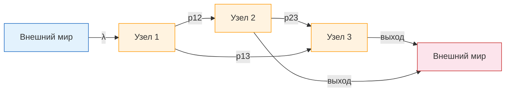
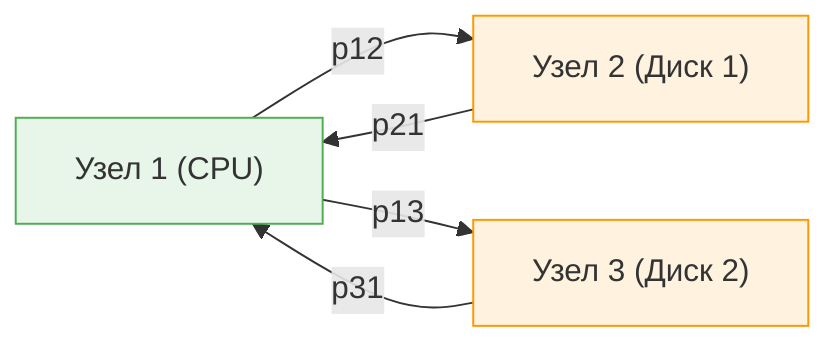
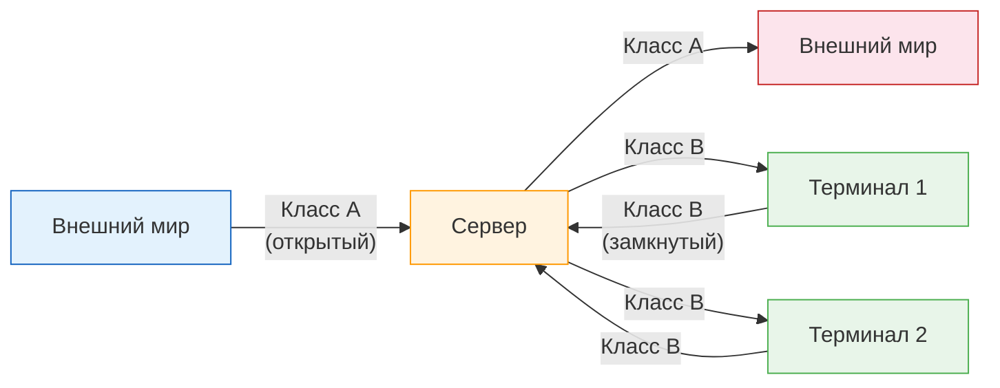
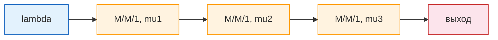
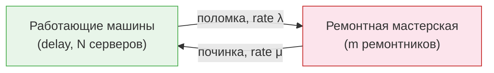
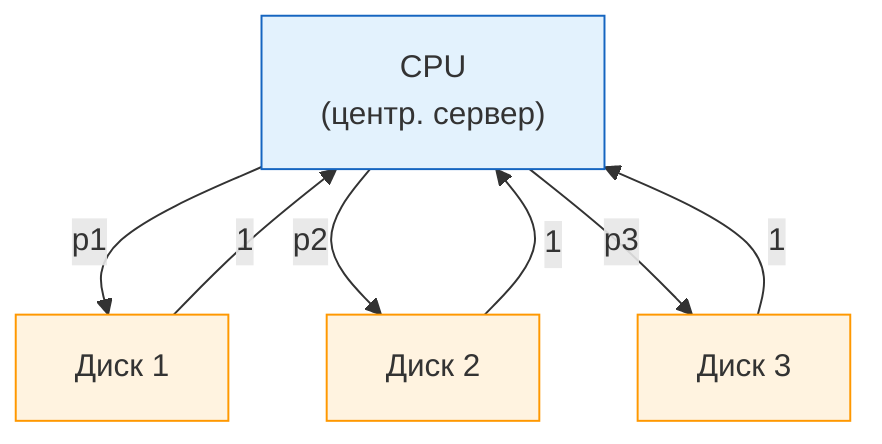

# Сети массового обслуживания

Мы разобрались с отдельными СМО -- одна очередь, один или несколько серверов. Но реальные системы устроены сложнее. Погнали разбираться с ==сетями массового обслуживания== -- когда несколько СМО соединены друг с другом, и заявки путешествуют между ними.

Реальная система -- это не одна очередь, а несколько связанных. В макдаке: очередь на кассу -> очередь на кухню -> очередь на выдачу. Это и есть сеть. Каждый этап -- отдельная СМО, но они работают не в вакууме, а влияют друг на друга. Если кухня тормозит -- касса тоже начинает задыхаться, потому что клиенты не уходят.

---

## Зачем это нужно

Суть в том, что любая реальная система -- это цепочка узлов:

- **Компьютерная сеть:** запрос сначала попадает на веб-сервер, потом на сервер приложений, потом в базу данных, потом обратно -- и на каждом этапе есть очередь и обслуживание.
- **Производственная линия:** деталь проходит через несколько станков -- фрезерный, токарный, шлифовальный. У каждого станка своя очередь.
- **Больница:** пациент приходит в регистратуру, потом к терапевту, потом на анализы, потом к специалисту -- и на каждом этапе ждёт.
- **Call-центр:** звонок сначала обрабатывается автоответчиком (IVR), потом переводится на оператора первой линии, а при необходимости -- на специалиста.

Моделировать каждый узел по отдельности бессмысленно -- важно понимать ==взаимодействие== между ними. Именно для этого и нужны сети массового обслуживания.

!!! note "Ключевая идея"
    Сеть массового обслуживания -- это набор **сервисных центров** (узлов), соединённых **маршрутами** перемещения заявок. Каждый узел -- это отдельная СМО со своей очередью, своей дисциплиной обслуживания и своей интенсивностью.

---

## Открытые сети

**Открытая сеть** (Open Network) -- это сеть, в которую заявки **приходят извне** и **уходят наружу**. Аналогия: открытая сеть -- это аэропорт. Пассажиры прилетают, проходят через паспортный контроль, получают багаж, проходят таможню -- и улетают. Постоянно кто-то приходит, кто-то уходит, и число людей внутри всё время меняется.

Основные свойства открытых сетей:

| Свойство | Описание |
|---|---|
| **Внешние поступления** | Заявки приходят в сеть извне с интенсивностью $\lambda$ |
| **Внешние уходы** | Заявки покидают сеть после обслуживания |
| **Переменное число заявок** | Количество заявок в сети колеблется со временем |
| **Пропускная способность** | В стационарном режиме пропускная способность = интенсивности входа $\lambda$ |

!!! tip "Пропускная способность"
    В стационарном режиме (когда система устаканилась) сколько заявок входит в сеть в единицу времени -- столько же и выходит. Это следует из ==закона сохранения==: если бы выход был меньше входа, заявки бы накапливались бесконечно.

Для каждого узла $i$ можно записать **уравнение баланса потоков**:

$$
\Lambda_i = \lambda_i + \sum_{j=1}^{K} \Lambda_j \cdot p_{ji}
$$

где:

- $\Lambda_i$ -- суммарная интенсивность поступления в узел $i$;
- $\lambda_i$ -- интенсивность внешнего потока в узел $i$;
- $p_{ji}$ -- вероятность перехода из узла $j$ в узел $i$.

---

## Замкнутые сети

**Замкнутая сеть** (Closed Network) -- это сеть, в которой **нет внешних поступлений и уходов**. Фиксированное число заявок $N$ бесконечно циркулирует между узлами.

Аналогия: замкнутая сеть -- это парк аттракционов с фиксированным числом посетителей. Купил билет -- крутишься внутри: покатался на горке -> пошёл на карусель -> снова на горку. Никто новый не заходит, никто не уходит. Одни и те же люди бесконечно циркулируют между аттракционами.

Основные свойства замкнутых сетей:

| Свойство | Описание |
|---|---|
| **Нет внешних потоков** | Заявки не приходят и не уходят |
| **Постоянное число заявок** | $N = \text{const}$ -- всегда ровно $N$ заявок в сети |
| **Пропускная способность** | Определяется как поток через любое разрезающее ребро сети |

!!! info "Как определить пропускную способность?"
    В замкнутой сети нет входа и выхода в привычном смысле. ==Пропускная способность== определяется как интенсивность потока через любую выбранную связь. Обычно выбирают связь, которая замыкает цикл (OUT -> IN), и измеряют поток через неё.

Замкнутые сети идеально подходят для моделирования систем с **фиксированным числом пользователей** -- например, терминальных систем с $N$ пользователями или производственных линий с $N$ деталями на конвейере.

---

## Смешанные сети

**Смешанная сеть** (Mixed Network) -- это сеть, которая одновременно является открытой для одних классов заявок и замкнутой для других.

Пример: компьютерная система, где:

- **Пакетные задания** (batch jobs) приходят извне и уходят после обработки -- ==открытая часть==;
- **Интерактивные пользователи** сидят за терминалами и постоянно отправляют запросы -- ==замкнутая часть== (число пользователей фиксировано).

!!! note "Зачем смешанные сети?"
    Смешанные сети позволяют моделировать реальные системы, где разные типы нагрузки ведут себя принципиально по-разному. Это гораздо реалистичнее, чем пытаться впихнуть всё в одну открытую или одну замкнутую модель.

---

## Последовательные сети

Короче, **последовательная сеть** (Series Network, Tandem Network) -- это простейший случай: $k$ узлов типа M/M/1, соединённых последовательно. Выход одного узла -- вход следующего.

Ключевое свойство последовательных сетей: благодаря ==теореме Бёрка== (Burke's theorem), выходной поток M/M/1-очереди в стационарном режиме является пуассоновским с той же интенсивностью $\lambda$. Это означает, что:

1. Каждый узел можно **анализировать независимо** от остальных.
2. Входной поток в каждый узел -- пуассоновский с интенсивностью $\lambda$.
3. Совместное распределение числа заявок в сети имеет ==продуктовую форму==.

$$
P(n_1, n_2, \ldots, n_k) = \prod_{i=1}^{k} P_i(n_i) = \prod_{i=1}^{k} (1 - \rho_i)\,\rho_i^{n_i}
$$

где $\rho_i = \frac{\lambda}{\mu_i}$ -- загрузка $i$-го узла.

!!! warning "Условие стабильности"
    Для стабильности сети необходимо, чтобы **каждый** узел был стабилен: $\rho_i < 1$ для всех $i = 1, \ldots, k$. Если хотя бы один узел перегружен -- вся сеть нестабильна.

---

## Сети продуктовой формы

Последовательные сети -- лишь частный случай гораздо более общего результата. **Сети продуктовой формы** (Product-Form Networks) -- это класс сетей, для которых совместное стационарное распределение состояний разлагается в произведение.

### Основная идея

Совместная вероятность того, что в узле 1 находится $n_1$ заявок, в узле 2 -- $n_2$ и т.д., равна:

$$
P(n_1, n_2, \ldots, n_K) = \frac{1}{G} \prod_{i=1}^{K} f_i(n_i)
$$

где:

- $f_i(n_i)$ -- функция, зависящая только от состояния узла $i$;
- $G$ -- ==нормализующая константа==, обеспечивающая $\sum P = 1$.

!!! tip "Почему это так важно?"
    Продуктовая форма -- это джекпот. Она означает, что каждую очередь можно анализировать отдельно, как будто остальных нет. Вместо одной огромной задачи -- много маленьких. Представь, что у тебя сеть из 10 узлов, в каждом может быть от 0 до 100 заявок. Пространство состояний -- $100^{10}$ комбинаций, это безнадёжно. Но продуктовая форма говорит: расслабься, считай каждый узел по отдельности, как будто остальных нет, а потом просто перемножь результаты. Вместо одной невозможной задачи -- десять элементарных.

### Ключевые теоремы

#### Теорема Джексона (1963) -- открытые сети

**Джексон** (Jackson, 1963) доказал, что открытая сеть из $K$ узлов типа M/M/m имеет продуктовую форму при условии:

- Внешние поступления -- пуассоновские;
- Времена обслуживания -- экспоненциальные;
- Маршрутизация -- вероятностная (Марковская).

Тогда:

$$
P(n_1, \ldots, n_K) = \prod_{i=1}^{K} P_i(n_i)
$$

где $P_i(n_i)$ -- стационарное распределение для узла $i$, рассматриваемого изолированно с входным потоком интенсивности $\Lambda_i$.

#### Теорема Гордона-Ньюэлла (1967) -- замкнутые сети

**Гордон и Ньюэлл** (Gordon, Newell, 1967) получили аналогичный результат для **замкнутых** сетей:

$$
P(n_1, \ldots, n_K) = \frac{1}{G(N)} \prod_{i=1}^{K} f_i(n_i)
$$

где $G(N)$ -- нормализующая константа, зависящая от общего числа заявок $N$ в сети. Вычисление $G(N)$ -- отдельная вычислительная задача (об этом ниже -- ==алгоритм Бузена==).

#### Теорема BCMP (1975)

Теорема **Баскетта, Чанди, Мунца и Палачио** (Baskett, Chandy, Muntz, Palacios, 1975) -- самое общее условие продуктовой формы. Она допускает:

- **Несколько классов заявок** (каждый со своим маршрутом);
- **Разные дисциплины обслуживания** (FCFS, PS, LCFS-PR, IS);
- **Общие распределения** времени обслуживания (не только экспоненциальные -- при некоторых дисциплинах);
- **Открытые, замкнутые и смешанные** сети.

!!! info "Четыре типа узлов BCMP"
    1. **FCFS** (First Come, First Served) -- обслуживание в порядке очереди. Требуется экспоненциальное распределение времени обслуживания.
    2. **PS** (Processor Sharing) -- все заявки обслуживаются одновременно, деля ресурс поровну. Допускается произвольное распределение.
    3. **LCFS-PR** (Last Come, First Served with Preemptive Resume) -- последний пришёл -- первый обслужен, с возобновлением. Допускается произвольное распределение.
    4. **IS** (Infinite Server) -- бесконечное число серверов, нет очереди. Допускается произвольное распределение.

---

## Модель ремонтника

**Модель ремонтника** (Machine Repairman Model) -- классическая замкнутая сеть с двумя узлами. Это ровно модель техподдержки. $N$ компьютеров ломаются, $K$ айтишников чинят. Пока комп в ремонте -- он не генерирует новых заявок (им же никто не пользуется). Починили -- вернулся в строй, пользователь снова работает и рано или поздно опять что-то сломает.

Устройство модели:

- **$N$ машин** работают независимо. Каждая машина ломается через экспоненциально распределённое время с интенсивностью $\lambda$.
- Сломанная машина поступает в **ремонтную мастерскую** с $m$ ремонтниками ($m \leq N$).
- Время ремонта -- экспоненциальное с интенсивностью $\mu$.
- После ремонта машина возвращается в работу.
- Общее число заявок (машин) фиксировано: $N = \text{const}$.

!!! note "Применение Шерра (1967)"
    **Шерр** (Scherr, 1967) использовал модель ремонтника для анализа ==систем разделения времени== (timesharing). В его интерпретации:

    - **Машины** = пользователи за терминалами (думают, набирают команды);
    - **Ремонтная мастерская** = центральный процессор (обрабатывает запросы);
    - **Время работы** = время думания пользователя (think time);
    - **Время ремонта** = время обработки запроса на CPU.

    Это была одна из первых успешных аналитических моделей производительности компьютерных систем.

Ключевые метрики модели:

$$
\text{Среднее число работающих машин} = N - \bar{L}_R
$$

$$
\text{Пропускная способность} = \lambda \cdot (N - \bar{L}_R)
$$

где $\bar{L}_R$ -- среднее число машин в ремонтной мастерской (в очереди + на ремонте).

---

## Модель центрального сервера

**Модель центрального сервера** (Central Server Model) -- ещё одна замкнутая сеть, предложенная **Бузеном** (Buzen, 1973).

Устройство модели:

- **CPU** -- ==центральный сервер==, через который проходят все задания.
- **Диски** (I/O-устройства) -- периферийные узлы.
- После обработки на CPU задание с вероятностью $p_i$ направляется на диск $i$, а с вероятностью $p_0$ покидает цикл (для замкнутой сети -- возвращается на вход к CPU через терминал).
- После обращения к диску задание всегда возвращается на CPU.

!!! tip "Алгоритм Бузена"
    Бузен предложил эффективный ==рекуррентный алгоритм== для вычисления нормализующей константы $G(N)$ в замкнутых сетях продуктовой формы. Без этого алгоритма прямой подсчёт $G(N)$ потребовал бы перебора всех возможных состояний -- а их число растёт комбинаторно.

    Алгоритм работает с таблицей $g(n, k)$, где $n$ -- число заявок, $k$ -- число узлов:

    $$
    g(n, k) = \sum_{j=0}^{n} f_k(j) \cdot g(n-j, k-1)
    $$

    Для M/M/1-узлов $f_i(j) = \rho_i^j$, и формула упрощается:

    $$
    g(n, k) = g(n, k-1) + \rho_k \cdot g(n-1, k)
    $$

Модель центрального сервера стала **основой анализа производительности** компьютерных систем в 1970-х годах и используется до сих пор (в обобщённом виде) для capacity planning.

---

## Типы сервисных центров

В сетях массового обслуживания узлы (сервисные центры) могут иметь разный характер. Выделяют три основных типа:

### 1. Центры с фиксированной ёмкостью (Fixed-Capacity Centers)

Это классическая СМО с конечным числом серверов: $m$ серверов, очередь, дисциплина обслуживания.

$$
\mu_i(n) = \begin{cases}
n \cdot \mu_i, & \text{если } n \leq m_i \\
m_i \cdot \mu_i, & \text{если } n > m_i
\end{cases}
$$

**Примеры:** процессор (1 сервер), банк кассиров ($m$ окошек), пул потоков ($m$ потоков).

### 2. Центры задержки (Delay Centers / Infinite Server)

У таких центров **бесконечное число серверов**: каждая заявка обслуживается немедленно, без ожидания в очереди.

$$
\mu_i(n) = n \cdot \mu_i \quad \text{для любого } n
$$

!!! info "Где встречаются delay-центры?"
    - **Терминалы пользователей** -- каждый пользователь думает независимо, не ожидая других.
    - **Сетевые каналы** -- если пропускная способность достаточна, каждый пакет передаётся без ожидания.
    - **Параллельные вычисления** -- неограниченный пул ресурсов.

### 3. Центры с зависимостью от нагрузки (Load-Dependent Centers)

Наиболее общий случай: интенсивность обслуживания $\mu_i(n)$ зависит от текущего числа заявок $n$ в узле.

$$
f_i(n_i) = \prod_{j=1}^{n_i} \frac{1}{\mu_i(j)}
$$

Это позволяет моделировать, например:

- **Многосерверные узлы** (интенсивность растёт до $m \cdot \mu$, потом постоянна);
- **Замедление при высокой нагрузке** (thrashing, congestion);
- **Масштабируемые системы** (авто-масштабирование облачных ресурсов).

| Тип центра | Число серверов | Очередь | $\mu(n)$ |
|---|---|---|---|
| **Фиксированная ёмкость** | $m$ (конечное) | Да | $\min(n, m) \cdot \mu$ |
| **==Центр задержки==** | $\infty$ | Нет | $n \cdot \mu$ |
| **Зависимый от нагрузки** | Переменное | Зависит | Произвольная $\mu(n)$ |

---

Подведём итог. Сети массового обслуживания позволяют моделировать реальные многостадийные системы -- от компьютерных сетей до производственных линий. Ключевой результат -- **продуктовая форма** стационарного распределения: при определённых условиях (теоремы Джексона, Гордона-Ньюэлла, BCMP) совместное распределение разлагается в произведение, и каждый узел можно анализировать почти независимо. Модели ремонтника и центрального сервера -- классические примеры замкнутых сетей, которые заложили основу аналитического моделирования производительности компьютерных систем.

Практическая шпаргалка: если твоя система -- сеть из M/M/m очередей с вероятностной маршрутизацией, применяй теорему Джексона и считай аналитически. Это быстро, точно и красиво. Если хоть одно условие нарушено (распределения не экспоненциальные, маршрутизация зависит от состояния, есть блокировки) -- бери SimPy и моделируй. Не пытайся натянуть аналитику на систему, для которой она не работает.
