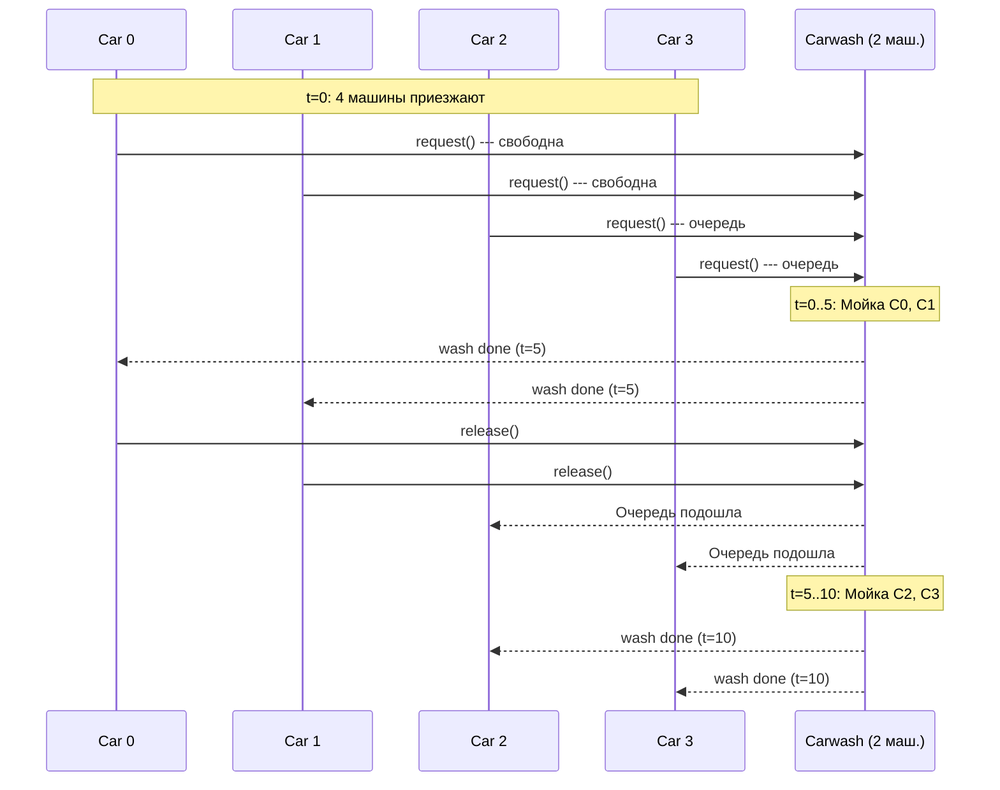
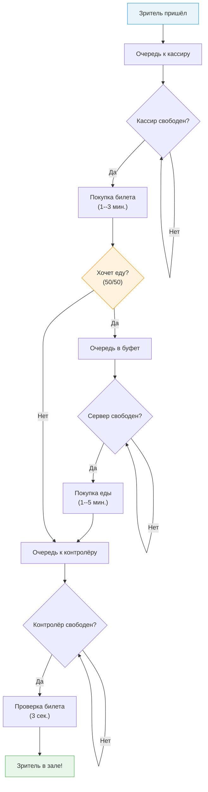

# SimPy --- практические примеры

Погнали разбирать SimPy на двух полноценных моделях: **автомойка** и **кинотеатр**. Оба примера --- классика документации SimPy, и они отлично показывают, как из маленьких кирпичиков (Resource, timeout, process) складываются реальные модели.

---

## Пример 1: Автомойка (Carwash)

### Постановка задачи

Автомойка имеет **ограниченное число моечных машин**. Автомобили приезжают случайным образом. Если свободная машина есть --- автомобиль сразу начинает мойку. Если все машины заняты --- автомобиль встаёт в очередь и ждёт.

Параметры модели:

| Параметр | Значение | Описание |
|---|---|---|
| `RANDOM_SEED` | 42 | Зерно генератора для воспроизводимости |
| `NUM_MACHINES` | 2 | Количество моечных машин |
| `WASHTIME` | 5 | Время мойки одного автомобиля (мин.) |
| `T_INTER` | 7 | Среднее время между приездами автомобилей (мин.) |
| `SIM_TIME` | 20 | Общее время симуляции (мин.) |

### Ключевые концепции

Суть в том, что этот пример демонстрирует три фундаментальных паттерна SimPy:

1. ==Resource== --- ресурс с ограниченной ёмкостью (моечные машины)
2. **Случайные поступления** --- автомобили приезжают через случайные интервалы
3. ==Взаимодействие процессов== --- процесс автомобиля запускает подпроцесс мойки и ждёт его завершения

### Что тут происходит

Логика модели очень простая, если разложить по шагам. Есть автомойка с двумя машиноместами. В самом начале симуляции разом приезжают 4 машины --- две сразу попадают на мойку, две стоят в очереди. Дальше раз в 5--9 минут (случайно) приезжает ещё одна машина. Каждая мойка длится ровно 5 минут. Когда машина домыта, она освобождает место, и туда сразу заезжает следующая из очереди (если кто-то ждёт). Вся магия SimPy в том, что тебе не надо руками двигать часы или проверять очередь --- `yield request` сам усыпит процесс, пока ресурс не освободится, а `yield env.timeout(...)` промотает симуляционное время на нужное количество минут.

### Полный код с комментариями

```python
import itertools
import random
import simpy

RANDOM_SEED = 42
NUM_MACHINES = 2   # машиноместа на мойке
WASHTIME = 5       # сколько минут моем одну машину
T_INTER = 7        # в среднем раз в 7 минут приезжает новая машина
SIM_TIME = 20      # сколько минут гоняем симуляцию


class Carwash:
    """Автомойка с ограниченным числом моечных машин.

    Автомобили запрашивают машину (Resource). Когда получают ---
    запускают процесс мойки и ждут его завершения.
    """

    def __init__(self, env, num_machines, washtime):
        self.env = env
        self.machine = simpy.Resource(env, num_machines)  # машиномест всего num_machines
        self.washtime = washtime

    def wash(self, car):
        """Процесс мойки: занимает washtime минут.

        После мойки выводим, сколько процентов грязи удалено
        (случайное число от 50 до 99).
        """
        yield self.env.timeout(self.washtime)  # мойка занимает фиксированное время
        pct_dirt = random.randint(50, 99)
        print(f"Carwash removed {pct_dirt}% of {car}'s dirt.")


def car(env, name, cw):
    """Процесс одного автомобиля.

    Автомобиль приезжает на мойку, запрашивает моечную машину,
    ожидает мойку и уезжает.
    """
    print(f"{name} arrives at the carwash at {env.now:.2f}.")

    with cw.machine.request() as request:
        yield request  # ждём свободную мойку

        print(f"{name} enters the carwash at {env.now:.2f}.")
        yield env.process(cw.wash(name))  # моем

        print(f"{name} leaves the carwash at {env.now:.2f}.")
    # при выходе из with ресурс автоматически освобождается


def setup(env, num_machines, washtime, t_inter):
    """Генератор автомобилей.

    Создаёт автомойку, запускает начальную партию автомобилей,
    а затем генерирует новые автомобили через случайные интервалы.
    """
    carwash = Carwash(env, num_machines, washtime)

    car_count = itertools.count()  # бесконечный счётчик: 0, 1, 2, ...

    # в момент t=0 на мойку приезжают сразу 4 машины
    for _ in range(4):
        env.process(car(env, f"Car {next(car_count)}", carwash))

    # дальше генерим машины по одной через случайные интервалы
    while True:
        # генерим время между приходами: t_inter +/- 2 минуты
        yield env.timeout(random.randint(t_inter - 2, t_inter + 2))
        env.process(car(env, f"Car {next(car_count)}", carwash))


# запуск симуляции
print("Carwash")
random.seed(RANDOM_SEED)  # фиксируем seed, чтобы результат воспроизводился

env = simpy.Environment()
env.process(setup(env, NUM_MACHINES, WASHTIME, T_INTER))
env.run(until=SIM_TIME)  # гоняем модель 20 минут
```

### Пример вывода

```
Carwash
Car 0 arrives at the carwash at 0.00.
Car 1 arrives at the carwash at 0.00.
Car 2 arrives at the carwash at 0.00.
Car 3 arrives at the carwash at 0.00.
Car 0 enters the carwash at 0.00.
Car 1 enters the carwash at 0.00.
Car 4 arrives at the carwash at 5.00.
Carwash removed 97% of Car 0's dirt.
Carwash removed 67% of Car 1's dirt.
Car 0 leaves the carwash at 5.00.
Car 1 leaves the carwash at 5.00.
Car 2 enters the carwash at 5.00.
Car 3 enters the carwash at 5.00.
Car 5 arrives at the carwash at 10.00.
Carwash removed 64% of Car 2's dirt.
Carwash removed 58% of Car 3's dirt.
Car 2 leaves the carwash at 10.00.
Car 3 leaves the carwash at 10.00.
Car 4 enters the carwash at 10.00.
Car 5 enters the carwash at 10.00.
Carwash removed 97% of Car 4's dirt.
Carwash removed 56% of Car 5's dirt.
Car 4 leaves the carwash at 15.00.
Car 5 leaves the carwash at 15.00.
Car 6 arrives at the carwash at 16.00.
Car 6 enters the carwash at 16.00.
```

### Анализ вывода

Короче, вот что тут происходит:

1. **t=0:** Четыре машины приезжают одновременно. Но моечных машин всего 2 --- поэтому Car 0 и Car 1 сразу начинают мойку, а Car 2 и Car 3 встают в ==очередь==.
2. **t=5:** Мойка Car 0 и Car 1 завершена (5 минут). Они уезжают, освобождая ресурсы. Car 2 и Car 3 немедленно занимают машины. Также в этот момент приезжает Car 4 --- встаёт в очередь.
3. **t=10:** Car 2 и Car 3 уезжают. Car 4 и Car 5 (приехал в t=10) начинают мойку.
4. **t=15:** Car 4 и Car 5 уезжают. Очередь пуста.
5. **t=16:** Car 6 приезжает и сразу попадает на свободную машину.

!!! note "Обрати внимание"
    Car 6 приезжает в t=16, а не в t=15, потому что интервал между приездами случайный: `random.randint(5, 9)` (то есть $\text{T\_INTER} \pm 2 = 7 \pm 2$).

### Что можно менять и смотреть

Этот пример --- отличная песочница, чтобы поиграться с параметрами и посмотреть, как меняется поведение системы.

- **`NUM_MACHINES = 1`** --- попробуй оставить одну мойку. Сразу увидишь, как очередь растёт: 4 машины приехали в t=0, а мойка обслуживает по одной за 5 минут. Последняя из начальных четырёх будет ждать 15 минут.
- **`NUM_MACHINES = 4`** --- поставь 4 мойки. Все начальные машины попадут сразу, очереди не будет вообще. Но зато 2 мойки будут простаивать почти всё время --- деньги на ветер.
- **`WASHTIME = 10`** --- увеличь время мойки вдвое. При тех же 2 машиноместах и потоке раз в 7 минут система начнёт захлёбываться.
- **`T_INTER = 3`** --- сделай поток интенсивнее (машина каждые 1--5 минут). Очередь будет расти бесконечно, потому что система не справляется.
- **`SIM_TIME = 200`** --- увеличь время симуляции, чтобы увидеть устоявшееся поведение. На 20 минутах статистика ещё не стабилизировалась.

!!! tip "Совет"
    Когда подбираешь параметры, смотри на соотношение: если среднее время обслуживания / (число серверов * среднее время между приходами) > 1, то очередь будет расти бесконечно. Для нашей мойки: 5 / (2 * 7) = 0.36 --- система стабильна, очередь не растёт.

### Диаграмма последовательности



---

## Пример 2: Кинотеатр (Theater)

### Постановка задачи

Зрители приходят в кинотеатр и проходят через **несколько последовательных этапов** обслуживания:

1. **Кассир** --- покупка билета (1--3 мин.)
2. **Буфет** (опционально, с вероятностью 50%) --- покупка еды (1--5 мин.)
3. **Контролёр** --- проверка билета (3 секунды = 3/60 мин.)

Задача --- измерить ==среднее время ожидания== зрителя (от прихода до момента, когда он попал в зал) и подобрать оптимальное количество кассиров, серверов буфета и контролёров.

### Почему время ожидания такое большое

Прежде чем лезть в код, разберёмся, почему в этой модели зрители ждут по полчаса и больше. Тут 3 ресурса последовательно: кассир, потом буфет, потом контролёр. Узкое место --- самый медленный ресурс. Если кассиров 2, каждый обслуживает 1--3 минуты (в среднем 2 мин.), а новый зритель приходит каждые 12 секунд --- это 5 зрителей в минуту. Два кассира обслуживают в среднем 1 зрителя в минуту. Приход в 5 раз быстрее обслуживания --- очевидно, очередь будет расти каждую секунду. Добавь сюда буфет (1--5 мин. для половины зрителей) --- и получается, что система безнадёжно перегружена. Именно поэтому среднее ожидание получается 36 минут. Контролёр (3 секунды) --- вообще не узкое место, его можно хоть убрать.

### Ключевые концепции

| Концепция | Как реализована |
|---|---|
| **Несколько ресурсов** | `cashier`, `server`, `usher` --- три отдельных `Resource` |
| **Последовательные этапы** | Зритель проходит `yield request` для каждого ресурса по очереди |
| **Условный этап** | `if random.choice([True, False])` --- буфет с вероятностью 50% |
| **Сбор статистики** | `wait_times.append(env.now - arrival_time)` |
| **Непрерывная генерация** | `while True: yield env.timeout(0.20)` |

### Полный код с комментариями

```python
import simpy
import random
import statistics

# сюда складываем время ожидания каждого зрителя
wait_times = []


class Theater:
    """Кинотеатр с тремя типами ресурсов:
    кассиры, серверы буфета и контролёры.
    """

    def __init__(self, env, num_cashiers, num_servers, num_ushers):
        self.env = env
        self.cashier = simpy.Resource(env, num_cashiers)   # кассы
        self.server = simpy.Resource(env, num_servers)      # буфет
        self.usher = simpy.Resource(env, num_ushers)        # контролёры на входе

    def purchase_ticket(self, moviegoer):
        """Покупка билета: занимает от 1 до 3 минут."""
        yield self.env.timeout(random.randint(1, 3))  # кассир работает 1-3 мин.

    def check_ticket(self, moviegoer):
        """Проверка билета: занимает 3 секунды (3/60 минуты)."""
        yield self.env.timeout(3 / 60)  # контролёр проверяет почти мгновенно

    def sell_food(self, moviegoer):
        """Продажа еды в буфете: от 1 до 5 минут."""
        yield self.env.timeout(random.randint(1, 5))  # буфет --- самый долгий этап


def go_to_movies(env, moviegoer, theater):
    """Процесс одного зрителя.

    Зритель проходит три этапа:
    1. Кассир (обязательно)
    2. Буфет (с вероятностью 50%)
    3. Контролёр (обязательно)
    """
    arrival_time = env.now  # запоминаем, когда пришёл зритель

    # этап 1: покупка билета
    with theater.cashier.request() as request:
        yield request  # тут ждём очередь к кассиру
        yield env.process(theater.purchase_ticket(moviegoer))

    # этап 2: буфет --- ходит только половина зрителей
    if random.choice([True, False]):
        with theater.server.request() as request:
            yield request  # ждём очередь в буфет
            yield env.process(theater.sell_food(moviegoer))

    # этап 3: проверка билета на входе
    with theater.usher.request() as request:
        yield request  # ждём контролёра
        yield env.process(theater.check_ticket(moviegoer))

    # зритель в зале, считаем статистику
    wait_times.append(env.now - arrival_time)


def run_theater(env, num_cashiers, num_servers, num_ushers):
    """Запуск модели кинотеатра.

    Создаёт театр, запускает первых 3 зрителей,
    затем генерирует нового зрителя каждые 12 секунд (0.20 мин.).
    """
    theater = Theater(env, num_cashiers, num_servers, num_ushers)

    # сначала 3 зрителя уже стоят в очереди
    for moviegoer in range(3):
        env.process(go_to_movies(env, moviegoer, theater))

    # дальше каждые 12 секунд приходит новый зритель
    while True:
        yield env.timeout(0.20)  # 0.20 мин = 12 секунд
        moviegoer += 1
        env.process(go_to_movies(env, moviegoer, theater))


def get_average_wait_time(wait_times):
    """Считаем среднее время ожидания,
    возвращаем в формате (минуты, секунды).
    """
    average_wait = statistics.mean(wait_times)
    minutes, frac_minutes = divmod(average_wait, 1)
    seconds = frac_minutes * 60
    return round(minutes), round(seconds)


# запуск симуляции
random.seed(42)
num_cashiers = 2
num_servers = 2
num_ushers = 2

env = simpy.Environment()
env.process(run_theater(env, num_cashiers, num_servers, num_ushers))
env.run(until=90)  # гоняем 90 минут

mins, secs = get_average_wait_time(wait_times)
print(
    "Running simulation...",
    f"\nThe average wait time is {mins} minutes and {secs} seconds.",
)
```

### Анализ результатов

При конфигурации `(2 кассира, 2 сервера, 2 контролёра)` и времени симуляции 90 минут среднее время ожидания составляет **36 минут и 38 секунд**. Это довольно много!

!!! warning "Почему так долго?"
    Зрители приходят каждые 12 секунд --- это очень интенсивный поток. При двух кассирах, каждый из которых обслуживает 1--3 минуты, система быстро перегружается и очередь растёт.

### Как искать узкое место

Когда среднее ожидание слишком большое, надо понять, какой именно ресурс тормозит всю систему. Простой способ --- посчитать загрузку каждого ресурса.

```python
# загрузка = время_занятости / общее_время
# ресурс с загрузкой > 0.8 --- узкое место, он перегружен

# Для кинотеатра прикинем на пальцах:
# зритель каждые 0.2 мин = 5 зрителей/мин
# кассир обслуживает в среднем 2 мин на зрителя
# 2 кассира обслуживают 2/2 = 1 зрителя/мин
# загрузка кассиров = 5 / 1 = 5.0 (!!!) --- перегрузка в 5 раз

# буфет: половина зрителей * 3 мин в среднем = 2.5 * 3 = 7.5 мин/мин на 2 сервера
# загрузка буфета = 7.5 / 2 = 3.75 --- тоже перегрузка

# контролёр: 5 зрителей/мин * 0.05 мин = 0.25 мин/мин на 2 контролёра
# загрузка контролёров = 0.25 / 2 = 0.125 --- контролёры скучают
```

!!! tip "Правило большого пальца"
    Увеличивать надо тот ресурс, загрузка которого больше 1.0 (или ближе к 1.0, если хочешь короткие очереди). Ресурсы с загрузкой < 0.5 трогать бессмысленно --- они и так простаивают.

### Подбор оптимальных параметров

Чтобы найти оптимальную конфигурацию, нужно запускать симуляцию с разными параметрами:

| Кассиры | Серверы | Контролёры | Среднее ожидание |
|---|---|---|---|
| 1 | 1 | 1 | Очень долго |
| 2 | 2 | 2 | ~36 мин. 38 сек. |
| 3 | 2 | 2 | Значительно меньше |
| 4 | 3 | 2 | Ещё меньше |

!!! tip "Узкое место"
    Контролёр проверяет билет за 3 секунды --- это самый быстрый этап. ==Узкое место== --- **кассиры** (1--3 мин.) и **буфет** (1--5 мин.). Увеличение числа контролёров почти не повлияет на результат, а вот добавление кассиров --- повлияет существенно.

### Блок-схема процесса зрителя



---

## Общие паттерны SimPy

Оба примера используют одни и те же базовые паттерны. Они пригодятся при написании любой SimPy-модели.

### 1. Захват ресурса с `with resource.request()`

Это основной механизм работы с ограниченными ресурсами:

```python
with resource.request() as request:
    yield request          # Ждём, пока ресурс не освободится
    yield env.process(...)  # Используем ресурс
# Ресурс автоматически освобождается при выходе из with
```

!!! note "Почему with?"
    Конструкция `with` гарантирует, что ресурс будет освобождён даже если внутри произойдёт ошибка. Без `with` можно забыть вызвать `resource.release(request)` --- и ресурс останется занятым навсегда.

**Автомойка:** `with cw.machine.request()` --- запрос моечной машины.

**Кинотеатр:** три последовательных `with` --- кассир, буфет, контролёр.

### 2. Случайные интервалы с `random.randint()`

SimPy работает с любыми генераторами случайных чисел Python:

```python
# Случайный интервал между приездами (автомойка)
yield env.timeout(random.randint(t_inter - 2, t_inter + 2))

# Случайное время обслуживания (кинотеатр)
yield self.env.timeout(random.randint(1, 3))
```

!!! tip "Воспроизводимость"
    Всегда устанавливайте `random.seed(42)` (или другое фиксированное значение) в начале симуляции. Это позволяет воспроизвести результаты --- критически важно для отладки и сравнения экспериментов.

### 3. Сбор статистики

Простейший подход --- собирать значения в список и вычислять агрегаты после окончания симуляции:

```python
# В начале
wait_times = []

# В процессе (внутри go_to_movies)
wait_times.append(env.now - arrival_time)

# После симуляции
average_wait = statistics.mean(wait_times)
```

В автомойке статистика не собирается (только вывод в консоль). В кинотеатре --- полноценный сбор и анализ времён ожидания. В реальных проектах стоит собирать больше метрик: длину очереди, загрузку ресурсов, число обслуженных заявок.

### 4. Генерация процессов (паттерн `while True`)

Оба примера используют один и тот же паттерн для непрерывной генерации новых заявок:

```python
def setup(env, ...):
    # Создаём начальные заявки
    for _ in range(initial_count):
        env.process(some_process(env, ...))

    # Бесконечная генерация
    while True:
        yield env.timeout(inter_arrival_time)  # Ждём
        env.process(some_process(env, ...))     # Создаём новую заявку
```

!!! note "Бесконечный цикл?"
    `while True` не зависает, потому что `yield env.timeout(...)` приостанавливает генератор. Симуляция остановится, когда `env.run(until=SIM_TIME)` дойдёт до указанного времени --- все незавершённые процессы просто прекратятся.

### Сводная таблица паттернов

| Паттерн | Автомойка | Кинотеатр |
|---|---|---|
| Ресурсы | 1 (`machine`) | 3 (`cashier`, `server`, `usher`) |
| Случайное время | `randint(5, 9)` для интервала | `randint(1, 3)`, `randint(1, 5)` для обслуживания |
| Статистика | Только `print()` | `wait_times` + `statistics.mean()` |
| Генерация | `while True` + `timeout` | `while True` + `timeout` |
| Начальные заявки | 4 автомобиля | 3 зрителя |

---

## Паттерны для домашки

Ниже --- готовые кирпичики, которые пригодятся при написании домашки. Бери и адаптируй под свою задачу.

### Паттерн 1: Несколько типов клиентов

Если в задаче есть VIP и обычные клиенты (или срочные/несрочные заявки), используй `PriorityResource`. Он работает как обычный `Resource`, но при освобождении ресурса первым обслуживается клиент с наименьшим приоритетом (0 = самый важный).

```python
import simpy
import random

def vip_customer(env, name, server):
    """VIP клиент --- обслуживается первым."""
    print(f"[{env.now:.2f}] {name} (VIP) пришёл")
    with server.request(priority=0) as req:  # 0 = высший приоритет
        yield req  # VIP пролезет вперёд очереди
        print(f"[{env.now:.2f}] {name} (VIP) обслуживается")
        yield env.timeout(random.expovariate(1/3))  # среднее время обслуживания 3 мин.

def regular_customer(env, name, server):
    """Обычный клиент --- ждёт дольше, если есть VIP."""
    print(f"[{env.now:.2f}] {name} пришёл")
    with server.request(priority=1) as req:  # 1 = обычный приоритет
        yield req  # если впереди есть VIP, пропустим их
        print(f"[{env.now:.2f}] {name} обслуживается")
        yield env.timeout(random.expovariate(1/5))  # обычные обслуживаются дольше

# PriorityResource вместо обычного Resource
server = simpy.PriorityResource(env, capacity=2)
```

!!! warning "Осторожно с приоритетами"
    Если VIP приходят слишком часто, обычные клиенты могут ждать вечно --- это называется starvation. В реальных системах для защиты от этого ограничивают время ожидания или резервируют часть ресурсов для обычных клиентов.

### Паттерн 2: Несколько этапов обслуживания

Этот паттерн уже есть в примере с кинотеатром, но вот чистый шаблон, который можно скопировать. Ключевая идея --- каждый `with` блок захватывает свой ресурс, и они идут последовательно.

```python
def multi_stage_customer(env, name, stage1, stage2, wait_times):
    """Клиент проходит два этапа обслуживания подряд."""
    arrival = env.now  # запоминаем время прихода

    # сначала проходим первый этап
    with stage1.request() as req:
        yield req  # ждём первый ресурс
        yield env.timeout(random.expovariate(1/2))  # обслуживание ~2 мин.

    # потом второй (первый ресурс уже освободился!)
    with stage2.request() as req:
        yield req  # ждём второй ресурс
        yield env.timeout(random.expovariate(1/3))  # обслуживание ~3 мин.

    # считаем статистику: полное время от прихода до выхода
    wait_times.append(env.now - arrival)
```

!!! tip "Важный момент"
    Обрати внимание: первый ресурс освобождается, когда мы выходим из первого `with`, а не когда заканчивается весь процесс. Это правильное поведение --- клиент ушёл от кассира и перешёл к следующему этапу, кассир уже свободен для следующего клиента.

### Паттерн 3: Запуск нескольких экспериментов

В домашке часто надо сравнить: а что если серверов 1, 2, 3, 4, 5? Вот как это сделать одним скриптом. Ключевой трюк --- фиксировать `random.seed` перед каждым запуском, чтобы сравнение было честным (одни и те же клиенты приходят в одно и то же время).

```python
import simpy
import random
import statistics

def source(env, server, wait_times):
    """Генератор клиентов --- стандартный паттерн."""
    i = 0
    while True:
        yield env.timeout(random.expovariate(1/2))  # клиент каждые ~2 мин.
        i += 1
        env.process(customer(env, f"Client-{i}", server, wait_times))

def customer(env, name, server, wait_times):
    """Клиент: пришёл, подождал, обслужился."""
    arrival = env.now
    with server.request() as req:
        yield req  # тут ждём очередь
        yield env.timeout(random.expovariate(1/4))  # обслуживание ~4 мин.
    wait_times.append(env.now - arrival)  # записываем полное время в системе

# прогоняем эксперименты для разного числа серверов
results = []
for num_servers in range(1, 6):
    random.seed(42)  # одинаковый seed для честного сравнения!
    wait_times = []
    env = simpy.Environment()
    server = simpy.Resource(env, capacity=num_servers)
    env.process(source(env, server, wait_times))
    env.run(until=1000)  # достаточно большое время для стабильной статистики
    avg = statistics.mean(wait_times)
    results.append((num_servers, avg))
    print(f"{num_servers} серверов: среднее ожидание {avg:.2f} мин.")
```

Результат будет выглядеть примерно так:

```
1 серверов: среднее ожидание 18.42 мин.
2 серверов: среднее ожидание 4.31 мин.
3 серверов: среднее ожидание 4.05 мин.
4 серверов: среднее ожидание 4.02 мин.
5 серверов: среднее ожидание 4.01 мин.
```

Видно, что основной выигрыш --- при переходе от 1 к 2 серверам. Дальше добавление серверов уже почти не помогает. Это типичная картина для СМО: после снятия узкого места дальнейшие улучшения дают убывающую отдачу.

---

## Чеклист перед сдачей домашки

Перед тем как отправлять домашку, пройдись по этому списку. Каждый пункт --- типичная ошибка, на которой теряют баллы.

**Воспроизводимость:**

- [ ] `random.seed()` зафиксирован в начале? Без этого результаты будут разными при каждом запуске, и проверяющий не сможет воспроизвести твои числа.

**Время симуляции:**

- [ ] `SIM_TIME` достаточно большой? Минимум 1000, а лучше 5000--10000. На коротких прогонах (20--100) статистика ещё не стабилизировалась и может сильно гулять. Попробуй запустить с разным `SIM_TIME` и убедись, что среднее перестало прыгать.

**Сбор статистики:**

- [ ] Не забыл `wait_times.append(...)` внутри процесса клиента? Частая ошибка --- написать весь процесс, но забыть записать результат. Без `append` список будет пустым и `statistics.mean()` упадёт с ошибкой.
- [ ] Считаешь правильную величину? `env.now - arrival_time` --- это полное время в системе (ожидание + обслуживание). Если нужно только время ожидания в очереди, то надо замерять момент до и после `yield request`.

**Проверка результатов:**

- [ ] Результаты симуляции сходятся с теорией? Для простых случаев (M/M/1, M/M/c) есть аналитические формулы. Например, для M/M/1 с интенсивностью прихода lambda и обслуживания mu, среднее время в системе = 1 / (mu - lambda). Если симуляция показывает что-то сильно другое --- ищи баг.

**Визуализация:**

- [ ] Графики есть? Минимальный набор --- гистограмма времён ожидания и график среднего ожидания от числа серверов. Вот болванка:

```python
import matplotlib.pyplot as plt

# гистограмма времён ожидания
plt.figure(figsize=(10, 4))
plt.subplot(1, 2, 1)
plt.hist(wait_times, bins=30, edgecolor='black', alpha=0.7)
plt.xlabel('Время ожидания (мин.)')
plt.ylabel('Количество клиентов')
plt.title('Распределение времён ожидания')

# среднее ожидание vs число серверов (из эксперимента выше)
plt.subplot(1, 2, 2)
servers = [r[0] for r in results]
avg_waits = [r[1] for r in results]
plt.plot(servers, avg_waits, 'o-', linewidth=2, markersize=8)
plt.xlabel('Число серверов')
plt.ylabel('Среднее ожидание (мин.)')
plt.title('Влияние числа серверов')
plt.grid(True, alpha=0.3)

plt.tight_layout()
plt.savefig('simulation_results.png', dpi=150)
plt.show()
```

**Оформление кода:**

- [ ] Код разбит на функции, а не всё в одном блоке? Минимум: функция-генератор клиентов, функция-процесс клиента, функция запуска эксперимента.
- [ ] Константы вынесены наверх, а не захардкожены внутри функций?

---

!!! success "Итого"
    Два примера --- автомойка и кинотеатр --- покрывают все основные паттерны SimPy: ==ресурсы==, случайные времена, взаимодействие процессов, сбор статистики и непрерывную генерацию заявок. Разобрался с этими двумя моделями --- можешь построить практически любую дискретно-событийную модель на SimPy.
