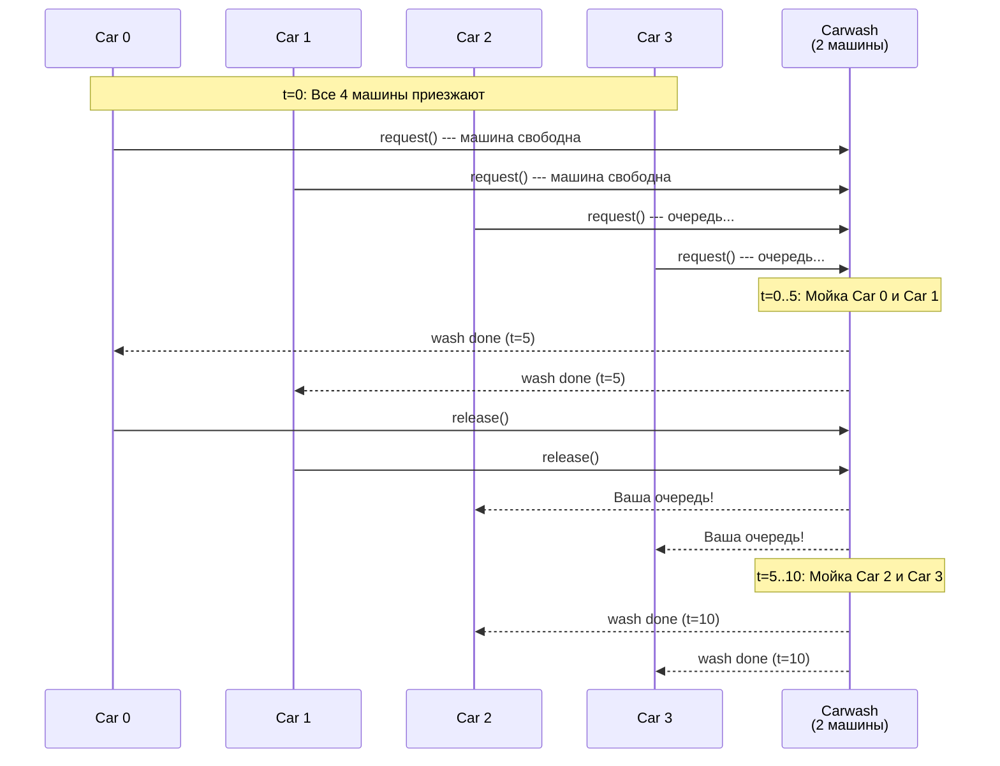
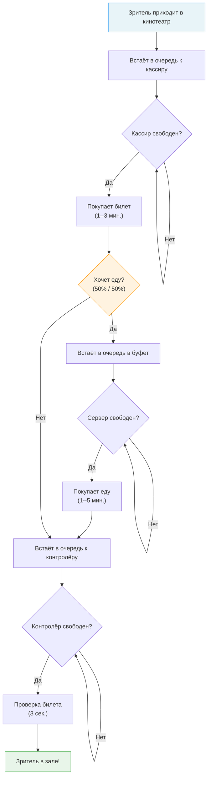

# SimPy --- практические примеры

Привет! В прошлый раз мы познакомились с SimPy как с библиотекой --- узнали про окружение, процессы, ресурсы и таймауты. Сегодня закрепим всё на двух полноценных моделях: **автомойка** и **кинотеатр**. Оба примера --- классика документации SimPy, и они отлично показывают, как из маленьких кирпичиков (Resource, timeout, process) складываются реальные модели.

---

## Зачем это нужно

Теория без практики --- как учебник по плаванию без бассейна. Можно прочитать про `simpy.Resource` и `env.timeout()`, но пока не напишешь полноценную модель с несколькими процессами, взаимодействующими друг с другом, --- настоящего понимания не будет.

В этом конспекте мы разберём:

- **Автомойку (Carwash)** --- простая модель с одним ресурсом и случайным потоком заявок
- **Кинотеатр (Theater)** --- модель посложнее, с несколькими последовательными этапами обслуживания и сбором статистики

!!! tip "Совет"
    Попробуй запустить оба примера самостоятельно и поменять параметры --- это лучший способ разобраться, как работает SimPy.

---

## Пример 1: Автомойка (Carwash)

### Постановка задачи

Автомойка имеет **ограниченное число моечных машин**. Автомобили приезжают случайным образом. Если свободная машина есть --- автомобиль сразу начинает мойку. Если все машины заняты --- автомобиль встаёт в очередь и ждёт.

Параметры модели:

| Параметр | Значение | Описание |
|---|---|---|
| `RANDOM_SEED` | 42 | Зерно генератора для воспроизводимости |
| `NUM_MACHINES` | 2 | Количество моечных машин |
| `WASHTIME` | 5 | Время мойки одного автомобиля (мин.) |
| `T_INTER` | 7 | Среднее время между приездами автомобилей (мин.) |
| `SIM_TIME` | 20 | Общее время симуляции (мин.) |

### Ключевые концепции

Этот пример демонстрирует три фундаментальных паттерна SimPy:

1. **Resource** --- ресурс с ограниченной ёмкостью (моечные машины)
2. **Случайные поступления** --- автомобили приезжают через случайные интервалы
3. **Взаимодействие процессов** --- процесс автомобиля запускает подпроцесс мойки и ждёт его завершения

### Полный код с комментариями

```python
import itertools
import random
import simpy

# === Параметры модели ===
RANDOM_SEED = 42
NUM_MACHINES = 2   # Количество моечных машин
WASHTIME = 5       # Время мойки одного автомобиля (мин.)
T_INTER = 7        # Среднее время между приездами (мин.)
SIM_TIME = 20      # Общее время симуляции (мин.)


class Carwash:
    """Автомойка с ограниченным числом моечных машин.

    Автомобили запрашивают машину (Resource). Когда получают ---
    запускают процесс мойки и ждут его завершения.
    """

    def __init__(self, env, num_machines, washtime):
        self.env = env
        # Resource --- ключевой объект SimPy.
        # num_machines задаёт, сколько автомобилей
        # могут мыться одновременно.
        self.machine = simpy.Resource(env, num_machines)
        self.washtime = washtime

    def wash(self, car):
        """Процесс мойки: занимает washtime минут.

        После мойки выводим, сколько процентов грязи удалено
        (случайное число от 50 до 99).
        """
        yield self.env.timeout(self.washtime)
        pct_dirt = random.randint(50, 99)
        print(f"Carwash removed {pct_dirt}% of {car}'s dirt.")


def car(env, name, cw):
    """Процесс одного автомобиля.

    Автомобиль приезжает на мойку, запрашивает моечную машину,
    ожидает мойку и уезжает.
    """
    print(f"{name} arrives at the carwash at {env.now:.2f}.")

    # with cw.machine.request() --- запрашиваем ресурс.
    # Если свободная машина есть --- yield request вернётся сразу.
    # Если нет --- процесс «засыпает» до освобождения ресурса.
    with cw.machine.request() as request:
        yield request  # Ждём, пока машина не освободится

        print(f"{name} enters the carwash at {env.now:.2f}.")
        # Запускаем подпроцесс мойки и ждём его завершения
        yield env.process(cw.wash(name))

        print(f"{name} leaves the carwash at {env.now:.2f}.")
    # При выходе из with ресурс автоматически освобождается!


def setup(env, num_machines, washtime, t_inter):
    """Генератор автомобилей.

    Создаёт автомойку, запускает начальную партию автомобилей,
    а затем генерирует новые автомобили через случайные интервалы.
    """
    carwash = Carwash(env, num_machines, washtime)

    car_count = itertools.count()  # Бесконечный счётчик: 0, 1, 2, ...

    # Создаём 4 начальных автомобиля (они приедут в момент t=0)
    for _ in range(4):
        env.process(car(env, f"Car {next(car_count)}", carwash))

    # Бесконечный цикл генерации новых автомобилей
    while True:
        # Случайный интервал: t_inter +/- 2 минуты
        yield env.timeout(random.randint(t_inter - 2, t_inter + 2))
        env.process(car(env, f"Car {next(car_count)}", carwash))


# === Запуск симуляции ===
print("Carwash")
random.seed(RANDOM_SEED)

env = simpy.Environment()
env.process(setup(env, NUM_MACHINES, WASHTIME, T_INTER))
env.run(until=SIM_TIME)
```

### Пример вывода

```
Carwash
Car 0 arrives at the carwash at 0.00.
Car 1 arrives at the carwash at 0.00.
Car 2 arrives at the carwash at 0.00.
Car 3 arrives at the carwash at 0.00.
Car 0 enters the carwash at 0.00.
Car 1 enters the carwash at 0.00.
Car 4 arrives at the carwash at 5.00.
Carwash removed 97% of Car 0's dirt.
Carwash removed 67% of Car 1's dirt.
Car 0 leaves the carwash at 5.00.
Car 1 leaves the carwash at 5.00.
Car 2 enters the carwash at 5.00.
Car 3 enters the carwash at 5.00.
Car 5 arrives at the carwash at 10.00.
Carwash removed 64% of Car 2's dirt.
Carwash removed 58% of Car 3's dirt.
Car 2 leaves the carwash at 10.00.
Car 3 leaves the carwash at 10.00.
Car 4 enters the carwash at 10.00.
Car 5 enters the carwash at 10.00.
Carwash removed 97% of Car 4's dirt.
Carwash removed 56% of Car 5's dirt.
Car 4 leaves the carwash at 15.00.
Car 5 leaves the carwash at 15.00.
Car 6 arrives at the carwash at 16.00.
Car 6 enters the carwash at 16.00.
```

### Анализ вывода

Давай разберём, что тут происходит:

1. **t=0:** Четыре машины приезжают одновременно. Но моечных машин всего 2 --- поэтому Car 0 и Car 1 сразу начинают мойку, а Car 2 и Car 3 встают в очередь.
2. **t=5:** Мойка Car 0 и Car 1 завершена (5 минут). Они уезжают, освобождая ресурсы. Car 2 и Car 3 немедленно занимают машины. Также в этот момент приезжает Car 4 --- встаёт в очередь.
3. **t=10:** Car 2 и Car 3 уезжают. Car 4 и Car 5 (приехал в t=10) начинают мойку.
4. **t=15:** Car 4 и Car 5 уезжают. Очередь пуста.
5. **t=16:** Car 6 приезжает и сразу попадает на свободную машину.

!!! note "Обрати внимание"
    Car 6 приезжает в t=16, а не в t=15, потому что интервал между приездами случайный: `random.randint(5, 9)` (то есть $T\_INTER \pm 2 = 7 \pm 2$).

### Диаграмма последовательности



---

## Пример 2: Кинотеатр (Theater)

### Постановка задачи

Зрители приходят в кинотеатр и проходят через **несколько последовательных этапов** обслуживания:

1. **Кассир** --- покупка билета (1--3 мин.)
2. **Буфет** (опционально, с вероятностью 50%) --- покупка еды (1--5 мин.)
3. **Контролёр** --- проверка билета (3 секунды = 3/60 мин.)

Наша задача --- измерить **среднее время ожидания** зрителя (от прихода до момента, когда он попал в зал) и подобрать оптимальное количество кассиров, серверов буфета и контролёров.

### Ключевые концепции

| Концепция | Как реализована |
|---|---|
| **Несколько ресурсов** | `cashier`, `server`, `usher` --- три отдельных `Resource` |
| **Последовательные этапы** | Зритель проходит `yield request` для каждого ресурса по очереди |
| **Условный этап** | `if random.choice([True, False])` --- буфет с вероятностью 50% |
| **Сбор статистики** | `wait_times.append(env.now - arrival_time)` |
| **Непрерывная генерация** | `while True: yield env.timeout(0.20)` |

### Полный код с комментариями

```python
import simpy
import random
import statistics

# Глобальный список для сбора времён ожидания
wait_times = []


class Theater:
    """Кинотеатр с тремя типами ресурсов:
    кассиры, серверы буфета и контролёры.
    """

    def __init__(self, env, num_cashiers, num_servers, num_ushers):
        self.env = env
        self.cashier = simpy.Resource(env, num_cashiers)
        self.server = simpy.Resource(env, num_servers)
        self.usher = simpy.Resource(env, num_ushers)

    def purchase_ticket(self, moviegoer):
        """Покупка билета: занимает от 1 до 3 минут."""
        yield self.env.timeout(random.randint(1, 3))

    def check_ticket(self, moviegoer):
        """Проверка билета: занимает 3 секунды (3/60 минуты)."""
        yield self.env.timeout(3 / 60)

    def sell_food(self, moviegoer):
        """Продажа еды в буфете: от 1 до 5 минут."""
        yield self.env.timeout(random.randint(1, 5))


def go_to_movies(env, moviegoer, theater):
    """Процесс одного зрителя.

    Зритель проходит три этапа:
    1. Кассир (обязательно)
    2. Буфет (с вероятностью 50%)
    3. Контролёр (обязательно)
    """
    arrival_time = env.now  # Запоминаем время прихода

    # Этап 1: Покупка билета
    with theater.cashier.request() as request:
        yield request  # Ждём свободного кассира
        yield env.process(theater.purchase_ticket(moviegoer))

    # Этап 2: Буфет (опционально)
    if random.choice([True, False]):
        with theater.server.request() as request:
            yield request  # Ждём свободного сервера
            yield env.process(theater.sell_food(moviegoer))

    # Этап 3: Проверка билета
    with theater.usher.request() as request:
        yield request  # Ждём свободного контролёра
        yield env.process(theater.check_ticket(moviegoer))

    # Зритель в зале! Записываем общее время ожидания.
    wait_times.append(env.now - arrival_time)


def run_theater(env, num_cashiers, num_servers, num_ushers):
    """Запуск модели кинотеатра.

    Создаёт театр, запускает первых 3 зрителей,
    затем генерирует нового зрителя каждые 12 секунд (0.20 мин.).
    """
    theater = Theater(env, num_cashiers, num_servers, num_ushers)

    # Первые 3 зрителя уже в очереди
    for moviegoer in range(3):
        env.process(go_to_movies(env, moviegoer, theater))

    # Бесконечная генерация новых зрителей
    while True:
        yield env.timeout(0.20)  # Каждые 12 секунд новый зритель
        moviegoer += 1
        env.process(go_to_movies(env, moviegoer, theater))


def get_average_wait_time(wait_times):
    """Вычисляет среднее время ожидания и
    возвращает его в формате (минуты, секунды).
    """
    average_wait = statistics.mean(wait_times)
    minutes, frac_minutes = divmod(average_wait, 1)
    seconds = frac_minutes * 60
    return round(minutes), round(seconds)


# === Запуск симуляции ===
random.seed(42)
num_cashiers = 2
num_servers = 2
num_ushers = 2

env = simpy.Environment()
env.process(run_theater(env, num_cashiers, num_servers, num_ushers))
env.run(until=90)

mins, secs = get_average_wait_time(wait_times)
print(
    "Running simulation...",
    f"\nThe average wait time is {mins} minutes and {secs} seconds.",
)
```

### Анализ результатов

При конфигурации `(2 кассира, 2 сервера, 2 контролёра)` и времени симуляции 90 минут среднее время ожидания составляет **36 минут и 38 секунд**. Это довольно много!

!!! warning "Почему так долго?"
    Зрители приходят каждые 12 секунд --- это очень интенсивный поток. При двух кассирах, каждый из которых обслуживает 1--3 минуты, система быстро перегружается и очередь растёт.

### Подбор оптимальных параметров

Чтобы найти оптимальную конфигурацию, нужно запускать симуляцию с разными параметрами:

| Кассиры | Серверы | Контролёры | Среднее ожидание |
|---|---|---|---|
| 1 | 1 | 1 | Очень долго |
| 2 | 2 | 2 | ~36 мин. 38 сек. |
| 3 | 2 | 2 | Значительно меньше |
| 4 | 3 | 2 | Ещё меньше |

!!! tip "Узкое место"
    Контролёр проверяет билет за 3 секунды --- это самый быстрый этап. Узкое место --- **кассиры** (1--3 мин.) и **буфет** (1--5 мин.). Увеличение числа контролёров почти не повлияет на результат, а вот добавление кассиров --- повлияет существенно.

### Блок-схема процесса зрителя



---

## Общие паттерны SimPy

Оба примера используют одни и те же базовые паттерны. Давай их выделим --- они пригодятся при написании любой SimPy-модели.

### 1. Захват ресурса с `with resource.request()`

Это основной механизм работы с ограниченными ресурсами:

```python
with resource.request() as request:
    yield request          # Ждём, пока ресурс не освободится
    yield env.process(...)  # Используем ресурс
# Ресурс автоматически освобождается при выходе из with
```

!!! note "Почему `with`?"
    Конструкция `with` гарантирует, что ресурс будет освобождён даже если внутри произойдёт ошибка. Без `with` можно забыть вызвать `resource.release(request)` --- и ресурс останется занятым навсегда.

**Автомойка:** `with cw.machine.request()` --- запрос моечной машины.

**Кинотеатр:** три последовательных `with` --- кассир, буфет, контролёр.

### 2. Случайные интервалы с `random.randint()`

SimPy работает с любыми генераторами случайных чисел Python:

```python
# Случайный интервал между приездами (автомойка)
yield env.timeout(random.randint(t_inter - 2, t_inter + 2))

# Случайное время обслуживания (кинотеатр)
yield self.env.timeout(random.randint(1, 3))
```

!!! tip "Воспроизводимость"
    Всегда устанавливайте `random.seed(42)` (или другое фиксированное значение) в начале симуляции. Это позволяет воспроизвести результаты --- критически важно для отладки и сравнения экспериментов.

### 3. Сбор статистики

Простейший подход --- собирать значения в список и вычислять агрегаты после окончания симуляции:

```python
# В начале
wait_times = []

# В процессе (внутри go_to_movies)
wait_times.append(env.now - arrival_time)

# После симуляции
average_wait = statistics.mean(wait_times)
```

В автомойке статистика не собирается (только вывод в консоль). В кинотеатре --- полноценный сбор и анализ времён ожидания. В реальных проектах стоит собирать больше метрик: длину очереди, загрузку ресурсов, число обслуженных заявок.

### 4. Генерация процессов (паттерн `while True`)

Оба примера используют один и тот же паттерн для непрерывной генерации новых заявок:

```python
def setup(env, ...):
    # Создаём начальные заявки
    for _ in range(initial_count):
        env.process(some_process(env, ...))

    # Бесконечная генерация
    while True:
        yield env.timeout(inter_arrival_time)  # Ждём
        env.process(some_process(env, ...))     # Создаём новую заявку
```

!!! note "Бесконечный цикл?"
    `while True` не зависает, потому что `yield env.timeout(...)` приостанавливает генератор. Симуляция остановится, когда `env.run(until=SIM_TIME)` дойдёт до указанного времени --- все незавершённые процессы просто прекратятся.

### Сводная таблица паттернов

| Паттерн | Автомойка | Кинотеатр |
|---|---|---|
| Ресурсы | 1 (`machine`) | 3 (`cashier`, `server`, `usher`) |
| Случайное время | `randint(5, 9)` для интервала | `randint(1, 3)`, `randint(1, 5)` для обслуживания |
| Статистика | Только `print()` | `wait_times` + `statistics.mean()` |
| Генерация | `while True` + `timeout` | `while True` + `timeout` |
| Начальные заявки | 4 автомобиля | 3 зрителя |

---

!!! success "Итого"
    Два примера --- автомойка и кинотеатр --- покрывают все основные паттерны SimPy: ресурсы, случайные времена, взаимодействие процессов, сбор статистики и непрерывную генерацию заявок. Если ты разобрался с этими двумя моделями --- ты можешь построить практически любую дискретно-событийную модель на SimPy.
