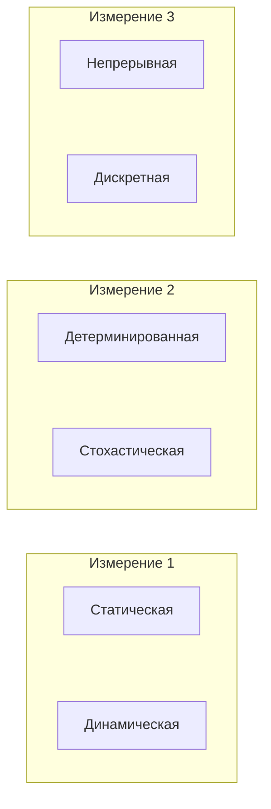
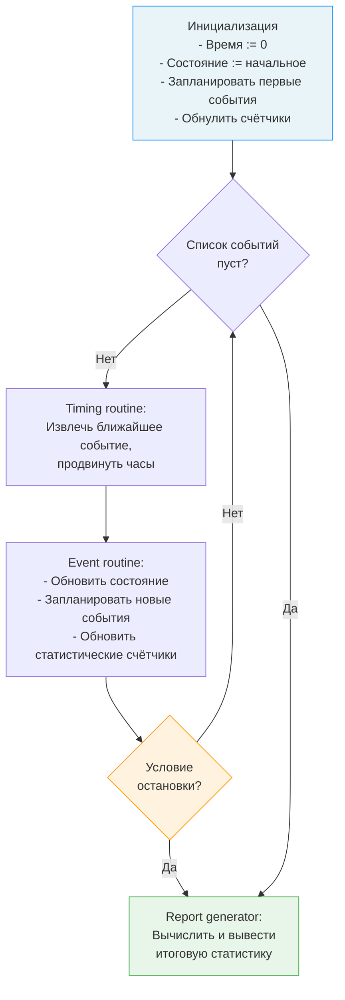
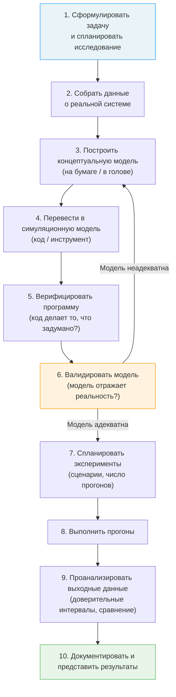
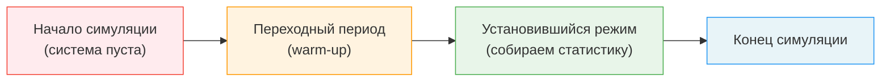

# Моделирование и анализ симуляций

Привет! Сегодня мы поговорим о **методологии** имитационного моделирования --- не о конкретных инструментах, а о том, как правильно строить, верифицировать, валидировать и анализировать модели. Основной источник --- классический учебник Аверилла Лоу «Simulation Modeling and Analysis», который считается стандартным справочником в этой области уже более 30 лет.

---

## Зачем это нужно

Имитационное моделирование --- это не просто программирование. Можно написать красивый код на SimPy или AnyLogic, запустить симуляцию, получить числа... и эти числа будут бессмысленными, если не соблюдена методология.

Типичные ошибки:

- Модель не валидирована --- она не отражает реальную систему
- Выходные данные проанализированы как обычные числа, а не как **случайные величины**
- Не учтён переходный период --- статистика «загрязнена» начальными условиями
- Недостаточно прогонов --- доверительные интервалы слишком широкие

!!! warning "Главный посыл"
    Симуляция --- это **стохастический эксперимент**. Один прогон --- это одна реализация случайного процесса. Делать выводы по одному прогону --- всё равно что бросить монетку один раз и заявить, что она всегда падает орлом.

---

## Системы, модели, симуляция

### Что такое система

**Система** --- это совокупность сущностей (entities), которые взаимодействуют друг с другом для достижения некоторой логической цели. Примеры:

- Банковское отделение (клиенты, кассиры, очереди)
- Производственная линия (станки, детали, операторы)
- Компьютерная сеть (пакеты, маршрутизаторы, каналы)

### Состояние системы

**Состояние системы** --- это набор переменных, которые описывают систему в любой данный момент времени. Например, для банковского отделения:

- Число клиентов в очереди
- Статус каждого кассира (свободен / занят)
- Время прихода каждого клиента в очереди

### Дискретные vs. непрерывные системы

| Тип системы | Состояние меняется... | Пример |
|---|---|---|
| **Дискретная** | Мгновенно, в отдельные моменты времени | Банк: клиент пришёл, кассир освободился |
| **Непрерывная** | Плавно, в каждый момент времени | Химический реактор: температура, давление |

!!! note "На практике"
    Многие реальные системы содержат и дискретные, и непрерывные элементы. Но для моделирования обычно выбирают доминирующий тип и моделируют его, упрощая второй.

### Классификация моделей

Модели можно классифицировать по трём измерениям:



| Измерение | Варианты | Пояснение |
|---|---|---|
| Время | **Статическая** / **Динамическая** | Зависит ли модель от времени? |
| Случайность | **Детерминированная** / **Стохастическая** | Есть ли случайные компоненты? |
| Изменение состояния | **Непрерывная** / **Дискретная** | Как меняется состояние --- плавно или скачками? |

**Дискретно-событийная симуляция (DES)** --- это модель, которая является **динамической**, **стохастической** и **дискретной**.

### Аналитическое решение vs. симуляция

Для **простых** систем (одноканальная СМО с пуассоновским потоком и экспоненциальным обслуживанием) существуют аналитические формулы. Например, среднее время ожидания в очереди M/M/1:

$$W_q = \frac{\rho}{\mu(1 - \rho)}, \quad \text{где } \rho = \frac{\lambda}{\mu}$$

Но для **сложных** систем (несколько типов заявок, приоритеты, зависимые распределения, ограниченные буферы) аналитических решений нет --- и тогда единственный путь --- **симуляция**.

---

## Дискретно-событийная симуляция (детально)

### Продвижение времени по событиям (Next-Event Time Advance)

Это ключевой механизм DES. Идея проста: модельное время **не тикает** равномерно, а **прыгает** от одного события к следующему, пропуская периоды бездействия.

Алгоритм:

1. Инициализация: время = 0, установить начальное состояние, запланировать первые события
2. Из списка событий выбрать ближайшее по времени
3. Продвинуть модельные часы до этого момента
4. Обработать событие (обновить состояние, запланировать новые события, обновить счётчики)
5. Проверить условие остановки. Если не выполнено --- перейти к шагу 2

!!! tip "Эффективность"
    Если между двумя событиями проходит 1000 единиц модельного времени --- алгоритм просто переставляет часы на 1000 вперёд за одну операцию. Не нужно обрабатывать каждый «тик» --- это делает DES чрезвычайно быстрым.

### Компоненты ДС-модели

По классификации Лоу, каждая ДС-модель включает:

| Компонент | Назначение |
|---|---|
| **Состояние системы** (System state) | Переменные, описывающие систему в текущий момент |
| **Модельные часы** (Simulation clock) | Текущее модельное время |
| **Список событий** (Event list) | Запланированные будущие события с временами наступления |
| **Статистические счётчики** (Statistical counters) | Накопители статистики (суммы, интегралы и т.д.) |
| **Подпрограмма инициализации** | Установка начального состояния |
| **Подпрограмма продвижения времени** (Timing routine) | Выбор ближайшего события и продвижение часов |
| **Подпрограммы обработки событий** (Event routines) | Логика обработки каждого типа событий |
| **Генератор случайных чисел** (Library routines) | Генерация случайных величин с нужными распределениями |
| **Генератор отчётов** (Report generator) | Вычисление итоговой статистики |

### Блок-схема логики симуляции



---

## Пример: одноканальная СМО

Рассмотрим классическую задачу --- **система массового обслуживания с одним сервером** (single-server queueing system). Это каноничный пример из книги Лоу.

### Постановка задачи

- Один сервер, одна очередь FIFO
- Заявки приходят с **независимыми одинаково распределёнными** (IID) интервалами между приходами
- Время обслуживания каждой заявки --- IID случайная величина
- Нужно оценить три показателя качества

### Три выходные метрики

#### 1. Средняя задержка в очереди

$$\hat{d}(n) = \frac{\sum_{i=1}^{n} D_i}{n}$$

где $D_i$ --- задержка $i$-й заявки в очереди (время от прихода до начала обслуживания), $n$ --- число обслуженных заявок.

!!! note "Дискретная статистика"
    Это **дискретно-временная статистика** (discrete-time statistic) --- мы записываем значение для каждой заявки, а затем усредняем.

#### 2. Среднее по времени число заявок в очереди

$$\hat{q}(n) = \frac{\int_0^{T(n)} Q(t)\, dt}{T(n)}$$

где $Q(t)$ --- число заявок в очереди в момент $t$, а $T(n)$ --- время обслуживания $n$-й заявки.

Поскольку $Q(t)$ --- кусочно-постоянная функция (она меняется только в моменты событий), интеграл вычисляется как сумма прямоугольников:

$$\int_0^{T(n)} Q(t)\, dt = \sum_{j} Q_j \cdot \Delta t_j$$

!!! note "Непрерывная статистика"
    Это **непрерывно-временная статистика** (continuous-time statistic) --- мы интегрируем функцию по времени, а затем делим на общее время.

#### 3. Загрузка сервера

$$\hat{u}(n) = \frac{\int_0^{T(n)} B(t)\, dt}{T(n)}$$

где $B(t) = 1$, если сервер занят в момент $t$, и $B(t) = 0$, если сервер свободен.

Загрузка --- это доля времени, в течение которого сервер был занят. Это тоже непрерывно-временная статистика.

### Дискретные vs. непрерывные статистики

| Тип | Как собирается | Как вычисляется среднее | Пример |
|---|---|---|---|
| **Дискретно-временная** | Записываем значение для каждой заявки | $\bar{X} = \frac{1}{n}\sum X_i$ | Задержка в очереди |
| **Непрерывно-временная** | Записываем значение функции на каждом интервале | $\bar{Y} = \frac{1}{T}\int_0^T Y(t)\,dt$ | Длина очереди, загрузка |

---

## Этапы симуляционного исследования

Лоу выделяет следующие этапы **грамотного** симуляционного исследования:



### Подробнее о каждом этапе

**1. Формулировка задачи.** Что именно мы хотим узнать? Какие альтернативы сравниваем? Какие метрики нас интересуют?

**2. Сбор данных.** Данные о реальной системе: распределения времён обслуживания, интервалов между приходами, маршруты заявок. Без данных модель --- фантазия.

**3. Концептуальная модель.** Упрощённое описание системы: какие сущности, какие процессы, какие ресурсы, какие допущения. Это самый важный этап --- ошибка здесь приведёт к бесполезной модели.

**4. Трансляция в симуляционную модель.** Перевод концептуальной модели в код (SimPy, AnyLogic, Arena и т.д.).

**5. Верификация.** Проверяем, что программа делает то, что мы задумали. Отладка, трассировка, проверка на простых примерах с известным ответом.

!!! info "Верификация vs. Валидация"
    **Верификация** --- «правильно ли мы строим модель?» (код соответствует спецификации).
    **Валидация** --- «правильную ли модель мы строим?» (модель соответствует реальности).

**6. Валидация.** Сравниваем выходы модели с данными реальной системы. Если расхождение велико --- возвращаемся к концептуальной модели.

**7. Планирование экспериментов.** Сколько прогонов нужно? Какие сценарии сравнивать? Какие параметры варьировать?

**8. Выполнение прогонов.** Запуск симуляции с разными seed-ами для получения статистически независимых реализаций.

**9. Анализ выходных данных.** Построение доверительных интервалов, проверка гипотез, сравнение альтернатив. Это не просто «посмотреть на среднее» --- это полноценный статистический анализ.

**10. Документация и представление.** Результаты должны быть понятны лицам, принимающим решения, а не только разработчику модели.

---

## Преимущества и недостатки симуляции

### Преимущества

- **Гибкость.** Можно моделировать системы любой сложности, для которых нет аналитических решений.
- **Любые метрики.** Можно измерить всё, что угодно: средние, квантили, распределения, корреляции.
- **What-if анализ.** Можно сравнивать альтернативные конфигурации системы без изменения реальной системы.
- **Контроль условий.** Можно повторить эксперимент с теми же случайными числами, изменив только один параметр.
- **Визуализация.** Анимация модели помогает обнаружить неожиданное поведение и объяснить результаты заказчику.
- **Безопасность.** Можно моделировать аварии, пиковые нагрузки и экстремальные ситуации без риска.

### Недостатки

- **Стохастический выход.** Результат одного прогона --- случайная величина. Нужно несколько прогонов и статистический анализ, чтобы получить достоверные выводы.
- **Трудоёмкость.** Построение хорошей модели занимает время: сбор данных, программирование, валидация, эксперименты.
- **Сложность валидации.** Доказать, что модель адекватно отражает реальность, --- нетривиальная задача.
- **Ложное чувство точности.** Красивая анимация и десять знаков после запятой не означают, что результат верный.
- **Не даёт оптимального решения.** Симуляция --- это эксперимент, а не оптимизация. Она оценивает заданные сценарии, но не ищет лучший автоматически (хотя существуют гибриды симуляции и оптимизации).

!!! warning "Помни"
    Симуляция --- это **инструмент анализа**, а не волшебная кнопка. Качество результата зависит от качества модели и правильности статистического анализа.

---

## Генерация случайных чисел

Любая стохастическая симуляция нуждается в **генераторе случайных чисел**. Вот краткий обзор основных методов.

### Линейный конгруэнтный генератор (LCG)

Основной генератор **псевдослучайных** чисел, равномерно распределённых на $[0, 1)$:

$$X_{n+1} = (a \cdot X_n + c) \mod m$$

$$U_n = \frac{X_n}{m}$$

где $a$ --- множитель, $c$ --- приращение, $m$ --- модуль, $X_0$ --- начальное значение (seed).

!!! note "Псевдослучайность"
    Числа **не** являются по-настоящему случайными --- последовательность полностью определяется seed-ом. Но если параметры выбраны правильно, статистические свойства последовательности неотличимы от настоящей случайной.

### Метод обратного преобразования (Inverse Transform)

Для генерации случайной величины $X$ с функцией распределения $F(x)$:

1. Сгенерировать $U \sim \text{Uniform}(0, 1)$
2. Вычислить $X = F^{-1}(U)$

Пример: **экспоненциальное распределение** с параметром $\lambda$:

$$F(x) = 1 - e^{-\lambda x} \quad \Rightarrow \quad X = -\frac{1}{\lambda} \ln(1 - U) = -\frac{1}{\lambda} \ln U$$

```python
import random
import math

def exponential(lam):
    """Генерация экспоненциально распределённой СВ
    методом обратного преобразования."""
    u = random.random()  # U ~ Uniform(0, 1)
    return -math.log(u) / lam
```

### Метод отбора (Acceptance-Rejection)

Используется, когда $F^{-1}$ сложно или невозможно вычислить:

1. Найти «мажоранту» $c \cdot g(x) \geq f(x)$ для всех $x$, где $g(x)$ --- плотность, из которой легко генерировать
2. Сгенерировать $Y \sim g$ и $U \sim \text{Uniform}(0, 1)$
3. Если $U \leq \frac{f(Y)}{c \cdot g(Y)}$ --- принять $X = Y$, иначе --- повторить

!!! tip "На практике"
    В Python не нужно реализовывать эти методы вручную --- модуль `random` уже содержит генераторы для всех основных распределений: `random.expovariate()`, `random.gauss()`, `random.triangular()` и т.д.

---

## Анализ выходных данных

Это, пожалуй, самая недооценённая часть имитационного моделирования. Многие строят модель, запускают один прогон и принимают решение на основе одного числа. Это грубейшая ошибка.

### Переходный период vs. установившийся режим

| Тип анализа | Что моделируем | Пример |
|---|---|---|
| **Терминирующая симуляция** (Transient / Terminating) | Система с естественным началом и концом | Банк: открылся в 9:00, закрылся в 17:00 |
| **Стационарная симуляция** (Steady-state) | Система работает «вечно», интересует установившийся режим | Колл-центр 24/7, интернет-сервер |

Для **стационарной** симуляции критически важно учитывать **переходный период** (warm-up period): в начале симуляции система «пуста» --- в очередях никого, серверы простаивают. Статистика за этот период не отражает установившегося поведения.



!!! warning "Что делать?"
    Нужно «отбросить» данные за переходный период. Метод Уэлча (Welch's method) помогает определить длительность переходного периода: запускаем несколько прогонов, усредняем метрику по прогонам, сглаживаем скользящим средним и визуально определяем, когда кривая «стабилизируется».

### Доверительные интервалы

Результат симуляции --- **случайная величина**. Чтобы оценить среднее, нужно:

1. Выполнить $k$ **независимых** прогонов (с разными seed-ами)
2. Для каждого прогона вычислить интересующую метрику $\bar{X}_1, \bar{X}_2, \ldots, \bar{X}_k$
3. Построить доверительный интервал:

$$\bar{X} \pm t_{k-1, 1-\alpha/2} \cdot \frac{S}{\sqrt{k}}$$

где $\bar{X}$ --- среднее по прогонам, $S$ --- стандартное отклонение, $t_{k-1, 1-\alpha/2}$ --- квантиль распределения Стьюдента.

!!! note "Сколько прогонов?"
    Минимум --- 3--5 прогонов, чтобы хоть как-то оценить разброс. Для публикации --- обычно 10--30 прогонов. Точное число зависит от желаемой ширины доверительного интервала.

### Методы снижения дисперсии (Variance Reduction)

Чтобы получить более точные оценки при том же числе прогонов, используют специальные техники:

| Метод | Идея |
|---|---|
| **Общие случайные числа** (Common Random Numbers, CRN) | Сравнивать два сценария с одинаковыми случайными числами --- разница будет менее шумной |
| **Антитетические переменные** (Antithetic Variates) | Если в одном прогоне использовали $U$, в парном --- $1-U$. Отрицательная корреляция снижает дисперсию среднего |
| **Контрольные переменные** (Control Variates) | Используем вспомогательную величину с известным средним для коррекции оценки |

---

!!! success "Итого"
    Имитационное моделирование --- это не только код, но и **методология**. Правильная формулировка задачи, валидация модели, грамотный статистический анализ выходных данных --- всё это не менее важно, чем сама программа. Книга Лоу «Simulation Modeling and Analysis» --- незаменимый справочник для всех, кто занимается симуляцией серьёзно.
